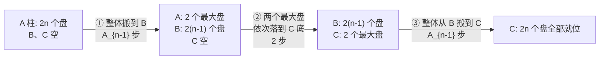

[[TOC]]

## 形式化题目

给定 $n$。三根柱 $A$、$B$、$C$，$A$ 柱上从下到上叠着 $2n$ 个盘：共 $n$ 种尺寸，每种尺寸恰好 2 个不加区分的相同盘。每次移动把某柱最顶端的一个盘放到另一柱顶，任意时刻每根柱必须保持上小下大。求把全部 $2n$ 个盘移到 $C$ 柱所需的最少移动次数 $A_n$。

数据范围：$1 \leqslant n \leqslant 200$。

## 正解

### 思路

**朴素做法的困境**：如果直接按"单个盘"做汉诺塔式搜索/记忆化，状态是三根柱上盘的具体分布，而本题有 $2n$ 个盘且同尺寸两盘无区别，枚举移动序列完全不可行。但题面提示我们建立 $A_n$ 与 $A_{n-1}$ 的递推——关键是换一种"数盘子"的方式。

**关键观察：按尺寸分层**。同尺寸的两个盘完全等价，把"最大的那种尺寸的 2 个盘"看成一个整体。要把它压到 $C$ 柱最底端，必须满足：

- $C$ 柱此刻完全为空（否则更大盘会压住它，违反上小下大）；
- $A$ 柱上只剩这 2 个最大盘（上面的 $2(n-1)$ 个盘必须已经全部搬离 $A$）。

此时这 2 个最大盘各自恰好移动 1 次落到 $C$ 底。而搬离 $A$ 的那 $2(n-1)$ 个盘去哪？若搬到 $C$，会堵住 $C$ 底，之后还得额外搬走，严格不优；所以最优方案是把它们整体搬到 $B$。而"把 $2(n-1)$ 个盘从一根柱搬到另一根空柱"正是规模为 $n-1$ 的原问题，最少 $A_{n-1}$ 次。

于是最优解一定是三步结构：

即

$$A_n = 2A_{n-1} + 2,\qquad A_1 = 2.$$

**从递推到通项**。逐层展开：

$$A_n = 2^{n-1}A_1 + 2\bigl(2^{n-2} + \cdots + 2 + 1\bigr) = 2^n + 2\left(2^{n-1}-1\right) = 2^{n+1} - 2.$$

用前几项核验（表格第 1 列是 $n$，第 2 列是递推值，第 3 列是公式值，两列一致说明通项无误）：

| $n$ | $2A_{n-1}+2$ | $2^{n+1}-2$ |
| :-: | :-: | :-: |
| 1 | — | $2$ |
| 2 | $2\times2+2=6$ | $6$ |
| 3 | $2\times6+2=14$ | $14$ |
| 4 | $2\times14+2=30$ | $30$ |

样例 $n=1$ 输出 $2$、$n=2$ 输出 $6$，与公式一致。

**数据范围**：$n=200$ 时 $2^{201}-2$ 约 61 位十进制，C++ 需要手写高精度；Python 的整数天然是任意精度，直接算出 `2^(n+1) - 2` 输出即可。

### 代码

@include-code(./main.py, python)

### 复杂度

- 时间：位运算 `2 << n` 与一次减法在 $n \leqslant 200$ 下是 $O(1)$ 规模的大数运算，可视为 $O(n / w)$（$w$ 为机器字长），远低于限制。
- 空间：答案约 61 位十进制，$O(1)$。

## 总结

- 同尺寸双盘的汉诺塔问题，把"最大的 2 个盘"作为整体分层，最优解结构为：搬走上面 $2(n-1)$ 个盘（$A_{n-1}$）→ 移两个最大盘（2）→ 搬回（$A_{n-1}$），得 $A_n = 2A_{n-1}+2$。
- 迭代展开得闭式 $A_n = 2^{n+1} - 2$，免去逐项递推。
- $n \leqslant 200$ 时答案超出 64 位整数范围，C++ 需高精度；Python 直接用大数。
- 经验：带权/加倍版的经典递推问题，先写出"整体三步"的递推式，再尝试解出通项，往往比逐项模拟更短更快。
