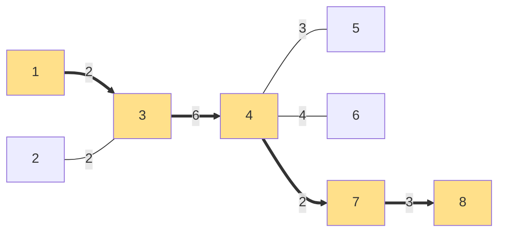

[[TOC]]

## 形式化题目

设 $T=(V,E,W)$ 是一棵无根树，边有正整数边权。$d(a,b)$ 表示 $a,b$ 两点间唯一简单路径的边权之和。

- 对路径 $P$ 与结点 $v$，定义 $d(v,P)=\min\limits_{u \in P} d(v,u)$；
- $\mathrm{ECC}(F)=\max\limits_{v \in V} d(v,F)$，即 $F$ 到全树最远结点的距离，称为 $F$ 的偏心距。

给定非负整数 $s$，要求在**某条直径**上取一段两端都是结点的子路径 $F$（长度可退化为 $0$，即单个结点），使得 $F$ 的长度不超过 $s$，且 $\mathrm{ECC}(F)$ 最小。输出这个最小的偏心距。

## 正解

### 思路

**第一步：把问题收缩到直径上。** 设某条直径为 $u_0 \to \dots \to u_k$，长度为 $D$。任取核 $F$，由三角不等式（树上距离就是路径长，直接成立）：

- 树上任意一点到 $F$ 的距离，不超过它到 $F$ 所在直径上**更远一端**的距离。具体地：位于 $u_i$ 左侧（朝 $u_0$ 一侧）的结点到 $F$ 的距离 $\leqslant$ 核左端到 $u_0$ 的距离，记 $\text{left}=pos(i)$；右侧同理记 $\text{right}=D-pos(j)$；
- 于是 $\mathrm{ECC}(F) \leqslant \max(\text{left},\ \text{right},\ \text{窗口内挂深})$。取等号的最坏情形可以在直径端点处取到，所以直径上长度为 $\min(s, D)$ 的整段核本身就是一个可行解，最优值不会小于从直径上选出候选核后按该式算出的最小值。

因此只需在**这条直径上**枚举候选核即可。

**第二步：求直径与直径结点。** 经典两次 BFS：在树上，离任意一点最远的结点必是某条直径的端点。先从结点 $1$ BFS 得到最远点 $u_0$，再从 $u_0$ BFS 得到最远点 $u_k$，$d(u_0,u_k)$ 就是直径长 $D$。$n \leqslant 300$，干脆对**每个结点**都做一次 BFS 存下全源距离表，后面直接查表，代码最短。

**第三步：筛出直径结点。** 结点 $x$ 在直径 $u_0 \to u_k$ 上，当且仅当

$$d(x,u_0)+d(x,u_k)=D$$

（必要：直径路径上按定义成立；充分：若 $d(x,u_0)+d(x,u_k)>D$ 与 $u_0 \to u_k$ 是直径矛盾，小于则拼接出比直径更长的路径）。把满足条件的结点按 $d(x,u_0)$ 排序，就得到直径上的结点序列 $path[0..k-1]$，$pos[t]=d(path[t],u_0)$。

**第四步：把每个结点"挂"到直径上。** 结点 $v$ 到核 $F$ 的路径，与直径的交点必是**直径上离 $v$ 最近的结点**（树上路径唯一，路径先走到直径、再沿直径走到 $F$；交点唯一是因为核在直径上且树上路径唯一）。定义

- $v$ 的**挂点**：$path[t]$，使 $d(v,path[t])$ 最小（可证这样的 $t$ 唯一——若最小值在相邻两处打平，会拼出比直径更长的路径）；
- $v$ 的**挂接深度**：$d(v,\text{挂点})$。

窗口内所有挂点的深度取 $\max$，就是核内一侧的贡献；核两侧"露出"的直径段贡献 $\text{left}$ 与 $\text{right}$。于是候选核 $[i..j]$ 的偏心距为

$$\mathrm{ECC} = \max\Big(\underbrace{pos(i)}_{\text{左侧露出}}，\ \underbrace{D-pos(j)}_{\text{右侧露出}}，\ \underbrace{\max_{i \leqslant t \leqslant j} dep[t]}_{\text{窗口内挂深}}\Big)$$

其中 $dep[t]$ 是挂在 $path[t]$ 上的最大挂接深度。

**第五步：滑窗枚举。** 枚举左端 $i$，右端 $j$ 随 $i$ 增大单调不减（$pos$ 随 $t$ 递增），因此用双指针保证 $pos(j)-pos(i) \leqslant s$，同时维护窗口内 $dep$ 的最大值，逐个候选算 $\max$ 三元组，取全局最小。整体复杂度由 $n$ 次 BFS 主导。

#### 样例 2 的直径与核

这张图展示样例 2 中两次 BFS 找到的直径，黄色结点按位置排成直径：

直径端点是 `8` 与 `1`，直径长度为 `13`；黄色结点 `[8, 7, 4, 3, 1]` 依次位于直径的位置 `[0, 3, 5, 11, 13]`。观察发现：非黄色结点 `2`、`5`、`6` 的路径都先经过某个黄色结点（它们的挂点），偏心距只需关心这些挂点的深度，以及核两端露出的直径长度。

| 结点 v | 挂点 path[t] | 位置 t | 挂接深度 |
| --- | --- | --- | --- |
| 2 | 3 | 3 | 2 |
| 5 | 4 | 2 | 3 |
| 6 | 4 | 2 | 4 |

这张表只列出非直径结点的挂接情况：挂接深度就是该结点到挂点的距离。当 `s = 6` 时，最优核是结点 `4` 到 `3` 这一段，偏心距为 $\max(5, 2, 4)=5$，与样例输出一致（左露出为核左端 `4` 到直径端点 `8` 的距离，右露出为核右端 `3` 到端点 `1` 的距离，窗口内最大挂深来自结点 `6`）。

### 代码

@include-code(./main.cpp, cpp)

@include-code(./main.py, python)

### 复杂度

- 时间：对每个结点做一次 BFS 为 $O(n^2)$（$n \leqslant 300$，全源距离表约 $9 \times 10^4$ 项）；双指针扫直径为 $O(n)$，总复杂度 $O(n^2)$，与标准 C++ 解法同阶。
- 空间：全源距离表 $O(n^2)$。

## 总结

本题是经典的"树的直径 + 核"模型，核心链条是三次收缩：

1. **求直径**：两次 BFS 定端点，用 $d(x,u_0)+d(x,u_k)=D$ 筛出直径结点；
2. **挂点分解**：每个结点到核的路径必先经过直径上离它最近的结点，把"全树到核的最远距离"拆成"左右露出的直径长度"与"窗口内最大挂接深度"两个可局部维护的量；
3. **滑窗枚举**：候选核的左右端点在直径上都是单调的，双指针加窗口最大值即可。

$n \leqslant 300$ 的规模允许直接建全源距离表，省去求 LCA 或树形 DP 的复杂度，是这道题最舒服的实现方式。该模型向 $n$ 更大的版本推广时，用 DFS 树形 DP 或双 BFS 求直径、前缀最大值维护挂深，思路不变。
