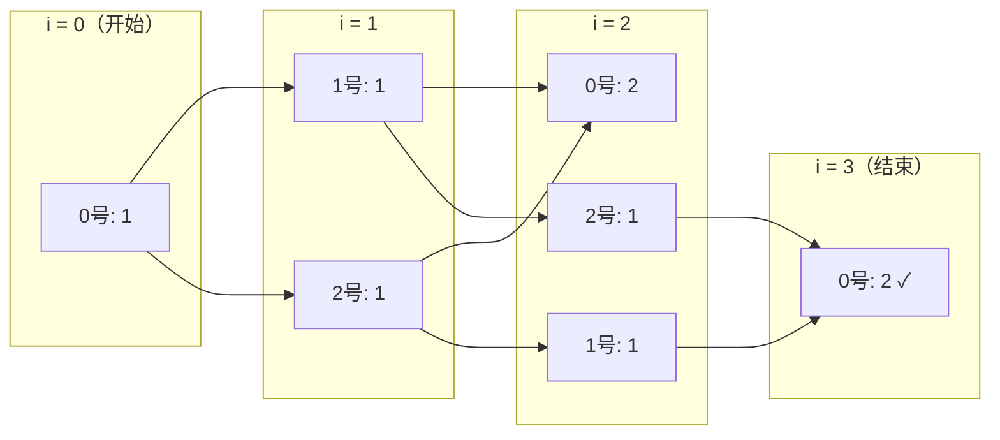

[[TOC]]

## 形式化题目

$n$ 个同学围成一个环，编号 $0 \sim n-1$（小蛮是 $0$ 号）。球一开始在 $0$ 号手中，每一次传球，持球人必须把球传给自己**左右相邻的两个同学之一**（在环上即向左或向右走一步）。求恰好传 $m$ 次后，球回到 $0$ 号手中的**传球序列条数**——两个序列不同当且仅当某一步接球的人不同。

数据范围：$3 \le n \le 30$，$1 \le m \le 30$。

## 正解

### 思路

**朴素做法**：每一步传球都有"传左"或"传右"两种选择，直接枚举全部 $2^m$ 条传球序列，检验哪些序列最后回到 $0$ 号。$m=30$ 时约有 $10^9$ 条序列，枚举不可行。

**从"一步一步传"到"按次数分层"**。我们并不需要知道每条序列的完整样子，只需要在每一步结束时回答一个问题：**球现在在谁手里，有多少种走法走到这一步**。定义

$$f(i, j) = \text{传了 } i \text{ 次后，球在 } j \text{ 号手中的方案数。}$$

第 $i$ 次传球是把球从某个位置传到 $j$，而能一步传给 $j$ 的只有 $j$ 的左右两个邻居。所以第 $i-1$ 次传球后球必然在 $(j-1) \bmod n$ 或 $(j+1) \bmod n$ 手里，这两种来源互不重叠（倒数第二个持球人不同），直接相加：

$$f(i, j) = f(i-1,\ (j-1) \bmod n) + f(i-1,\ (j+1) \bmod n)$$

边界：$f(0, 0) = 1$（开始时球在 $0$ 号手里），其余 $f(0, j) = 0$。答案就是 $f(m, 0)$。

两个细节：

- **环的闭合**。$0$ 号的左邻居是 $n-1$ 号，$n-1$ 号的右邻居是 $0$ 号，`(j-1) % n` 与 `(j+1) % n` 在 Python 的非负下标下自动完成绕回，不需要任何特判。
- **方案数大小**。总方案数不超过 $2^{30} \approx 10^9$，C++ 需要注意用 32 位整数即可；Python 的 `int` 是任意精度，完全不用担心溢出。

用 $n=3,\ m=3$ 把 DP 的每层算出来（箭头表示"上一层的哪两个格子加出本层这一格"）：

| $i \backslash j$ | $0$ | $1$ | $2$ |
| :-: | :-: | :-: | :-: |
| $0$ | **1** | 0 | 0 |
| $1$ | 0 | 1 | 1 |
| $2$ | 2 | 1 | 1 |
| $3$ | **2** | 3 | 3 |

第 $3$ 层的 $f(3,0) = f(2,1) + f(2,2) = 1 + 1 = 2$，正是样例答案。下图展示这三次传球中所有"活着"的方案如何逐层汇合回 $0$ 号：

读法：每个结点是"传 $i$ 次后球在某人手里"的计数；球每传一次只能挪到相邻结点，边上的汇合就是把两条来源路径的方案数相加。$i=3$ 时汇回 $0$ 号的恰好 $2$ 条，对应 $1{\to}2{\to}3{\to}1$ 和 $1{\to}3{\to}2{\to}1$。

**为什么是对的**：对 $i$ 归纳。$i=0$ 时定义与实际一致；若 $f(i-1,\cdot)$ 正确，则任何一条到达 $(i, j)$ 的传球序列去掉最后一步后，唯一落在 $j$ 的左邻居或右邻居，且不同来源的序列互不相同，反之每个邻居的每条序列添一步都能到达 $(i,j)$——转移在不重不漏的意义下完成了计数。

### 代码

@include-code(./main.py, python)

实现说明：`f(i, j)` 用 `functools.cache` 记忆化，自顶向下等价于按 $i$ 分层的递推；递归深度只有 $m \le 30$。`(j-1) % n`、`(j+1) % n` 处理环边界。

### 复杂度

- 时间复杂度：$O(mn)$。状态共 $(m+1) \cdot n \le 31 \times 30 = 931$ 个，每个状态 $O(1)$ 次转移。
- 空间复杂度：$O(mn)$，记忆化保存所有状态（若改成滚动数组可降到 $O(n)$，但本题规模下没有必要）。

## 总结

- 逐层计数是环上游走问题的标准姿势：状态只需要「已传次数 + 当前位置」，转移由"球只能来自左右邻居"这一局部规则决定。
- 环形边界用 `% n` 一行解决，注意 $0$ 号和 $n-1$ 号相邻的两个绕回方向都由同一个取模覆盖。
- 递推边界 $f(0,0)=1$；答案 $f(m,0)$；$m=1$ 时答案为 $0$（一次传球回不到自己），可作为手测检查点。
