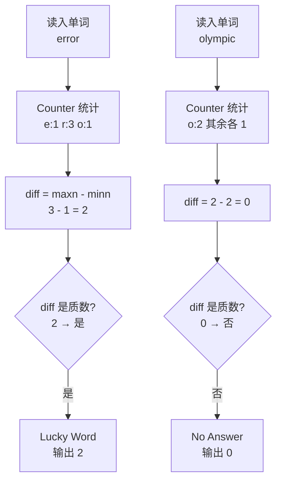

[[TOC]]

## 形式化题目

给定一个仅含小写字母的单词（长度小于 $100$）。设 `maxn` 是单词中出现次数最多的字母的出现次数，`minn` 是出现次数最少的字母的出现次数。若 `maxn - minn` 是质数，则称这个单词是 `Lucky Word`，输出 `Lucky Word` 和 `maxn - minn` 的值；否则输出 `No Answer` 和 `0`。

## 正解

### 思路

这题没有任何算法瓶颈，考的是把题面规则忠实翻译成代码的三步：

1. **统计**：数出每个出现过的字母各出现多少次。单词里只有 $26$ 种小写字母，用一个长度 $26$ 的计数表（Python 里就是 `Counter`）扫一遍即可。
2. **求差**：`maxn` 是计数表里的最大值，`minn` 是最小值，`diff = maxn - minn`。注意最少的字母指**出现过的**字母，所以 `minn` 在计数表内部取，不需要处理"没出现的字母次数为 $0$"。
3. **判质数**：$diff < 100$，用最朴素的试除法——枚举 $i$ 从 $2$ 到 $\lfloor\sqrt{diff}\rfloor$，只要 $diff \bmod i = 0$ 就不是质数。$diff = 0$（所有字母次数相同）和 $diff = 1$ 都不是质数，这一步会自动判掉。

用样例走一遍流程，看清三个量是怎么来的：

| 单词 | 各字母计数 | maxn | minn | diff | 是否质数 | 输出 |
| --- | --- | --- | --- | --- | --- | --- |
| `error` | `e:1, r:3, o:1` | 3 | 1 | 2 | 是 | `Lucky Word` / `2` |
| `olympic` | `o:2, l:1, y:1, m:1, p:1, i:1, c:1` | 2 | 1 | 1 | 否（1 非质数） | `No Answer` / `0` |

观察重点：`olympic` 的 `diff = 1` 是最容易踩的坑——$1$ 不是质数；另外如果某个单词所有字母出现次数相同（如 `aabb`），$diff = 0$ 也不是质数，这正好对应题面注释里纠正过的原题解释错误。

一个常见误区是只用一个布尔数组标记"字母是否出现过"就下结论，那样拿不到次数差；必须完整计数。另一个误区是质数判断从 $1$ 开始枚举——$1$ 能整除一切，会把所有情况都判成合数。

### 代码

@include-code(./main.py, python)

### 复杂度

- 时间复杂度：统计一遍是 $O(n)$（$n < 100$ 为单词长度），试除判质数是 $O(\sqrt{diff}) \leqslant O(\sqrt{n})$，总计 $O(n)$。
- 空间复杂度：$O(26)$ 的计数表，即 $O(1)$。

数据规模下无论怎么写都不会超时；上面的实现已经是最自然的线性做法，没有再优化的必要。

## 总结

- 核心就三个动作：**计数 → 求最值差 → 试除判质数**，全是入门级基本功。
- 两个边界要背下来：$0$ 和 $1$ 都不是质数，分别对应"所有字母次数相同"和"恰好多出现一次"这两种单词。
- 题面样例 2 的官方解释本身有误（`olympic` 实际 `diff = 0`），以题面注释的纠正为准。

## 图示解析

### 判定流程

下图展示从单词到输出的完整判定链路，两条路径分别对应样例 1 和样例 2：

观察重点：上下两条链路结构完全相同，唯一的分叉点在菱形的质数判断——`diff = 2` 落进"是"分支，`diff = 0` 落进"否"分支。$0$ 和 $1$ 在判断处被自然挡下，不需要任何特殊分支，这就是试除判质数从 $2$ 开始枚举带来的正确性。
