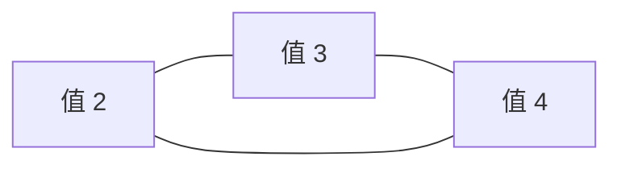

[[TOC]]

## 形式化题目

给定 $1 \sim n$ 的排列 $P$ 与两个栈 $S_1, S_2$，只允许四种操作：

- `a`：把输入序列的队头压入 $S_1$；
- `b`：把 $S_1$ 栈顶弹出到输出序列末尾；
- `c`：把输入序列的队头压入 $S_2$；
- `d`：把 $S_2$ 栈顶弹出到输出序列末尾。

判断是否存在一串操作使输出恰好为 $1, 2, \dots, n$。若存在，输出**字典序最小**的操作序列（按 `a < b < c < d` 比较，操作之间用空格分隔）；否则输出 $0$。

以样例 1（$P = 1\ 3\ 2\ 4$）为例，下表逐操作展示状态变化，它对应答案 `a b a a b b a b`：

| 步骤 | 操作 | 说明 | $S_1$（右为栈顶） | $S_2$ | 已输出 |
| --- | --- | --- | --- | --- | --- |
| 1 | `a` | 压入 1 | $[1]$ | $[\,]$ | $()$ |
| 2 | `b` | 栈顶 1 正是 need，弹出 | $[\,]$ | $[\,]$ | $(1)$ |
| 3 | `a` | 压入 3 | $[3]$ | $[\,]$ | $(1)$ |
| 4 | `a` | 压入 2（比栈顶 3 小，合法） | $[3, 2]$ | $[\,]$ | $(1)$ |
| 5 | `b` | 弹出 2 | $[3]$ | $[\,]$ | $(1, 2)$ |
| 6 | `b` | 弹出 3 | $[\,]$ | $[\,]$ | $(1, 2, 3)$ |
| 7 | `a` | 压入 4 | $[4]$ | $[\,]$ | $(1, 2, 3)$ |
| 8 | `b` | 弹出 4，输入同时耗尽 | $[\,]$ | $[\,]$ | $(1, 2, 3, 4)$ |

need 表示下一个必须输出的值。可以看到：每个栈自始至终保持从栈底到栈顶**递减**，need 一旦进入某个栈就停在栈顶，随叫随到——这个不变量正是后面贪心规则的来源。

## 正解

### 思路

**朴素想法与瓶颈。** 最直接的思路是搜索：每一步四种选择，或者枚举每个元素进哪个栈（$2^n$ 种分配）再模拟验证。$n \leqslant 1000$ 时都不可行。它暴露的瓶颈是：我们提前不知道**哪些值绝不能进同一个栈**，只能盲目枚举。若能先把「必须分家」的值对全部找出来，分栈就从 $2^n$ 种选择退化成一个二分图染色判定。

**推导冲突条件。** 考察两个位置 $i < j$ 上的值 $x = a[i]$、$y = a[j]$，假设它们进了同一个栈：

- 若 $x$ 在位置 $j$ 之前已经弹出，两者互不干扰，没有冲突。
- 否则 $y$ 压在 $x$ 上面，$y$ 必然先弹。此时若 $x < y$，升序输出却要求 $x$ 先出，矛盾；$x > y$ 则顺序恰好正确，没有冲突。

所以危险情形是 $x < y$ 且 $x$ 拖到 $j$ 之后才弹出。$x$ 何时才能弹出？必须等所有比 $x$ 小的数都输出完，need 才轮到 $x$。于是只要 $j$ 之后还存在比 $x$ 小的数 $a[k]$（$k > j$），它压入得比 $x$ 晚，会迫使 $x$ 在它之后才弹出——此时 $y$ 早已压在 $x$ 上，矛盾必然发生。得到经典冲突条件：

$$\exists\, i < j < k \quad \text{使得} \quad a[k] < a[i] < a[j] \;\Longrightarrow\; a[i] \text{ 与 } a[j] \text{ 不能同栈}.$$

两个方向都不可省：样例 1 中 $a[1] = 1 < a[2] = 3$，但位置 2 之后没有比 1 小的数，$1$ 不会被拖住，所以 $1, 3$ 同栈没有问题；反过来 $2\ 3\ 4\ 1$ 中 $2 < 3$ 且后面有 $1 < 2$，$2, 3$ 必须分家——事实上该图最终是三角形，怎么分都不够。

**建图与染色。** 把每个**值**作为顶点，冲突对连边。一个栈装的值必须两两无冲突，即每个栈是独立集，所以：

- 图是二分图 ⟺ 两个栈够用，染色方案直接给出每个值进哪个栈；
- 图含奇环 ⟺ 无论怎么分都不行，输出 $0$。

下图是样例 2（$2\ 3\ 4\ 1$）的冲突图，$2, 3, 4$ 两两冲突构成三角形，因此输出 $0$：

**染色定完可行性，还差字典序。** 二分图每个连通块的染色整体翻转后仍是合法染色，方案不唯一。由于 `a` 比 `c` 小，把「在输入中出现最早」的值染成 0（进 $S_1$），第一次压入就能拿到更小的 `a`，同块其余值跟着整体翻转。这是拿到字典序最小答案的第一步。

**贪心模拟。** 分栈固定后，每步只需在当前合法的操作里取字典序最小者。两条关键规则：

1. **压入必须比栈顶小**。若把大值盖在小值上面，小值是将来的 need，被压住后大值只有等 need 先弹，而 need 又被它挡着——死锁，所以 `v > 栈顶` 的压法一律非法。这条规则保证栈始终递减、need 一旦进栈就停在栈顶，染色合法时模拟绝不会中途卡死。
2. **按 `a < b < c < d` 取最小合法操作**。合法时先压 `a`，它比 `b`、`d` 都小，而且「先压 `a` 再弹 `d`」与「先弹 `d` 再压 `a`」到达完全相同的状态，晚一步弹不会变差；`a` 非法时（会盖死栈顶的 need，或比栈顶大）能弹 need 就弹 `b`——`b` 比 `c`、`d` 都小，且「先弹 `b` 再压 `c`」同样与「先压 `c` 再弹 `b`」等价；再轮到合法的 `c`，最后才是 `d`。输入耗尽后只剩弹出，弹不出 need 即输出 $0$。

样例 3（$2\ 3\ 1$）演示全程：$2$ 与 $3$ 冲突（后面有 $1 < 2$），染色必须分家，于是得到 `a c a b b d`：压 2 进 $S_1$、压 3 进 $S_2$、压 1 进 $S_1$，随后依次弹出 $1, 2, 3$。

### 代码

@include-code(./main.py, python)

### 复杂度

- **时间**：建图两遍枚举 $i < j$，$O(n^2)$；染色与贪心模拟各 $O(n + E)$，合计 $O(n^2)$。$n = 1000$ 时内层判断约 $5 \times 10^5$ 次，实测远低于时限。
- **空间**：冲突图最坏约 $\binom{n}{2}$ 条边，用「度数前缀和 + 回填」的 CSR 邻接表存储，为 $O(n + E)$；朴素的逐点 `list` 邻接表在稠密反例（如 $2\ 3\ \dots\ n\ 1$）上会逼近 $O(n^2)$ 的解释器开销，超出 32 MB 限制。

## 总结

把「不能同栈」翻译成冲突图是本题的核心：冲突条件 $\exists\, i<j<k,\ a[k]<a[i]<a[j]$ 从「小值被大值盖住」的死锁推出来，染色判定可行性，连通块按输入最早值定向保证 `a` 优先；模拟阶段用「压入必须递减」维持 need 永在栈顶的不变量，再按 `a<b<c<d` 逐步取最小合法操作，等价状态可交换保证了每步贪心都朝字典序最小走。

验证：题面 3 组样例与 15 组真实测试数据全部一致；另与「对操作序列做 BFS 求字典序最小解」的暴力对拍 $n \leqslant 6$ 全部 873 个排列、$n = 7$ 全部 5040 个排列及 $n = 8, 9$ 共 380 组随机排列，输出逐一相同。
