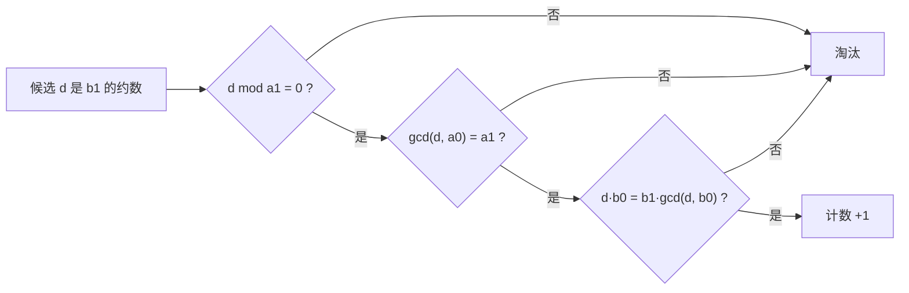

[[TOC]]

## 形式化题目

给定正整数 $a_0,a_1,b_0,b_1$（保证 $a_1 \mid a_0$，$b_0 \mid b_1$），统计满足下面两个条件的正整数 $x$ 的个数：

$$\gcd(x,a_0)=a_1,\qquad \operatorname{lcm}(x,b_0)=b_1$$

若这样的 $x$ 不存在，答案为 $0$。其中 $1 \leqslant a_0,a_1,b_0,b_1 \leqslant 2\times 10^9$，最多 $2000$ 组询问。

## 正解

### 思路

**朴素做法**：枚举 $x=1,2,\dots,b_1$，逐个验证两个条件。但 $b_1$ 最大 $2\times 10^9$，单组数据就要 $2\times 10^9$ 次验证，完全不可行。瓶颈在于候选空间和值域同阶，必须从条件本身把候选集压下来。

**关键观察**：合法的 $x$ 受到两条结构性限制：

1. 由 $\gcd(x,a_0)=a_1$ 知道 $a_1$ 是 $x$ 的约数，即 $a_1 \mid x$；
2. 由 $\operatorname{lcm}(x,b_0)=b_1$ 知道 $x$ 整除它们的最大公倍数，即 $x \mid b_1$。

两条合起来，**候选的 $x$ 只能是 $b_1$ 的约数**。一个不超过 $2\times 10^9$ 的数约数最多一千多个，而且可以用 $O(\sqrt{b_1})$ 的试除全部生成：对每个 $d \leqslant \sqrt{b_1}$，若 $d \mid b_1$ 就同时拿到约数 $d$ 和配对 $b_1/d$（$d = b_1/d$ 时只取一个）。

对每个候选 $d$，按"从便宜到贵"的顺序过三道判定，全部通过才计数：

| 顺序 | 判定 | 作用 |
| --- | --- | --- |
| 1 | $d \bmod a_1 = 0$ | 廉价预筛：$\gcd(d,a_0)=a_1$ 隐含 $a_1\mid d$，先筛掉一大批 |
| 2 | $\gcd(d,a_0)=a_1$ | 就是原条件一 |
| 3 | $d\cdot b_0 = b_1\cdot\gcd(d,b_0)$ | 等价于 $\operatorname{lcm}(d,b_0)=b_1$，即原条件二 |

第 3 道判定用到了 $\gcd$ 与 $\operatorname{lcm}$ 的基本恒等式：

$$\operatorname{lcm}(x,b_0)\cdot\gcd(x,b_0)=x\cdot b_0$$

要验证 $\operatorname{lcm}(d,b_0)=b_1$，不必真的计算 $\operatorname{lcm}$ 再比较（虽然本题数值范围内也不会溢出），直接比较乘积等式 $d\cdot b_0 = b_1\cdot\gcd(d,b_0)$ 更简洁。

用 Mermaid 看单个候选 $d$ 的判定链：

整个算法就是"生成约数 → 三道筛子 → 计数"。以第一组样例 $a_0{=}41,\ a_1{=}1,\ b_0{=}96,\ b_1{=}288$ 为例，$288$ 的约数有 $18$ 个，只有 $d=9,18,36,72,144,288$ 这 $6$ 个能连过三关，正好对应题面给出的 $6$ 个 $x$。

### 代码

@include-code(./main.py, python)

### 复杂度

每组数据的试除是 $O(\sqrt{b_1})$，约数个数 $\tau(b_1) \leqslant 1500$ 左右，每个约数再做 $O(\log b_1)$ 次 gcd。总计

$$O\bigl(n\,(\sqrt{b_1}+\tau(b_1)\log b_1)\bigr)\approx 9\times 10^7$$

基本操作，与标准 C++ 解法同阶；空间只用一个约数列表，$O(\tau(b_1))$。

## 总结

- 本题的核心是把"枚举 $x$"变成"枚举 $x$ 的可能取值"：两条 gcd/lcm 条件分别给出 $a_1\mid x$ 与 $x\mid b_1$，把候选压缩成 $b_1$ 的约数，$O(\sqrt{b_1})$ 试除即可枚举完。
- 验证 $\operatorname{lcm}$ 时利用恒等式 $\operatorname{lcm}\cdot\gcd = x\cdot b_0$ 转成乘法等式，避免直接算 $\operatorname{lcm}$。
- 按代价从小到大安排判定（取模 → gcd → 乘积等式），配合短路求值能省掉大量无用的 gcd 调用。
