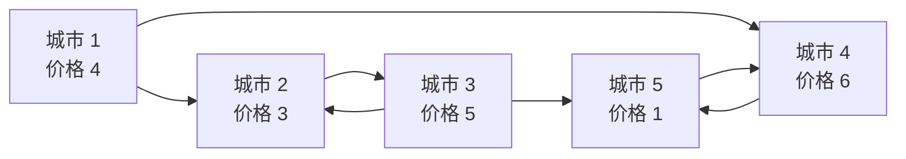
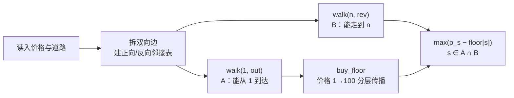

[[TOC]]

## 形式化题目

城市 $1 \sim n$ 构成一张有向混合图：$z=1$ 的道路是从 $x$ 到 $y$ 的单向边，$z=2$ 的道路是 $x$ 与 $y$ 之间的双向边（实现时拆成两条方向相反的单向边），任意两城市之间至多一条道路。第 $i$ 个城市的水晶球价格为 $p_i$（$1 \leqslant p_i \leqslant 100$，同一城市买入价与卖出价相同）。

求一条从 1 出发、到 $n$ 结束的行走（城市和道路都可以重复经过，不要求走遍所有城市），并在行走上按先后顺序选定两个位置：在位置 $b$ 买入、在 $b$ 之后的位置 $s$ 卖出，收益为 $p_s - p_b$。最多进行一次贸易；所有选择都赚不到时输出 $0$。

**样例**（$n=5$，$p = [4,3,5,6,1]$）的道路结构如下：

图中 $2 \leftrightarrow 3$ 与 $4 \leftrightarrow 5$ 是双向道路，画成一对方向相反的箭头。最优行走是 $1 \to 4 \to 5 \to 4 \to 5$：第 1 次到达价格 1 的 5 号城买入，第 2 次回到价格 6 的 4 号城卖出，收益 $6 - 1 = 5$，即样例输出。4、5 两城各经过两次——"城市可重复经过"让商人可以先冲到低价城再折回高价城，这是建模时不能丢的语义。

## 正解

### 思路

**第一步：朴素做法，瓶颈在可达性。** 枚举买点 $b$ 与卖点 $s$（共 $O(n^2)$ 对），每对用一次遍历检查"$1$ 到得了 $b$、$b$ 到得了 $s$、$s$ 到得了 $n$"，总复杂度 $O(n^2(n+m))$；改用 Floyd 预先算出全部点对可达性也要 $O(n^3)$。两者都不可行的根源是：点对之间共享大量可达性信息，而 $n = 10^5$ 时连 $O(n^2)$ 的可达矩阵都存不下——**任何先显式枚举买卖对的做法都到此为止**。

**第二步：刻画可行的买卖对。** 记

$$A = \{\, u \mid 1 \rightsquigarrow u \,\}, \qquad B = \{\, u \mid u \rightsquigarrow n \,\}.$$

- 存在合法行走 $1 \rightsquigarrow b \rightsquigarrow s \rightsquigarrow n$，当且仅当 $b \in A$、$s \in B$ 且 $b \rightsquigarrow s$。必要性直接从行走上读：行走从 1 出发，故 $b \in A$；从 $b$ 沿行走到 $s$ 再到 $n$，故 $s \in A \cap B$、$b \in B$。充分性把三段拼起来即可。
- 顺带得到一个关键结论：这样的行走上任何中间点 $x$ 都满足 $1 \rightsquigarrow x$（$x$ 在 $b$ 之后）与 $x \rightsquigarrow n$（$x$ 在 $s$ 之前），即**买点到卖点的路全程落在 $A \cap B$ 内**——不存在"必须先绕出可行区才能抄到低价"的暗坑。

**第三步：二维枚举压成一维查询。** 固定卖点 $s$，买点只需取"到得了 $s$ 的可买入城市"中的最低价：

$$\mathrm{ans} = \max_{s \in A \cap B} \big(\, p_s - \mathrm{floor}[s] \,\big), \qquad \mathrm{floor}[s] = \min\{\, p_b \mid b \in A,\ b \rightsquigarrow s \,\}.$$

取到最小值的买点 $b$ 与 $s$ 的可行路拼接就是一条合法行走，所以每一项都真实可实现；$b = s$ 同样是合法候选，给出 $0$，于是答案天然非负，"不做贸易输出 0" 不需要特判。剩下要解决的只有一件事：**给每个城市求出 floor**。

**第四步：floor 是环上的不动点。** 对 $u \in A$ 有 $\mathrm{floor}[u] = \min\big(p_u,\ \min_{u \to v} \mathrm{floor}[v]\big)$。图里可以有环（只有 50% 的子任务保证无环），没有拓扑序可依，逐边松弛又是 $O(nm)$。标准 C++ 正解是 Tarjan 求强连通分量、缩点成 DAG 后做两遍最值 DP，$O(n+m)$ 但实现较重。本题还有一个条件始终没被用上：**所有价格不超过 100**。

**第五步：按价格分层的多源传播。** floor 问的是"能到达 $u$ 的买点里最低价是多少"——既然求最低，就按价格从低到高依次处理：把城市按价格装进值域桶，枚举价格 $c = 1 \to 100$，桶里"属于 $A$ 且尚未被覆盖"的城市作为源点，从它沿出边扩散，新覆盖到的城市 floor 记为 $c$。

两个关键论证，缺一不可：

1. **被更低价覆盖的城市不再当源点，不会丢解。** 若价格 $c$ 的 $A$ 城市 $u$ 已被 $\ell < c$ 层覆盖，说明存在价格 $\ell$ 的源点 $z \rightsquigarrow u$；于是 $u$ 能到达的任何城市，$z$ 也能到达——$u$ 作买点处处被 $z$ 的更低价支配，跳过它不会改变任何 floor。
2. **传播不会越出 $A$，`from1` 只需在选源点时检查。** 源点都在 $A$，而 $A$ 对出边封闭：能从 1 到达的点，它的后继仍能从 1 到达。所以扩散途中遇到的点天然属于 $A$，途中不必再做可达性判断。

低层先跑，高层只把仍是 $\mathrm{INF}$ 的城市改成本层价格、绝不覆盖已有更小值，因此**每个城市至多入栈一次、每条出边至多扫描一次**：分层传播 $O(n+m)$，分桶 $O(n+100)$——与 SCC 正解同阶，只是把"缩点后按拓扑序 DP"换成了"按值域分层后按桶序传播"。

样例上的传播过程（$A = B =$ 全部城市，源点选中与否只看"是否属于 $A$ 且未被覆盖"）：

| 价格层 $c$ | 桶内城市 | 处理结果 |
| --- | --- | --- |
| 1 | 5 | 5 未被覆盖，当源点；沿出边覆盖 5, 4, 1, 2, 3，floor 全记 1 |
| 3 | 2 | floor[2] = 1 已被更低层覆盖，跳过 |
| 4 | 1 | floor[1] = 1 已被覆盖，跳过 |
| 5 | 3 | floor[3] = 1 已被覆盖，跳过 |
| 6 | 4 | floor[4] = 1 已被覆盖，跳过 |

表格第一列是值域桶的处理顺序，第三列是该层结束后的覆盖增量。要观察两件事：① 价格 1 的 5 号城一次扩散就覆盖了全图（$5 \to 4 \to 1 \to 2 \to 3$ 的出边链），所以每个卖点的 floor 都是 1，其中卖点 4 的 $p_4 - \mathrm{floor}[4] = 6 - 1 = 5$ 正是答案；② 后四层的候选源点全被支配跳过——传播代价只取决于图的规模，与价格分布无关。

**最后一步：收尾查询。** $s \in A \cap B$ 的判定在实现里是 `to_n[s] and floor[s] < INF`：`floor[s] < INF` 恰好等价于 $s \in A$（只有 $A$ 内的点会被覆盖），`to_n[s]` 是 $s \in B$；对合法 $s$ 取 $\max(p_s - \mathrm{floor}[s])$ 即答案。

### 代码

@include-code(./main.py, python)

代码与推导一一对应：`walk` 被调用两次，分别沿正向边和反向边求出 $A$（`from1`）与 $B$（`to_n`）；`buy_floor` 的 `for cost in range(1, 101)` 就是值域分层，`not from1[src] or floor[src] <= cost` 同时落实"源点必须属于 $A$"与"被更低价覆盖的买点被支配、跳过"，内层 `floor[v] > cost` 是"该点尚无买点到达"的覆盖判定，保证每城每边只处理一次；末行 `to_n[s] and floor[s] < INF` 即 $s \in A \cap B$ 的一维查询。

### 复杂度

- **时间** $O(n+m)$：建两张邻接表 $O(m)$；两次遍历各 $O(n+m)$；按价分桶 $O(n+100)$；分层传播中每城入栈、每条出边扫描各至多一次，$O(n+m)$；取答案 $O(n)$。与 Tarjan SCC + DAG DP 的标准正解同阶——价格上界只贡献分桶的 $O(n)$，不进入内层循环。实测数据仓 10 组真实数据全部 PASS，最慢单点 0.075s（OJ 限时 1000ms）。
- **空间** $O(n+m)$：两张 `list[list[int]]` 邻接表与若干 $O(n)$ 数组。实测峰值 RSS 约 37MB，略高于题面 32MB 的内存限制——超出部分主要是 CPython 解释器基线（约 15MB）加 Python 对象开销，本仓库允许 Python 侧 TLE/MLE；同一算法换成 C++ 前向星只需几 MB，若必须压进 32MB，把邻接表换成 `array('i')` 的 CSR 即可，算法与结构不变。

## 总结

整条路线是三次化归：先用正、反各一次可达性把"能不能买、能不能卖"筛成 $A$、$B$ 两个集合；再把 $O(n^2)$ 的买卖对枚举化成"每个卖点减去最低买价 floor"的一维查询，合法行走的存在性由第二步的拼接论证兜底；最后借"价格不超过 100"把环上不动点 floor 的求解变成按价格从低到高的多源传播——低值先跑保证每个城市只定值一次，支配性论证保证跳过源点不丢解。总复杂度 $O(n+m)$，与 SCC + DAG DP 的标准解法同阶，却把重实现的强连通分量换成了分桶加一次遍历。可迁移的经验是：**环上的最值不动点，只要值域小，就按值分层、低值先传播**。

## 图示解析

下图汇总 `main.py` 的数据流：两张邻接表各自服务哪一步、两个可达性集合在哪里合流。

正向邻接表承担两件事——从 1 出发的可达性、以及传播时的扩散方向；反向邻接表只回答"能否走到 n"。两个集合在最后一步合流，只有 $A \cap B$ 中的城市进入取 max 的循环。读代码时按这张图分段，筛选、传播、取值三块互不纠缠，也正是 `walk` / `buy_floor` / 末行查询的边界。
