[[TOC]]

## 形式化题目

有 $m$ 个相同的水龙头和 $n$ 名按固定顺序排队的人，第 $i$ 人需要占用某个龙头连续 $w_i$ 秒。规则如下：

- 开始时第 $1$ 到第 $m$ 人各占一个龙头（$m \leqslant n$）；
- 某人第 $x$ 秒结束离开后，队首的下一个人在第 $x+1$ 秒立刻顶上，**换人瞬间完成、不浪费水**；
- 换人时接哪个龙头是完全确定的吗？不是——任何空出来的龙头都可以接，题目不规定选择方式。

求所有人接完水的总秒数。

**样例 1**：$n=5,\ m=3$，$w=[4,4,1,2,1]$。下表按秒展示 3 个龙头上的人与已接水量（每个龙头一列，`人号/已接量`）：

| 时刻（秒末） | 龙头 A | 龙头 B | 龙头 C |
| :-: | :-: | :-: | :-: |
| 第 1 秒 | 1号/1 | 2号/1 | 3号/1 → 完成 |
| 第 2 秒 | 1号/2 | 2号/2 | 4号/1 |
| 第 3 秒 | 1号/3 | 2号/3 | 4号/2 → 完成 |
| 第 4 秒 | 1号/4 → 完成 | 2号/4 → 完成 | 5号/1 → 完成 |

表中第 1 秒末 3 号接完，4 号顶上；第 3 秒末 4 号接完，5 号顶上。第 4 秒末 1、2、5 号同时完成，答案为 $4$。注意第 4 秒末 A、B、C 三列的完成时刻并不相同也无妨——总时间取**最晚**的那个。

## 暴力解法

### 思路

最直接的做法是**逐秒模拟**：维护每个龙头上当前的人和已接水量，每一秒给所有工作中的龙头加 $1$，谁接满谁离开、队首下一人顶上，直到 $n$ 人全部离开。时间按题面定义逐秒推进，答案就是最后一个离开的人所在的秒数。

$$
1 \leqslant n \leqslant 10000,\quad 1 \leqslant m \leqslant 100,\quad 1 \leqslant w_i \leqslant 100
$$

总接水量不超过 $10^6$ 秒，逐秒模拟是 $O\!\left(n + m \cdot \sum w_i\right) \approx 10^8$ 次运算，在 1 秒的 C++ 限制下勉强可过，但模拟代码要处理"秒末完成、下一秒顶上"的边界，容易写错。

### 代码

<!-- 教学文章不单独给出暴力代码：逐秒模拟仅用于暴露瓶颈，正式实现见下文正解 -->

### 复杂度与瓶颈

时间 $O\!\left(m \cdot \sum w_i\right)$，瓶颈在于**大量秒内什么事件都没发生**（没有任何人完成接水），却仍然一秒一秒地空转。

## 正解

### 关键观察

回到问题本身：换人瞬间完成，意味着时间轴上真正值得关心的事件只有两类——**某人开始接水**和**某人接完水**。龙头在两次事件之间保持空闲或占用状态不变。所以不必逐秒推进，只需回答：**每个人开始接水的时刻是什么？**

由于每个人的用水量固定，第 $i$ 人的完成时刻 $=$ 开始时刻 $+ w_i$。而"下一个空位"永远出现在**最早空出来的那个龙头**上——这正是事件调度的思想：把 $m$ 个龙头各自看作一条"占用区间"，第 $i$ 人的区间接在哪条区间后面，取决于哪条区间结束得最早。

用小根堆维护 $m$ 个龙头的**当前占用结束时刻** $t_1 \leqslant t_2 \leqslant \cdots \leqslant t_m$。处理第 $i$ 人时：

1. 取出堆顶 $t = \min_j t_j$，即最早空闲的龙头，其空闲时刻就是第 $i$ 人的开始时刻（初始全 $0$，表示第 $1$ 秒大家都空闲）；
2. 第 $i$ 人占它 $w_i$ 秒，新的结束时刻为 $t + w_i$，写回堆中。

下面是样例 1 的事件时间线（横轴为秒，每个龙头一条区间）：

```mermaid
gantt
    dateFormat X
    axisFormat %s秒
    title 样例1的龙头占用区间（m=3）
    section 龙头A
    1号 (w=4)       :0, 4
    section 龙头B
    2号 (w=4)       :0, 4
    section 龙头C
    3号 (w=1)       :0, 1
    4号 (w=2)       :1, 3
    5号 (w=1)       :3, 4
```

图中龙头 C 的三段区间首尾相接：3 号区间结束于 $1$，4 号区间恰好从 $1$ 开始——这正是堆顶取 $\min$ 的效果；答案 $4$ 就是所有区间的最右端点。

### 思路

- 为什么堆顶给出的一定正确？因为每个龙头上的区间是**首尾相接**的，第 $i$ 人无论接到哪个龙头，其开始时刻都是该龙头上一段的结束时刻；接到结束最早（堆顶）的龙头，其完成时刻 $t + w_i$ 在所有选择中最小。逐人贪心做局部最优选择，最终 $\max$ 也最小——因为每个龙头的结束时刻序列在按此策略分配时逐项不劣于其他任何分配方式。
- 初始堆为 $m$ 个 $0$（$m$ 个龙头第 1 秒都可用），依次处理 $n$ 个人，每次 `弹出堆顶 t，压回 t + w_i`。
- 全部处理完后，答案为 $\max_j t_j$，即最后一条占用区间的结束时刻。

### 代码

@include-code(./main.py, python)

Python 实现里用 `heapq.heapreplace(taps, taps[0] + x)` 一行完成"弹出堆顶并压入新值"，比先 `heappop` 再 `heappush` 少一次上浮下沉。

### 复杂度

每人一次堆操作，时间复杂度 $O(n \log m)$，约 $10^4 \times \log 100 \approx 7 \times 10^4$ 次比较；空间 $O(m)$。相比逐秒模拟，我们把与 $\sum w_i$（可达 $10^6$）相关的开销压成了与人数相关的对数级开销。

## 总结

- 本题的关键转化：把"逐秒模拟"升级为"事件驱动"——换人瞬间完成，所以只需维护每个龙头的**下一次空闲时刻**。
- 小根堆是"多台机器、任务按序分配、求最早可用槽位"这类调度问题的标准工具，$n$ 个任务、$m$ 台机器时复杂度 $O(n \log m)$。
- 答案是所有占用区间结束时刻的最大值，而非最后一个被分配的人的开始时刻加 $w$ 之外的任何别的量。
