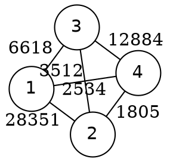

[[TOC]]

## 形式化题目

给定无向带权图 $G = (V, E, w)$，其中 $V = \{1, 2, \ldots, N\}$，$|E| = M$，每条边
$e = (a, b)$ 带正整数权 $w(e)$。把顶点**二染色**（分进甲、乙两座监狱），称一条边
**生效**当且仅当它的两端同色。定义一种染色的代价为全部生效边权值的最大值
（没有生效边时取 $0$），求所有染色方案中代价的最小值。

样例是一张 4 个点、6 条边的图，边上的数字为怨气值：



读图时注意两点。第一，边权差距悬殊（$1805$ 到 $28351$），所以要优先保证权值最大的那几条边
两端**不同监**，它们一旦同监，答案就被钉死在很大的数上。第二，"$1$ 与 $2$ 异监、$1$ 与 $3$ 异监"
会自动推出 "$2$ 与 $3$ 同监"——这种**传递关系**正是并查集要维护的东西。
把 $\{1, 4\}$ 关进甲狱、$\{2, 3\}$ 关进乙狱后，同监的仇恨只有 $(1,4)$ 与 $(2,3)$，
最大影响力是 $3512$，题面给出的最优答案正是它。

## 正解

### 思路

**朴素做法：枚举所有分法。** 暴力枚举 $2^N$ 种二染色，每种用 $O(M)$ 扫一遍边求
"生效边的最大权值"，取所有方案的最小值。总计 $O(2^N \cdot M)$，只够应付 $N \leqslant 15$ 的
小数据；本题 $N$ 达到 $20000$，$2^{20000}$ 种方案不可能枚举。

**瓶颈与关键观察。** 瓶颈在"枚举方案"，而不是"计算某个方案的代价"。顺着答案的结构走：

1. **答案只有 $M + 1$ 个候选值**：$0$ 或某条边的权值——因为目标函数就是生效边权值的最大值。
2. **单调性**：固定一个阈值 $X$，问"能不能染色让权值 $> X$ 的边全部异色"。
   $X$ 越大需要异色的边越少，判定只会更容易。判定本身就是"边权 $> X$ 的子图上做二分图判定"，
   $O(N + M)$，于是得到二分答案写法 $O((N + M)\log C)$——它已经与正解同阶。
3. **把二分压成一次降序扫描**：既然 $X$ 越大越"松"，就不必二分，直接把所有边按权值
   **从大到小**处理，逐条加入"两端必须异色"的约束。约束系统一旦**装不下**当前这条边
   （它的两端被之前的约束强制同色），当前权值就是答案；全部边装得下则输出 $0$。
   这等价于在权值轴上从大到小试 $X$，"首次矛盾"就是最小可行的 $X$。

**约束怎么表达：带权（种类）并查集。** 每条约束都是"两端异监"，状态只有同监/异监两种，
用二进制位表示即可。并查集里 `FA[x]` 是父节点，`REL[x]` 记录 $x$ 与**父节点**的仇敌关系
（$0$ 同监，$1$ 异监）；`find` 路径压缩时沿链把 `REL` 异或累计，使 `REL[x]` 始终表示
**$x$ 与根**的关系。于是：

- $a$、$b$ **异根** → 合并两棵约束树，并令 `REL[ra] = REL[a] ^ REL[b] ^ 1`，
  这个取值恰好使 $\text{REL}[a] \oplus \text{REL}[b] \oplus \text{REL}[r_a] = 1$，即强制 $a$、$b$ 异监；
- $a$、$b$ **同根** → 它们的相对关系已确定，等于 `REL[a] ^ REL[b]`：结果为 $1$ 说明约束早已满足，跳过；
  结果为 $0$ 说明 $a$、$b$ 已被强制同监，当前边 $(a,b,c)$ 躲不掉，返回 $c$。

**用样例走一遍降序扫描**（`≡` 表示被约束为同监）：

| 序号 | 处理边（怨气值） | 新增约束 / 判定 | 当前推出的阵营关系（≡ 同监） |
| --- | --- | --- | --- |
| 1 | (1, 2) 28351 | 新增：1 ≠ 2 | （尚无被迫同监的罪犯） |
| 2 | (3, 4) 12884 | 新增：3 ≠ 4 | （尚无被迫同监的罪犯） |
| 3 | (1, 3) 6618 | 新增：1 ≠ 3 | 1 ≡ 4、2 ≡ 3 |
| 4 | (2, 3) 3512 | **2、3 已被强制同监 → 返回 3512** | 1 ≡ 4、2 ≡ 3 |
| — | 后续 2 条边 | 不再处理 | 答案锁定为 3512 |

第 3 步是全题的缩影：$1 \neq 2$、$1 \neq 3$ 推出 $2 \equiv 3$，再由 $3 \neq 4$ 推出 $1 \equiv 4$。
于是第 4 步的边 $(2, 3)$ 两端已经站在同一监狱，$3512$ 的冲突不可避免——这正是样例答案。

**为什么返回的 $c$ 就是最优值？** 设返回时已加入的约束来自边集 $H$（权值比 $c$ 大的边，
以及权值同为 $c$ 但排在前面的边）。

- **下界**：任取一种染色。若 $H$ 中有边生效，它的权值 $\geqslant c$，代价 $\geqslant c$；
  否则 $H$ 的约束全部成立，而 $H$ 已把 $a$、$b$ 传递成必须同色，于是 $(a,b)$ 生效，代价 $\geqslant c$。
  两种情况都得到代价 $\geqslant c$，因此最小代价不可能低于 $c$。
- **上界**：并查集只在两端异根时合并、同根且已异监时跳过，因此除返回那一刻外，
  约束系统始终**可满足**——$H$ 存在一个合法二染色，在它之下 $H$ 中的边全部异监，
  只有权值 $\leqslant c$ 的边可能生效，代价至多 $c$。

上下界夹逼，$\text{opt} = c$。若所有边都加完仍无矛盾，则存在让**每条边**都异监的染色，
代价为 $0$，按题面输出 $0$。

**实现上的三个要点。**

1. **惰性读入**：逐行 `line.split()` 转整数，不一次性生成几十万个 token 字符串。
2. **边打包成一个整数再排序**：`(c << 40) | (a << 20) | b`（$N \leqslant 20000 < 2^{20}$）。
   降序排序等价于"先按怨气值降序"，而单个整数比三元组省下十余 MB——为的是守住 config 的 32MB 内存限制。
3. **两趟式路径压缩**：先沿父链收集 `path` 到根，再 `reversed(path)` 从根往回累计异或并直接挂到根。
   每个节点只在被访问时读一次自己的旧 `REL`，读完立刻改写，不会读到被覆盖后的脏值。

### 代码

@include-code(./main.cpp, cpp)

@include-code(./main.py, python)

### 复杂度

- **时间复杂度**：排序 $O(M \log M)$；每条边常数次 `find`，路径压缩下并查集操作均摊 $O(\alpha(N))$，
  扫描合计 $O(M \cdot \alpha(N))$。总计 $O(M \log M + M\,\alpha(N))$，与 C++ 正解（排序 + 并查集）同阶，
  也与二分答案写法 $O((N + M) \log C)$ 同阶。实测最大测例（$N = 20000$，$M = 100000$）
  本地 0.065s，远低于 OJ 的 1000ms。
- **空间复杂度**：并查集 $O(N)$、边表 $O(M)$，合计 $O(N + M)$。实测最大测例峰值 19.7MB，
  低于 config 的 32MB（打包排序与惰性读入就是为内存服务的）。

## 总结

- 模型：二染色 + 只关心生效边的最大权值 ⇒ "**按权值从大到小加异色约束，首个矛盾即答案**"。
- 单调性给了二分答案；把扫描线放在权值轴上从大到小走，二分就被一次降序遍历替代。
- 带权并查集用一个二进制位（`REL` 异或）表达"同监/异监"，路径压缩时沿链异或即可维护到根的关系。
- 正确性来自两头夹逼：矛盾边给出下界，约束系统的可满足性给出上界。
- 边打包排序、逐行惰性读入都是为 32MB 内存限制服务的工程细节，不改变算法复杂度。

## 图示解析

这张图串起本题从建模到得到答案的主线：

```text
带权图 G，目标 = 生效（同监）边的最大权值最小；答案 ∈ {0} ∪ {边权}
`- 单调性：X 越大，"权值 > X 全异色"越容易
   `- 扫描代替二分：边按权值从大到小加"异监"约束
      `- 带权并查集用 REL 异或传递同监/异监关系
         `- 两端同根且异或 = 0  ->  首个躲不开的冲突即答案；全部装得下  ->  输出 0
```

先确认第一行“目标 = 同监边最大权、候选只有边权和 0”，再沿分支看单调性如何把二分简化成一次降序扫描；
最后一层是算法的判定核心：并查集把一串“异监”约束压成到根的关系，
两个点的异或结果为 $0$ 的那一刻，就是答案浮出水面的那一刻。
