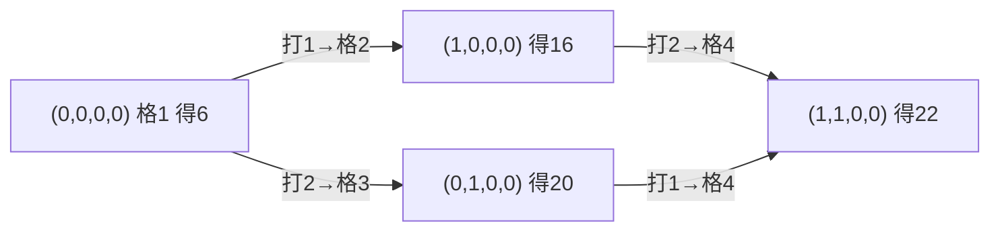

[[TOC]]

## 形式化题目

棋盘是一排 $N$ 个格子，第 $i$ 格的分数为 $a_i$（$a_i \geqslant 0$）。乌龟从第 $1$ 格出发（自动获得 $a_1$），手上有 $M$ 张卡片，每张标有 $1,2,3,4$ 之一：打出一张标 $k$ 的卡片，乌龟就向前走 $k$ 格，每张卡片恰好用一次。

用光全部 $M$ 张卡片后，乌龟恰好落在第 $N$ 格；途中到达的每个格子都计一次分数。求一种出牌顺序，使经过格子的分数总和最大。

## 样例解释

样例中 $N=9$，卡片为 `1 3 1 2 1`（三张 1、一张 2、一张 3），最优顺序 `1,1,3,1,2` 的行走路线是：

| 步骤 | 打出 | 从格子 | 到格子 | 到达格分数 |
| :--: | :--: | :--: | :--: | :--: |
| 起点 | — | — | 1 | $6$ |
| 1 | 1 | 1 | 2 | $10$ |
| 2 | 1 | 2 | 3 | $14$ |
| 3 | 3 | 3 | 6 | $8$ |
| 4 | 1 | 6 | 7 | $18$ |
| 5 | 2 | 7 | 9 | $17$ |

合计 $6+10+14+8+18+17=73$。注意第 4、5 格被跳过，不得分；同一个格子被"经过"（跳过）不算到达。

## 正解

### 思路

**朴素做法及其瓶颈。** 最直接的枚举是给 $M$ 张卡片排出一个全排列，逐个模拟算分——但 $M \leqslant 120$ 时排列数高达 $120!$，完全不可行。注意到同数字的卡片**互相没有区别**：真正影响得分轨迹的只有"每类数字各打了几张"，而不是打牌的具体顺序。设四类卡片张数为 $c_1,c_2,c_3,c_4$，用牌总数为 $S = c_1+c_2+c_3+c_4$，则乌龟此刻恰好站在第 $1 + (c_1 + 2c_2 + 3c_3 + 4c_4)$ 格——**位置被用牌组合唯一确定**，不需要在状态里单独存。也就是说，值得考虑的"局面"最多只有 $41^4 \approx 2.8 \times 10^6$ 个。

**从枚举顺序到计数 DP。** 进一步观察：某个组合 $(c_1,c_2,c_3,c_4)$ 的最大得分，与到达它之前"最后打的是哪张牌"有关，而最后一张牌只能是 $1/2/3/4$ 四种之一，且打完它之后的组合是确定的（对应数字的计数减一）。这就给了自然的递推结构：

$$
f(c_1,c_2,c_3,c_4) = a_{\,1+c_1+2c_2+3c_3+4c_4} + \max\limits_{\substack{k \in \{1,2,3,4\} \\ c_k > 0}} f(c_1,\dots,c_k - 1,\dots)
$$

其中 $f(0,0,0,0) = a_1$（起点的分数自动获得）。这里"计数即状态、每类减一即转移"的结构与背包 DP 同源：四种数字相当于四种"体积"，只是它们共同拼出的是**前缀位置**而非一个背包容量。下图展示样例中从起点出发、用一张 1 的两种路径分岔——同样的用牌组合，走的轨迹可以不同，但DP按组合记账后只保留最大值：

从 `(1,0,0,0)` 打 2、和从 `(0,1,0,0)` 打 1，都会到达组合 `(1,1,0,0)`，但得分不同（$22$ 与 $18$）——这正是 DP 取 `max` 的意义，也说明**得分依赖路径顺序，而组合本身不依赖**，所以必须把"每个组合的最优值"存下来。

**实现方式。** 既可以用四维数组 `f[c1][c2][c3][c4]` 按 $S$ 从小到大递推，也可以用记忆化搜索。下面的代码采用另一种等价写法：用 `dict` 以四元组为键直接从 $(0,0,0,0)$ **前向推**——枚举每个可达组合，尝试再打一张数字 $k$ 的卡片，把 `cnt[k]` 加一后得到的新组合的得分用 `max` 更新。这样状态里只存"实际可达"的组合，且无需写显式的四层逆序循环。需要注意两处剪枝：某类卡片用完就不能再打该类；下一步若走出棋盘（新位置 $> N$）则这条出牌不合法。题目保证用光 $M$ 张牌恰好落在终点，所以答案就是"四类牌全部用完"的那个状态。

### 代码

@include-code(./main.cpp, cpp)

@include-code(./main.py, python)

### 复杂度

状态数是 $\prod_{k=1}^{4}(c_k+1) \leqslant 41^4 \approx 2.8 \times 10^6$，每个状态最多 $4$ 次转移，总时间 $O(c_1 c_2 c_3 c_4)$（约 $10^7$ 级别）；空间同样是 $O(c_1 c_2 c_3 c_4)$。这与 C++ 正解同阶。

## 总结

- 同类物品无区别时，"排列枚举"应压缩为"计数组合"：本题的关键观察是**用牌总数唯一决定乌龟位置**，从而把状态从「位置 + 剩余所有牌」砍成四维计数。
- 转移是"最后一动画牌"的逆推（或等价的前向扩展），每个状态最多 $4$ 个前驱/后继，这是计数 DP 的典型形态。
- 用 `dict` + 元组状态可以省掉四维数组的边界书写，代价是常数变大；Python 实现需留意 `nxt_pos < n` 与"该类牌是否用完"两个合法性检查。
- 得分依赖行走顺序、状态却与顺序无关，二者靠 `max` 融合——凡是"过程有序、结果只看计数"的题都可以套用这个框架。

## 图示解析

下图把样例的 DP 状态按"已用牌数 $S$"分层，每层列出组合、对应格子与最大得分（`-` 表示该组合不可达，格子数 = $1 + c_1 + 2c_2 + 3c_3$，本题没有数字 4 的牌）：

| $S$ | 组合 $(c_1,c_2,c_3)$ | 格子 | 最大得分 |
| :--: | :--: | :--: | :--: |
| 0 | (0,0,0) | 1 | 6 |
| 1 | (1,0,0) / (0,1,0) / (0,0,1) | 2 / 3 / 4 | 16 / 20 / 8 |
| 2 | (2,0,0) / (1,1,0) / (1,0,1) / (0,1,1) | 3 / 4 / 5 / 6 | 30 / 22 / 24 / 28 |
| 3 | (3,0,0) / (2,1,0) / (2,0,1) / (1,1,1) | 4 / 5 / 6 / 7 | 32 / 38 / 38 / 46 |
| 4 | (3,1,0) / (3,0,1) / (2,1,1) | 5 / 6 / 8 | 46 / 56 / 51 |
| 5 | (3,1,1) | 9 | **73** |

观察重点：

- 每一层的状态只从上一层转移而来（每打一张牌 $S$ 加一），所以按 $S$ 递增处理即是无后效性的拓扑序。
- 最优出牌顺序 `1,1,3,1,2` 对应链 `(0,0,0)→(1,0,0)→(2,0,0)→(2,0,1)→(3,0,1)→(3,1,1)`，逐状态得分 $6,16,30,38,56,73$；例如 `(1,1,0)` 得 $22$ 是从 `(0,1,0)` 打 1 到达的（$20+2$），比从 `(1,0,0)` 打 2 到达的 $18$ 更优，体现取 `max` 的必要性。
- 终态 `(3,1,1)` 的 $73$ 正是样例答案，且它由 `(3,0,1)`（打 2）转移而来，与题面给出的最优出牌顺序一致。
