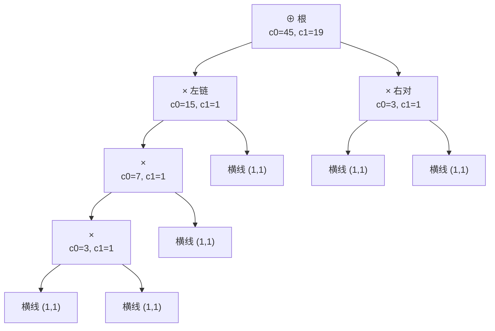

[[TOC]]

## 形式化题目

题面用真值表定义了两个作用在 $\{0,1\}$ 上的二元运算（注意：$\oplus$ 按真值表就是**逻辑或**，不是异或）：

| 运算 | 输入字符 | 运算规则 | 等价含义 |
| --- | --- | --- | --- |
| $\oplus$ | `+` | $0\oplus0=0$，$0\oplus1=1$，$1\oplus0=1$，$1\oplus1=1$ | 逻辑或 OR |
| $\times$ | `*` | $0\times0=0$，$0\times1=0$，$1\times0=0$，$1\times1=1$ | 逻辑与 AND |

两行规则真正要记住的只有两条：$\oplus$ 的结果为 $0$ 当且仅当**两边都为 $0$**，$\times$ 的结果为 $1$ 当且仅当**两边都为 $1$**——后文的计数合并公式就是从这两句话来的。

给定一个半成品表达式：只给出其中的运算符与括号（共 $L$ 个字符，只含 `+`、`*`、`(`、`)`），每个运算对象的位置是一条横线。横线数 = 运算符个数 $+1$（括号不产生横线）。求值顺序为：先算括号内，再算 $\times$，最后算 $\oplus$，同级从左到右。

每条横线独立填入 $0$ 或 $1$，问有多少种填法使整个表达式的值为 $0$，答案对 $10007$ 取模。

样例中给出的 4 个字符是 `+`、`(`、`*`、`)`，还原出的完整表达式为 `_+(_*_)`，记三条横线从左到右为 $x_1,x_2,x_3$，则表达式的值为 $x_1 \oplus (x_2 \times x_3)$。它等于 $0$ 当且仅当 $x_1=0$ 且 $x_2\times x_3=0$，即 $x_1$ 取 $0$、$(x_2,x_3)$ 不全为 $1$，共 $1\times3=3$ 种——正是官方输出 $3$。注意 $(1,1,1)$ 会得到 $1\oplus1=1$，不能计入。

## 正解

### 思路

**第一步：朴素做法与瓶颈。** 最直接的想法是枚举全部 $2^n$ 种填法（$n$ 为横线数），每种按优先级求值一遍。它只在 $n\leqslant 10$ 时可行：$L=10^5$ 时横线数 $n$ 最多 $L+1$，$2^n$ 是天文数字；而且每种填法都重新解析一遍字符串，连"括号与优先级怎么结合"都在重复计算。

**第二步：把枚举压成计数状态。** 关键观察：一个子表达式对上层的影响**只取决于它的值是 $0$ 还是 $1$**，与内部横线怎么填无关。于是对每个子表达式只记录二元状态

$$(c_0, c_1) = \text{使该子表达式取 } 0 \text{ / 取 } 1 \text{ 的横线填法数}.$$

- 叶子（一条横线）：$(c_0,c_1)=(1,1)$。
- 两个子表达式的横线集合互不相交，由乘法原理，合并后的总填法数为 $\text{whole}=(a_0+a_1)(b_0+b_1)$。
- $\times$（AND）：结果为 $1$ 当且仅当两边都是 $1$，故 $c_1=a_1b_1$，其余 $c_0=\text{whole}-c_1$；
- $\oplus$（OR）：结果为 $0$ 当且仅当两边都是 $0$，故 $c_0=a_0b_0$，其余 $c_1=\text{whole}-c_0$。

这正是区间 DP 的计数形式：对语法树做一次后序遍历，每个节点只做 $O(1)$ 的四则运算，枚举维度被彻底消掉。全程只出现 $+,-,\times$，每步对 $10007$ 取模（减法结果再 `% MOD` 保非负）不改变最终答案。

**第三步：一遍解析出语法树的合并顺序。** 横线是隐式的，用**调度场（shunting-yard）双栈**边扫边算：

- 用布尔量 `expect` 表示"当前位置该出现操作数"。`expect` 为真却遇到运算符（或扫描结束），说明运算符前面藏着一条横线，压入 $(1,1)$；
- 遇到运算符时，只要栈顶运算符优先级不低于它（$\times$ 高于 $\oplus$、同级从左到右），就先弹出合并，再把自己压栈——这一步同时兑现了"括号外先算 $\times$"的题面规则；
- 遇 `(` 压栈；遇 `)` 弹到 `(` 为止，括号内的结果收成一个操作数；
- 全程迭代，真实数据里深达 $24999$ 层的括号嵌套（exp9）也不会像递归实现那样突破 Python 默认递归深度。

样例 `_+(_*_)` 的双栈执行过程如下。四列依次是：当前读到的字符、这一步要做的动作、操作数栈内容（每个元素是一个 $(c_0,c_1)$）、运算符栈内容；每行是一次状态转移：

| 扫描到 | 动作 | 操作数栈（底→顶） | 运算符栈 |
| --- | --- | --- | --- |
| `+` | 前面补横线，压入 `+` | $(1,1)$ | `+` |
| `(` | 压入左括号 | $(1,1)$ | `+` `(` |
| `*` | 前面补横线，栈顶是 `(` 不弹 | $(1,1)$，$(1,1)$ | `+` `(` `*` |
| `)` | 补横线，弹 `*` 做 AND 合并，弹掉 `(` | $(1,1)$，$(3,1)$ | `+` |
| 结束 | 无横线要补，弹 `+` 做 OR 合并 | $(3,5)$ | 空 |

其中 AND 合并：$\text{whole}=(1+1)(1+1)=4$，$c_1=1\times1=1$，得 $(3,1)$；OR 合并：$c_0=1\times3=3$，$\text{whole}=2\times4=8$，得 $(3,5)$。操作数栈底的 $c_0=3$ 就是答案。扫描结束时栈里恰好剩一个元素，它就是整个表达式的 $(c_0,c_1)$。

### 代码

@include-code(./main.py, python)

`reduce_top()` 承载全部合并公式（AND/OR 两个分支对应第二步的两条规则）；`solve()` 的扫描循环按顺序落地第三步的四个分支：补横线、按优先级弹运算符、压 `(`、弹到 `(`；收尾的 `if expect` 处理"表达式以横线收尾"（如输入以 `*` 结束），最后弹空运算符栈并输出栈底的 $c_0$。

### 复杂度

- **时间复杂度** $O(L)$：每个字符入栈/出栈各一次，每次合并 $O(1)$。实测全部 10 组真实数据单测例不超过 $0.03$ 秒（exp9，$L=99998$），远小于 1 秒限制。
- **空间复杂度** $O(L)$：两个栈最坏深度 $O(L)$；实测峰值内存约 $16$ MB，小于 32 MB 限制。
- 对比：$2^n$ 枚举在 $n$ 上万时就完全不可行；计数合并把每个子表达式的指数级信息压缩成 $2$ 个数。

## 总结

- 模型：半成品表达式 = 语法树，横线 = 叶子；对每个子表达式记 $(c_0,c_1)$（取 $0$/$1$ 的填法数），叶子为 $(1,1)$。
- 合并规则：$\times$ 用 $c_1=a_1b_1$、$\oplus$ 用 $c_0=a_0b_0$，另一边用 $\text{whole}$ 相减；横线互不相交保证方案数相乘合法。
- 解析：调度场双栈一次扫描，优先级表兑现"$\times$ 先于 $\oplus$"，括号用栈边界隔离；迭代实现不怕深嵌套。
- 复杂度 $O(L)$ 时间、$O(L)$ 空间，$L=10^5$ 在 Python 下实测不超过 $0.03$ 秒。
- 易错点：$\oplus$ 按真值表是 OR 而非 XOR（当成 XOR 样例会算出 $4$ 而不是 $3$）；每步取模且减法要补模；$L=0$ 时表达式只有一条横线，答案是 $1$；表达式可能以横线收尾，也可能以 `)` 收尾，两种收尾不能重复补横线。

## 图示解析

### 计数如何沿语法树自底向上合并

下图用真实数据 exp0（字符串 `***+*`，无括号）画出语法树：每条边指向一个子表达式，节点上标注合并后得到的 $(c_0,c_1)$。

观察重点：优先级决定了树形——`*` 先各自结合成左右两团 AND，根节点才是 $\oplus$；每个内部节点只做一次 $O(1)$ 合并，答案从根的 $c_0=15\times3=45$ 读出，正是 exp0 的官方输出。树的形状对所有填法都相同，这就是"解析一遍、计数一遍"能取代指数枚举的原因。
