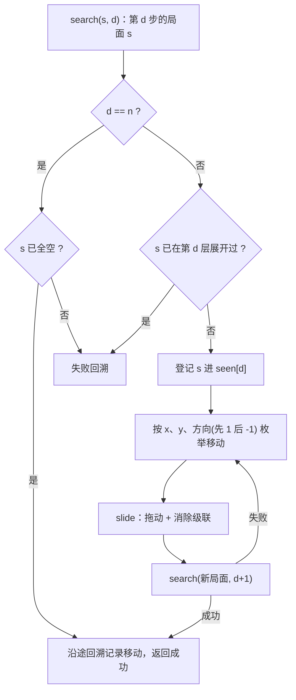

[[TOC]]

## 形式化题目

棋盘是 5 列（$x=0..4$）× 7 行（$y=0..6$）的网格，方块不能悬空，因此每一列天然是一个**自下而上的栈**：底部到某一高度连续有方块，上面全空。给定初始局面（保证没有可以立即消除的三连）和要求通关的步数 $n$，做如下定义。

**一次移动**：选中有方块的格子 $(x,y)$，横向拖动一格，目标列 $x\pm1$ 必须仍在棋盘内。

- 目标 $(x\pm1,y)$ 有方块：两块原地交换位置；
- 目标为空：该块从原竖列中抽出（原列上方的方块补落一格），再从目标位置掉落，直到不悬空。

**消除结算**：只要某一横行或某一竖列上出现连续三个或更多同色方块，所有满足条件的方块**同时**被消除——一次移动可以同时触发多组，行列共享某个方块时也只消一次；随后上方方块掉落，掉落过程中不做检查，落定后若又出现三连就继续消，如此反复直到局面稳定。

**目标**：用恰好 $n$ 次移动清空整个棋盘；存在多组解时按 $x$ 第一、$y$ 第二、方向 $1$ 优先于 $-1$ 取字典序最小的一组；不存在这样的移动序列则判定无解。

以题目样例（$n=3$）展示三步移动与消除级联的完整过程，每列写成自下而上的颜色序列，空列记作"空"：

| 阶段 | x=0 | x=1 | x=2 | x=3 | x=4 |
|---|---|---|---|---|---|
| 初始 | 1 | 2/1 | 2/3/4 | 3/1 | 2/4/3/4 |
| 第 1 步 拖动 (2,1)→ | 1 | 2/1 | 2/1/4 | 3/3 | 2/4/3/4 |
| 第 2 步 拖动 (3,1)→ | 1 | 2/1 | 2/1/4 | 3/4 | 2/3/3/4 |
| 第 3 步 拖动 (3,0)→ | 1 | 2/1 | 2/1/4 | 2/4 | 3/3/3/4 |
| 第 3 步 级联 1 | 1 | 1 | 1/4 | 4 | 4 |
| 第 3 步 级联 2 | 空 | 空 | 4 | 4 | 4 |
| 第 3 步 级联 3 | 空 | 空 | 空 | 空 | 空 |

这张表是后文所有规则的对照样本。前两步都只交换方块、没有凑出三连，说明**一次移动不一定会触发消除**；第 3 步把 $x=3$ 列的 $3$ 换到 $x=4$ 列底，于是竖列 $x=4$ 出现三个 $3$，而同一轮检查里 $y=0$ 行还有三个 $2$（$x=1..3$）——两组独立三连**同时**消除，这正是题面规则 a、b 的要求。掉落又依次凑出三个 $1$、三个 $4$，三轮级联后棋盘全空。

## 正解

### 思路

**朴素做法：把移动当转移，全枚举。** 每个局面的合法移动数是各列方块数之和的两倍（每块可左可右，边界列少一个方向），满盘 35 块时约 70 个分支；题面数据范围 $n \leqslant 5$，未剪枝的搜索树上界 $70^5 \approx 1.7\times10^9$，每个节点还要做一遍消除结算，直接枚举不可行。但深度只有 5 层这个事实同时说明：本题不需要更聪明的"数论式"结论，需要的是**把模拟做对做快、把重复状态剪掉**。

**第一步：状态压成列栈。** 因为方块不悬空，$5\times7$ 数组里的"空洞"信息是冗余的，整个局面只需 5 个自下而上的颜色序列。这样两种移动都能写成常数操作：

- 目标有方块 → 两列在高度 $y$ 处交换，两列交换后仍然实心，不需要先掉落；
- 目标为空 → 因为目标列实心且 $(x\pm1,y)$ 空，目标列高 $h\leqslant y$，方块不会被挡住，`源列弹出 y 处 + 目标列尾部插入` 一步同时完成"原列补落"和"落到目标列顶"。

消除则写成"标记 $\to$ 整组删除 $\to$ 循环"：横行用 `None` 补齐成定长 5 后扫连续段，竖列直接在栈上扫连续段，行列标记放进**同一个集合**再按列过滤——过滤本身就是掉落压实，外层循环到没有三连为止，正好实现"消除、掉落、再消除"的连锁。整个转移与棋盘尺寸同阶，是常数时间的纯函数，`tuple` 可哈希，局面可以直接进 `set`，连编码函数都省了。

**第二步：让搜索顺序等于输出顺序。** 题目要字典序最小的解，于是按 $x$ 升序 → $y$ 升序 → 方向先 $1$ 后 $-1$ 的顺序做深度优先搜索，走到第 $n$ 层时用"棋盘全空"判定成败：第一个成功的路径就是字典序最小解，因为所有字典序更小的前缀都会先被完整展开。相比之下 BFS 要按字典序排队所有路径，内存先爆；而 $n$ 由输入给定，也不需要迭代加深。

**第三步：剪枝。**

1. **同层去重**：同一层出现相同局面时，剩余步数相同、后续可行走法集合完全相同，先到的那次已经完整搜过（否则早已返回成功），后到的必然失败，直接跳过。注意 `seen` 必须**按层分桶**——判据是"恰好第 $n$ 步清空"，第 $d$ 层的子问题要求"再走 $n-d$ 步"，不同层的同局面不是同一个子问题，用全局 `set` 合并会丢解。
2. **无效移动**：目标出界不合法；目标方块与源方块同色时交换后局面完全不变，直接跳过。

单步结算与搜索主循环的流程如下：



流程图强调两件事：成功判定只发生在 `d == n` 的叶子上；`seen[d]` 的查询发生在枚举移动**之前**，所以整棵重复子树在入口处就被剪断，而不是展开后再发现重复。

### 代码

@include-code(./main.cpp, cpp)

@include-code(./main.py, python)

### 复杂度

- 时间复杂度：设按层去重后实际展开的局面总数为 $S$，方块总数 $B \leqslant 35$，则每个局面最多枚举 $2B$ 个移动、每次结算只做固定 $5\times7$ 的扫描（常数 $C$），总计 $O(S \cdot B \cdot C)$，即关于 $S$ 线性；未剪枝的搜索树上界为 $(2B)^n$，$n \leqslant 5$。
- 空间复杂度：$O(S \cdot B)$，保存各层已展开局面的集合；递归深度 $n \leqslant 5$，调用栈 $O(n)$。

## 总结

- 本题是"**小深度状态空间搜索 + 确定性模拟**"：难点不在算法思想，而在把交换、抽出、同时消除、连锁掉落这几条规则无遗漏地落成一个纯函数转移。
- 局面表示选对了，实现就短：列栈让"抽出 + 落地"变成一次 `pop` + 一次 `append`，让"掉落压实"变成一次过滤，让状态去重变成一个 `set`。
- 要字典序最小的解，就把枚举顺序写成字典序，第一个成功解无需比较。
- 去重必须分层：同层同局面才等价，跨层剩余步数不同，合并会丢解。
- 本解法复杂度与正解同阶；实测 10 组真实数据全部一致，最慢约 2.1s（本地限时 20s），Python 侧存在 OJ 限时风险但算法本身没有退化成暴力。

## 图示解析

这张图串起本题从建模到得到答案的主线：

```text
状态 = 5 个列栈（可哈希 tuple，35 格常数转移）
|- 单步结算：拖动(交换/抽出) → 同时标记消除 → 掉落压实 → 连锁
|- 搜索顺序：按 x、y、方向(先右后左) 的字典序 DFS，深度恰好 n
   `- 剪枝：同层去重 + 无效移动 → 首个全空局面即最小解，全失败则 -1
```

先看第一行的建模结论：它决定了后面所有操作都是常数代价；再沿两条分支检查——模拟保证"转移正确"，搜索顺序保证"答案字典序最小"，剪枝只砍掉与已展开子树完全同构的重复状态，不丢解。
