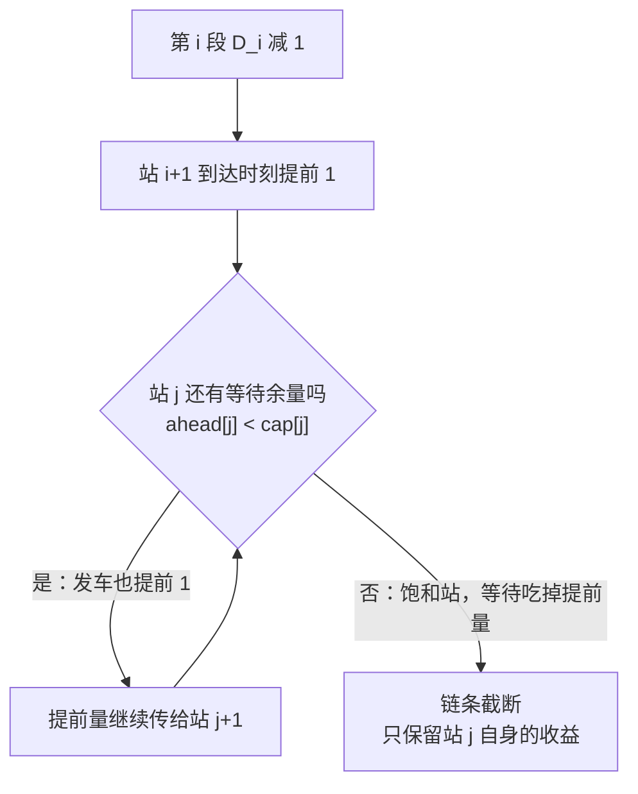

[[TOC]]

## 形式化题目

$n$ 个景点排成一条链，第 $i$ 段（景点 $i \to i+1$）行驶需要 $D_i$ 分钟。公交第 $0$ 分钟出现在景点 $1$，只能前进或在景点处等待，并且**必须等齐该站所有乘客才发车**，即

$$\mathrm{dep}[i] = \max\big(\mathrm{arrive}[i],\ W[i]\big),\qquad W[i] = \text{在景点 } i \text{ 上车的乘客的最晚到达时刻}.$$

$m$ 位乘客各在 $T_p$ 时刻到达景点 $A_p$、要去景点 $B_p$（$A_p < B_p$），旅行时间 $=$ 公交到达 $B_p$ 的时刻 $-\ T_p$。有 $k$ 个氮气加速器，每个可以把某段 $D_i$ 减 $1$（同一段可叠加，但必须保持 $D_i \geqslant 0$）。求所有乘客旅行时间总和的最小值。

样例（$n=3$，$D=[1,4]$，乘客 $(0,1,3),(1,1,2),(5,2,3)$，$k=2$）的时间线如下，用来说明"等齐再发车"和加速器的效果：

| 时刻 | 事件 | 说明 |
| --- | --- | --- |
| 0 | 公交到达景点 1 | 站 1 有乘客 1 分钟才到，等到 1 分发车 |
| 2 | 到达景点 2 | 发车时刻 $\max(0,1)$，再走 $D_1=1$ 分钟 |
| 5 | 从景点 2 发车 | 站 2 有乘客 5 分钟才到，$W[2]=5$，等到 5 分 |
| 7 | 到达景点 3 | 对 $D_2$ 用了 2 个加速器，$4 \to 2$ |

于是三位乘客的旅行时间为 $7-0=7$、$2-1=1$、$7-5=2$，总和 $10$。若不加速，公交 $9$ 分钟才到景点 3，总和是 $9+1+4=14$——加速器的全部收益，就在于让某些站的**到达时刻提前**。

## 正解

### 思路

**先把目标从"乘客"换成"站点"。** 乘客的 $T_p$ 与加速器无关，所以最小化总旅行时间等价于最小化 $\sum_p \mathrm{arrive}[B_p]$。按下车点聚合：记 $g_j$ 为在景点 $j$ 下车的乘客数，目标即最小化 $\sum_j \mathrm{arrive}[j]\cdot g_j$——只要知道哪些站的到达时刻被提前了、提前了多少，答案就出来了。

**朴素做法与瓶颈。** 最容易想到的贪心是：重复 $k$ 次，每次把某段 $D_i$ 减 $1$ 试算全部乘客的时间减少量，选减少最多的那条边真减。一次试算要模拟整条线路 $O(n+m)$，总复杂度 $O(k(n+m))$，按 $k \leqslant 10^5$、$m \leqslant 10^4$ 约 $10^9$ 次运算，必然超时。方向没有错（这正是本题的标准贪心），问题在于：相邻两次试算只差 1 分钟，**收益表几乎纹丝不动**，重算了 $k$ 遍几乎相同的状态。

**关键观察一：提前量沿链条传播，被"等待余量"截断。** 记 $a_j$ 为景点 $j$ 的到达时刻比原始时间线提前的分钟数。某段 $D_i$ 减 $1$ 后 $a_{i+1}$ 加 $1$，并尝试向下游传递；站 $j$ 的发车时刻提前量 $= \min(a_j,\ \mathrm{cap}[j])$，其中 $\mathrm{cap}[j]=\max(\mathrm{arrive}_0[j]-W[j],0)$ 是该站的**等待余量**——只要 $a_j < \mathrm{cap}[j]$，发车时刻就跟着提前，传递继续；一旦 $a_j$ 顶到 $\mathrm{cap}[j]$，等待把提前量吃掉，链条截断。$\mathrm{cap}$ 只由原始时间线决定，是常数；$\mathrm{cap}[j]=0$ 的站（或提前量已用满余量的站）称为**饱和站**，它自身的到达时刻仍能提前，只是不再向下游放行：

**关键观察二：单位收益只由饱和分布决定，$O(n)$ 求出全部。** 给第 $i$ 段再减 $1$，提前量从站 $i{+}1$ 出发，止于第一个饱和站（含该站）。所以第 $i$ 段的单位收益 $=$ 这条链上下车的乘客数：

$$\text{benefit}[i] = \sum_{j=i+1}^{R_i} g_j = \text{prefix}[R_i] - \text{prefix}[i],$$

其中 $R_i$ 是从 $i{+}1$ 起最近的饱和站（没有则为 $n$），$\text{prefix}$ 是 $g$ 的前缀和。一次倒序扫描得到"最近饱和站"数组后，$n-1$ 条边的收益全部 $O(n)$ 算完，选最大者。

**关键观察三：批量加速，轮数只与饱和事件有关。** 一次给选中的边注入 $t$ 个加速器，只要途中没有站**首次**饱和，收益表完全不动，$t$ 可以一路加到第一个事件为止：

- 某站首次饱和——全体站最多饱和 $n-1$ 次；
- 或该段耗尽（$X_i=D_i$）——最多 $n-1$ 次；
- 或加速器用完。

每轮必发生其中一种，故总轮数 $\leqslant 2n$，每轮 $O(n)$，总复杂度 $O(n^2+m)$，$k$ 的因子被彻底消掉。这与"逐个加速器、每次重算"产生完全相同的选边序列（批量只在收益恒定的区间内进行），只是把重复计算省掉了。

样例上的执行过程（$g_2=1$，$g_3=2$，$\mathrm{cap}[2]=\max(2-5,0)=0$，$\mathrm{cap}[3]=9$）：

| 轮次 | 收益链条 | 边 1 收益 | 边 2 收益 | 决策 |
| --- | --- | --- | --- | --- |
| 1 | 边 1 止于饱和站 2；边 2 链到终点站 3 | $g_2=1$ | $g_3=2$ | 选边 2，批量注入 $\min(k=2,\ D_2=4,\ \text{距饱和 }9)=2$ |
| 2 | 加速器已用完 | — | — | 停止，输出 $14-2\times 2=10$ |

站 2 一开始就是饱和站（$a_2=0 \geqslant \mathrm{cap}[2]=0$）：边 1 提前只会让公交更早到站 2，反正要等到 5 分——提前量被等待完全吃掉，这正是链条截断机制要表达的含义。

正确性上，目标对每段注入是凹的：链条上的 $\min$ 截断使边际收益只减不增，且不同段的注入竞争同一批等待余量（互相替代）。在这种结构下，把加速器逐个投给当前单位收益最大的边不会比任何分配差；而批量执行按"首次饱和"截停，与逐个执行严格等价。

### 代码

@include-code(./main.cpp, cpp)

@include-code(./main.py, python)

### 复杂度

- 时间复杂度：$O(n^2+m)$。预处理 $O(n+m)$；主循环每轮 $O(n)$，每轮至少触发一次"新饱和 / 边耗尽"，总轮数 $\leqslant 2n$。相比朴素的 $O(k(n+m))\approx 10^9$，消掉了 $k\leqslant10^5$ 的因子。
- 空间复杂度：$O(n)$，约十个长度为 $n$ 的数组，$n\leqslant1000$ 时仅几十 KB。
- 实测：20 组真实数据全部一致，单点 0.016--0.043 s、峰值内存 $\leqslant$ 17 MB，相对 1000 ms / 32 MB 的限制十分宽裕。

## 总结

这道题的三层转化是关键：总旅行时间 $\to$ 按下车点加权的到达时刻和 $\to$ 每站的"提前量" $a_j$ $\to$ 被等待余量 $\mathrm{cap}[j]$ 逐站截断的传播链条。收益结构一旦看清，贪心就是"每次把加速器投给链条上下车人数最多的那条边"；而"收益表只在站点首次饱和时才改变"这一事件性质，把 $O(k(n+m))$ 的逐个执行压成 $O(n^2+m)$ 的批量执行。

实现时注意三点：截断要用注入**前**的余量 `cap[j] - ahead[j]` 计算；饱和站自身的到达时刻仍算收益，链条"止于且包含"第一个饱和站；加速器耗尽或所有边收益为 0 时立即退出，避免无意义的空转。实测 20 组真实数据全部一致，样例输出 $10$。
