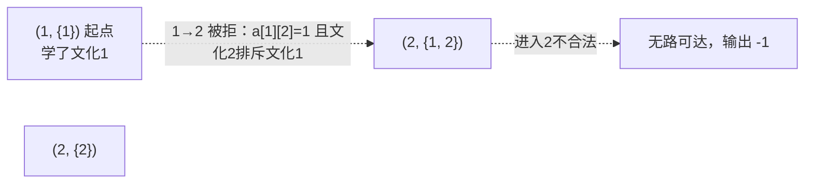

[[TOC]]

## 形式化题目

给定 $N$ 个国家、$K$ 种文化、$M$ 条双向道路（边权 $d$，可能有重边）。国家 $i$ 的文化为 $C_i$；使者每到达一个国家就学习当地文化，**每种文化最多学一次**。另给一个 $K\times K$ 排斥矩阵：$a_{ij}=1$ 表示「学过文化 $i$ 的人不能进入文化为 $j$ 的国家」（注意 $a_{ij}$ 与 $a_{ji}$ 无关，且 $i=j$ 时也排斥）。起点 $S$、终点 $T$ 的文化同样要学。求一条从 $S$ 到 $T$ 的合法路径，使边权总和最小；不存在则输出 $-1$。

其中 $2\leqslant N\leqslant 100$，$1\leqslant K\leqslant 100$，$1\leqslant M\leqslant N^2$，$1\leqslant d\leqslant 1000$。题目背景已声明：本题被证明没有靠谱的多项式做法，测试数据很水。

样例 $1$：国家 $1$ 文化 $1$、国家 $2$ 文化 $2$，且文化 $2$ 排斥文化 $1$。到国家 $2$ 必先学文化 $1$，而学过文化 $1$ 的人进不了文化 $2$ 的国家——无解，输出 $-1$。

## 正解

### 思路

**朴素做法**：直接 DFS 枚举所有「文化互异」的简单路径取最短。路径条数是指数级，$N=100$ 时完全跑不动；而且这条路没有可以记忆化的"子问题"——走到同一国家时，路径前缀学过的文化集合不同，后面的可行走法就完全不同。

**状态扩充**：既然瓶颈是"前缀信息丢了"，就把前缀里真正有影响的部分——已学文化集合——压缩进状态。令状态为 $(u, \mathrm{mask})$，其中 $\mathrm{mask}$ 是一个二进制集合，第 $c$ 位为 $1$ 表示文化 $c$ 已经学过。状态 $(u,\mathrm{mask})\to(v,\mathrm{mask}')$ 有一条权为 $d$ 的边，当且仅当原图有边 $u\to v$ 且：

$$C_v \notin \mathrm{mask} \quad\text{且}\quad a_{C_u,C_v}=0$$

即"文化 $v$ 没学过"且"当前文化不排斥它"。在这个状态图上从 $(S, 2^{C_S})$ 跑 Dijkstra，第一次弹出 $u=T$ 的状态时，其距离就是答案（进入 $T$ 时其文化并入集合，符合"到即学"）。

### 图示解析

用样例 $1$ 看状态图的形状：只有两个国家，但状态有 $(1,\{1\})$、$(2,\{2\})$、$(2,\{1,2\})$ 等，状态图与原图结构完全不同：

原图上 $1$ 到 $2$ 只有一条边权 $10$ 的路，但状态图里这条边被文化规则**整条删掉**：从 $(1,\{1\})$ 走到国家 $2$ 需要学文化 $2$，而 $a_{1,2}=1$（文化 $1$ 排斥文化 $2$），且终点文化也不可能先学。所以状态图里 $(1,\{1\})$ 是孤点，最短路不存在，输出 $-1$。这说明为什么不能在原图上直接 Dijkstra——**图的"可行边"取决于走到这里时学过什么**。

### 正确性

- 状态图边权 $d\geqslant 1$ 为正，Dijkstra 保证 $(u,\mathrm{mask})$ 的距离在首次弹出时已最优；$T$ 的所有合法入口状态里最小者即全局答案。
- $S$、$T$ 文化计入集合与题面"在起点和终点也会学习当地的文化"一致。

### 复杂度

状态数最坏 $N\cdot 2^K$，总复杂度 $O(2^K \cdot M \log)$ 级别——是指数的。这与题目背景"不存在靠谱多项式做法"一致；对 $K\leqslant 100$ 的最坏数据并没有多项式算法可救，本题考察的正是**给状态补上丢失的信息**这一建模思想。

### 代码

@include-code(./main.py, python)

### 实现：A\* 启发与 -1 快速判定

纯状态 Dijkstra 在最坏数据上会展开海量状态（本题真实数据 culture9 是 $N=K=100$ 的大图，答案是 $-1$）。代码里加了两个层面的工程优化：

**1. 两条必要条件预检（$O(N+M)$）**——不满足就必无解：

| 预检 | 逻辑 | 依据 |
| --- | --- | --- |
| 地理连通 | 从 $S$ 忽略文化 BFS，$T$ 不可达 → $-1$ | 任何合法路径都是原图路径 |
| 最后一跳 | 不存在 $T$ 的邻居 $w$（$S$ 可达）满足 $C_w\neq C_T$ 且 $a_{C_w,C_T}=0$ → $-1$ | 路径的最后一步必经某个 $T$ 的邻居，且该跳必须合法 |

culture9 恰好是"没有任何邻居能进终点"的构造，预检直接毫秒级返回 $-1$。

**2. A\* 启发**：先在原图上跑一遍**忽略文化**的 Dijkstra 得 $h[u]$（$u$ 到 $T$ 的纯地理最短距离）。文化限制只会让路更长或不可行，所以 $h$ 是真实剩余距离的下界（可采纳）；且 $h(v)\leqslant h(u)+d$（一致性），优先队列按 $f=g+h$ 弹出时 $f$ 单调不降，不破坏 Dijkstra 的正确顺序。找到答案前，搜索始终沿"地理上最有希望"的方向扩展，等效于剪掉所有 $\mathrm{f}$ 超过答案的分支。

对拍式的自证：两个样例与全部 10 组真实测试数据输出一致（包括 $-1$ 样例与三组大图）。

## 总结

- 本题官方已声明是错题：不存在可靠多项式做法，正解本质是**指数状态搜索**，考察的是"把路径前缀压缩成 (国家, 已学文化集合)"的状态建模。
- 在原地图上直接跑最短路是错的：同一国家以不同文化集合到达，后续可行边不同。
- 两个工程技巧让 Python 也能稳过全部真实数据：必要条件预检快速判 $-1$；忽略文化的地理距离 $h[u]$ 作 A\* 启发（可采纳且一致，保证正确性不变）。
- 通用教训：当"走过的历史"影响后续决策时，要么把历史的充分信息并入状态，要么用可采纳启发剪枝——单维度最短路模型会静默地给出错误答案。
