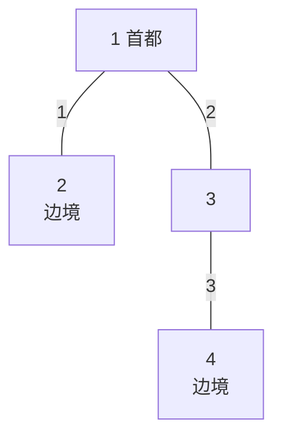

[[TOC]]

## 形式化题目

给定一棵 $n$ 个点的无根树，1 号点为根（首都）。要求选出若干个**非根**点建立检查点，使根到每个叶子的路径上都至少经过一个检查点。现有 $m$ 支军队，初始驻扎在给定节点（允许同点驻扎多支，保证不在根）。每支军队可以沿树边移动，并且**恰好**在一个非根节点建立一处检查点；走过一条长度为 $w$ 的边耗时 $w$，不同军队同时行动，总时间等于最慢那支军队的耗时。求控制疫情的最少时间；若无法做到，输出 $-1$。

样例中 $n=4$，边为 $1-2$（长 $1$）、$1-3$（长 $2$）、$3-4$（长 $3$），两支军队都在 2 号点：

观察这棵树：叶子是 2 和 4，根到它们的路径分别是 $1\to2$、$1\to3\to4$。一支军队原地在 2 号点设卡，第二支从 2 号点经首都走到 3 号点设卡，同时封锁两条路径，耗时 $1+2=3$ 小时，故输出 3。

## 正解

### 思路

**朴素做法**：枚举每支军队的最终驻扎点与检查点位置组合，再逐一验证叶子路径，是指数级的，无法承受 $n \leqslant 50000$。需要把"军队怎么走"和"全局是否覆盖"两件事分开优化。

**观察一：能上跳就上跳（支配关系）。** 检查点越靠近根，覆盖的叶子越多。一支从 $v$ 出发的军队若停在祖先 $u$，就能覆盖整棵 $u$ 的子树；从 $u$ 继续上移到父亲只会让覆盖范围变大，耗时也不增加。因此对任何军队，**在时限内停到最高可达的祖先永远不劣于停在更低处**——但首都本身不能设卡，所以"最高"要区分两类情况：

1. 走不到首都（$x < \mathrm{dist}[v]$）：唯一最优解是停在可达的最高祖先 $u \neq 1$，用倍增在 $O(\log n)$ 内求出；
2. 走得到首都（$x \geqslant \mathrm{dist}[v]$）：走到首都本身不产生覆盖，但获得了**机动性**——既可以在上跳途中顺路停在原孩子 $\mathrm{son}$（代价 $\mathrm{dist}[v]-w(1,\mathrm{son}) \leqslant \mathrm{dist}[v] \leqslant x$，恒可行），也可以继续走到首都、再下到其他孩子 $c$（要求剩余时间 $\mathrm{rest}=x-\mathrm{dist}[v] \geqslant w(1,c)$）。

**观察二：答案单调，二分时间。** 若 $x$ 小时可行，则 $x+1$ 也一定可行（军队只会走得更远），于是二分答案，只需求出判定函数 $\mathrm{check}(x)$。

**观察三：需求总在根的孩子这一层。** 根的孩子 $c$ 被"覆盖"当且仅当 $c$ 的子树里每条到叶子的路径都有检查点。自底向上统计即可：$\mathrm{cov}[u] = $（$u$ 处有军队）或（$u$ 的所有孩子都被覆盖；叶子则只看自己）。没有被覆盖的根的孩子就是当前的需求，一支军队把检查点建在 $c$ 上就能一次性解决 $c$ 的全部需求。

于是 $\mathrm{check}(x)$ 按以下顺序执行：

1. **上跳分流**：走不到首都的军队停在最高可达点并打标记；走得到首都的按剩余时间 $\mathrm{rest}$ 升序收集（按到根时长降序排序即得）。
2. **覆盖统计**：自底向上求出每个根的孩子是否已被标记的军队覆盖。
3. **"回不去"特判**：对走到首都的军队，若原孩子 $c$ 还没被覆盖、且 $\mathrm{rest} < w(1,c)$（从首都下不回去了），就直接让它原路停在 $c$ 处，把 $c$ 的需求消掉——这是"决策包容性"：这种军队留在原地只会比把它投到别处更优，因为它离开原孩子后就再也无法解决 $c$ 了。反之若 $\mathrm{rest} \geqslant w(1,c)$，它既能解决 $c$ 也能解决别人，先进匹配池不亏。
4. **双指针匹配**：剩下的需求按边权升序，匹配池（剩余时间升序）里每次取"第一个够用"的军队，能全部配上则 $x$ 可行。

**无解判定**：一个根的孩子必须有至少一支军队进入其子树，且一支军队只能覆盖一个孩子，因此 $m <$ 根的孩子数时直接输出 $-1$；否则把二分上界取为全树边权和 $\Sigma w$，此时所有军队都能走到首都且剩余时间充足，必可行。

以样例演示 $\mathrm{check}$ 的分流与匹配（两支军队初始都在 2 号点，$\mathrm{dist}=1$，根之子为 2（边权 1）和 3（边权 2））：

| 二分值 $x$ | 分流 | 覆盖统计与特判 | 双指针匹配 | 结论 |
| --- | --- | --- | --- | --- |
| $x=2$ | 两军都能到首都，剩余各 $1$ | 无标记，根之子 2、3 均为需求；$\mathrm{rest}=1 \nless w(1,2)=1$，特判不触发，全部进池 $[1,1]$ | 需求 2（$w=1$）配到 $1$；需求 3（$w=2$）池中只剩 $1$，不够 | 不可行 |
| $x=3$ | 两军都能到首都，剩余各 $2$ | 同上，进池 $[2,2]$ | 需求 2 配 $2$，需求 3 配 $2$ | 可行 |

二分最终落在最小可行值 3，与题解样例一致。注意若把"走到首都的军队只能从首都往下走"作为模型，样例之外会出现把顺路停在原孩子的情况误判为不可行的漏洞，特判第 3 步正是为此补上。

### 代码

@include-code(./main.cpp, cpp)

@include-code(./main.py, python)

### 复杂度

设二分轮数为 $T = O(\log \Sigma w)$。每轮中：军队倍增上跳共 $O(m\log n)$，自底向上的覆盖统计与贪心匹配均为 $O(n + m)$，排序（军队按到根时长、根的孩子按边权）均在读入后预处理完成，轮内无需再排。总时间复杂度 $O(T\cdot(m\log n + n))$，空间 $O(n\log n)$（倍增表）。与标准 C++ 解法同阶；$n = m = 50000$ 时 Python 可能面临 TLE 风险，但算法本身不引入额外量级。

## 总结

本题是"二分答案 + 倍增 + 贪心匹配"的组合：二分把最优化问题转为判定问题；"上跳支配"把每支军队的走法收敛为唯一的最高停点或一份剩余时间；"需求只在根的孩子层"把覆盖验证压成一次自底向上统计；最后用"回不去原孩子就留在原地"的特判加双指针匹配完成判定。$m$ 小于根的孩子数即无解，否则全树边权和是可行上界。
