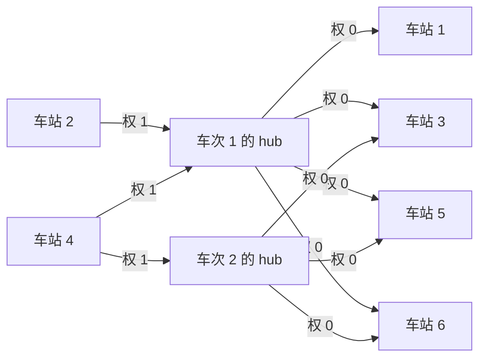

[[TOC]]

## 形式化题目

单向铁路线上有 $n$ 个编号为 $1, 2, \dots, n$ 的车站，每站有一个级别，最低为 $1$ 级。给定 $m$ 趟车次，第 $i$ 趟给出 $s_i$ 个升序排列的停靠站编号。每趟车次都满足停靠规则：

> 若车次停靠站 $x$，则它始发站到终点站之间所有级别不低于 $level(x)$ 的站都必须停靠（始发站、终点站算作已知停靠）。

等价地，对每趟车次，区间内每个**不停靠**的中间站 $x$ 与每个**停靠**站 $y$ 都必须满足

$$level(x) < level(y).$$

要求在满足全部 $m$ 趟车次约束的前提下，求 $n$ 个车站最少可以划分成多少个不同级别。

样例一中，车次 `1 3 5 6` 迫使中间站 `2, 4` 低于 `1, 3, 5, 6`，车次 `3 5 6` 迫使中间站 `4` 低于 `3, 5, 6`，而 `7, 8, 9` 没有任何约束：

| 车站 | 在车次中的角色 | 最低级别 |
| --- | --- | ---: |
| `2, 4` | 只作中间站，须低于全部停靠站 | `1` |
| `1, 3, 5, 6` | 停靠站，须高于 `2, 4` | `2` |
| `7, 8, 9` | 不在任何车次区间内 | `1` |

所以样例一答案为 $2$。样例二增加车次 `1 5 9` 后拼出链 $2 < 3 < 5$——`3` 在车次 1 中是停靠站、在车次 3 中是中间站——至少需要 $3$ 个级别，答案为 $3$。

## 正解

### 思路

**第一步：把严格不等式建成 DAG。** 每条约束 $level(x) < level(y)$ 写成有向边 $x \to y$，含义是 $level(y) \geqslant level(x) + 1$。输入保证存在合法赋值，说明图中无环。此时有两个结论：

- **最长链给出下界**：一条 $L$ 个节点的链上级别必须严格递增，$L$ 个节点互不相同，至少需要 $L$ 个级别；
- **拓扑定级给出匹配方案**：按拓扑顺序赋 $level[v] = \max(level[v], level[u] + 1)$（初值 $1$，即最低级别）满足全部边，最大值恰好等于最长链长度。

上下界相等，因此**最少级别数 = 约束图的最长链长度**。

**第二步：朴素逐对建图的瓶颈。** 最直接的做法是每趟车对"每个中间站 $\times$ 每个停靠站"逐对连边，单趟最坏 $O(n^2)$ 条边，$m$ 趟合计 $O(mn^2) = 10^9$，建图本身就不现实。瓶颈在边数，而约束结构其实高度重复。

**第三步：每趟车一个虚拟节点。** 同一趟车的全部逐对约束等价于"每个中间站都低于该车次停靠站中的最低级别"：

$$level(x) < \min_{y \in S} level(y), \quad \forall x \in M.$$

于是为第 $i$ 趟车引入虚拟节点 `hub` 承接这个下界，把乘积改成求和：

- 中间站 $\to$ hub，边权 $1$：$level[\text{hub}] \geqslant level(x) + 1$；
- hub $\to$ 每个停靠站，边权 $0$：$level(y) \geqslant level[\text{hub}]$。

两条边合起来给出 $level(y) \geqslant level(x) + 1$，恰好还原全部逐对约束；反过来，任意满足逐对约束的赋值取 $level[\text{hub}] = \max_{x \in M} level(x) + 1$ 也满足这两条边，所以压缩与逐对建图**完全等价**。下面用样例一展示压缩后的建图：

图中每趟车的中间站先经权 $1$ 边把 hub 抬到"最大中间站级别 $+1$"，hub 再用权 $0$ 边把这个下界一次性传给全部停靠站。若逐对连边，`车站 4` 需要向车次 1 的 4 个停靠站、车次 2 的 3 个停靠站共连 7 条边；有了 hub，每个中间站只出 1 条边，每趟车的边数从"中间站数 $\times$ 停靠站数"降为"中间站数 $+$ 停靠站数"。

!!! warning 常见错误：只连相邻停靠站
"中间站 < 相邻停靠站"推不出"中间站 < 更远的停靠站"，会漏掉跨车次拼链所需的边、低估答案。用官方 10 组真实数据实测，这种建图在其中 7 组上输出偏小（例如输出 11 而正确答案 53）。
!!!

**第四步：0/1 权拓扑最长路定级。** 对压缩后的图做 Kahn 拓扑排序：节点出队时用 $level[v] = \max(level[v], level[u] + w)$ 更新后继，入度减到 $0$ 再入队（保证前驱全部定级）。边权只由源点类型决定——车站出边权 $1$、hub 出边权 $0$——所以邻接表只需存终点，出队时用 `out_w = 1 if u <= n else 0` 取权。最后答案取 `max(level[1..n])`，虚拟节点只是中转下界，不计入级别数。

### 代码

@include-code(./main.py, python)

### 复杂度

- **时间**：建图每趟车扫描长度不超过 $n$ 的区间，共 $O(nm)$；边数 $E = O(nm)$，拓扑一遍 $O(V + E) = O(nm)$。合计 $O(nm)$，在 $n, m \leqslant 1000$ 时约 $10^6$。
- **空间**：邻接表 $O(nm)$ 条整数边，另有 $O(n + m)$ 的入度与级别数组。
- **实测**：官方 10 组数据全部输出一致，单组最慢 $0.13\text{s}$（限制 $1\text{s}$），峰值内存最大约 $84\text{MB}$（限制 $32\text{MB}$，按 python-oj-short 约定允许 MLE；同一算法的 C++ 实现无此问题）。

## 总结

- 全是 $a < b$ 的严格不等式约束：建 DAG，**最长链长度即最少级别数**，拓扑定级同时给出最优赋值。
- 同一趟车的逐对约束等价于"中间站 < 停靠站下界"，用**每车次一个虚拟节点**把 $O(n^2)$ 条边压成 $O(n)$ 条，总复杂度 $O(nm)$。
- 约束链只能**跨车次**拼长：一个站在某趟车是停靠站、在另一趟车是中间站，链才得以延伸；只看单趟车的相邻关系必然低估答案。
