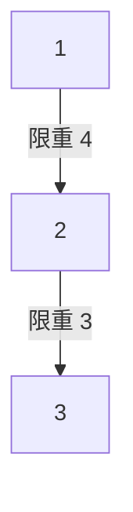

[[TOC]]

## 形式化题目

给定 $n$ 个点、$m$ 条带权无向边的图，边权为该边的「限重」。
$q$ 个询问：求点 $x$ 到点 $y$ 的所有路径中，**路径上最小边权的最大值**（瓶颈路）；若两点不连通输出 $-1$。
数据范围：$n < 10^4$，$m < 5 \times 10^4$，$q < 3 \times 10^4$，$0 \leqslant z \leqslant 10^5$，两座城市之间可能有多条道路。

## 正解

### 思路

#### 1. 朴素做法为什么不行

最直接的想法是：对每个询问，在图上枚举 / 搜索从 $x$ 到 $y$ 的所有路径，分别记录路径最小边权，取最大值。路径数量是指数级的，即使加剪枝，$q$ 高达 $3 \times 10^4$ 个询问也完全不可行。瓶颈在于：**每次询问都在"重新看一遍整张图"**，而询问之间其实共享大量结构。

#### 2. 关键观察：答案一定在最大生成树上

把答案换个说法：$x$ 到 $y$ 能运的货物最重是 $W$，等价于 **只保留限重 $\geqslant W$ 的边** 时 $x$ 与 $y$ 连通。

现在考察最大生成树的 Kruskal 构造过程：把所有边按限重**从大到小**排序，依次加入能用（不形成环）的边。设阈值 $W$，考虑"只保留限重 $\geqslant W$ 的边"的图 $G_W$，以及"最大生成树删去限重 $< W$ 的树边"得到的森林 $T_W$：

- Kruskal 扫到限重 $\geqslant W$ 的边时，它与在 $G_W$ 中做"不断合并连通块"的过程完全一致——两者最终形成的连通块集合相同。

于是 $x, y$ 在 $G_W$ 中连通 $\iff$ $x, y$ 在 $T_W$ 中连通。令 $W^\*$ 为树上 $x$ 到 $y$ 路径的最小边权，那么：

- $W \leqslant W^\*$ 时，路径上每条边限重都 $\geqslant W$，两点在 $T_W$ 中沿这条路径连通，原图也连通；
- $W > W^\*$ 时，树路径被切断，$T_W$ 中两点不连通，原图同样不连通。

所以 **$x, y$ 的答案恰好等于最大生成树上 $x$ 到 $y$ 路径的最小边权**。一句话：货车总可以放弃一些限重小的边不走，最优方案只需要 $n-1$ 条树边。

#### 3. 树上查询：倍增

树定根后（BFS 确定父亲和深度），询问"路径最小边权"可以用倍增解决。定义：

- $up[k][v]$：$v$ 往上走 $2^k$ 步到达的祖先；
- $mn[k][v]$：$v$ 往上走 $2^k$ 步这段路上**最小的边权**。

递推式：
$$up[k][v] = up[k-1][\,up[k-1][v]\,]$$
$$mn[k][v] = \min\big(mn[k-1][v],\ mn[k-1][\,up[k-1][v]\,]\big)$$

查询 $(x, y)$ 时，与求 LCA 完全同套路，只是每次"跳"的时候顺带对 $mn$ 取 min：

1. 若两点不连通（最终并查集代表元不同），直接输出 $-1$；
2. 把较深的一方按二进制拆分提升到与另一方同深度，沿途累计最小边权；
3. 若此时两点重合，答案已经算出；
4. 否则两点一起从高往低试：$2^k$ 级祖先不同就一起跳上去，最后停在 LCA 的下一层，再把最后一步的边权计入。

### 图示解析

以样例为例：4 座城市，道路 $1\!-\!2(4)$、$2\!-\!3(3)$、$3\!-\!1(1)$。Kruskal 按限重从大到小加边：

| 顺序 | 边 | 限重 | 动作 |
| --- | --- | --- | --- |
| 1 | $1-2$ | 4 | 加入 |
| 2 | $2-3$ | 3 | 加入 |
| 3 | $3-1$ | 1 | 会成环，舍弃 |

最大生成树（以 1 为根）：

查询 $1 \to 3$：路径是 $1 \xrightarrow{4} 2 \xrightarrow{3} 3$，瓶颈 = $\min(4,3) = 3$，与样例输出一致。被舍弃的 $3\!-\!1(1)$ 永远不会被最优路线用到——它正是"能被更宽的绕路取代"的那类边。

查询 $1 \to 4$：城市 4 不在任何树中，并查集判出不连通，输出 $-1$。

### 代码

@include-code(./main.cpp, cpp)

@include-code(./main.py, python)

实现上的两个要点：

- **图可能不连通**：生成树实际是森林。`build_tables` 里对每个还没访问过的点都做一次 BFS；`query` 开头用 Kruskal 遗留下来的最终并查集判断连通性。
- **哨兵与 $z=0$**：限重可以为 0，所以查询的初值必须设成 $+\infty$（`INF`）而不是 0，否则有 0 限重边的数据会算错。

### 复杂度

- 时间：Kruskal 排序 $O(m \log m)$；BFS 建树 $O(n + m)$；倍增表 $O(n \log n)$；每个询问 $O(\log n)$，共 $q$ 个 → 总计 $O\big(m \log m + (n + q)\log n\big)$，对 $n < 10^4$、$m < 5 \times 10^4$、$q < 3 \times 10^4$ 绰绰有余。
- 空间：倍增表 $O(n \log n)$，约 $10^4 \times 14$ 个整数，远小于 32MB 限制。
- 注：Python 版在最大数据上实测约 0.9s/测例，OJ 限时 1s 属于贴线（算法本身复杂度与 C++ 正解同阶）。

## 总结

- 这道题的钥匙是一个**等价转换**：「最大载重」=「瓶颈路径」=「只保留限重 $\geqslant W$ 的边时是否连通」，而这个连通性恰由最大生成树刻画，于是 $q$ 个图上询问全部塌缩成树上的路径最小值。
- 树上路径极值 + 多组询问的标准武器是**倍增 LCA**：一张 $2^k$ 跳表，跳的时候多带一维 min 就能回答路径 min。
- 容易漏的边界：图不连通（森林）、答案为 0（哨兵初值不能取 0）、重边（Kruskal 天然处理）。
