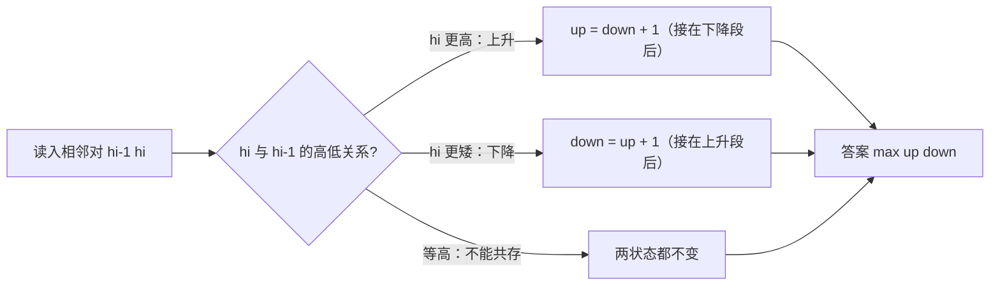

[[TOC]]

## 形式化题目

给定长度为 $n$ 的整数序列 $h_1, h_2, \ldots, h_n$。从中删去若干项（保持相对顺序）得到序列 $g_1, g_2, \ldots, g_m$，要求 $m$ 尽量大，且下面两个条件至少一个成立：

- 条件 A（偶数位是"峰"）：对所有 $2 \leqslant 2i \leqslant m$，有 $g_{2i} > g_{2i-1}$ 且 $g_{2i} > g_{2i+1}$；
- 条件 B（偶数位是"谷"）：对所有 $2 \leqslant 2i \leqslant m$，有 $g_{2i} < g_{2i-1}$ 且 $g_{2i} < g_{2i+1}$。

当 $m = 1$ 时两个条件同时成立。求最大的 $m$。

即：在 $h$ 中选一个尽量长的子序列，使得相邻两项的高低关系**交替**出现——要么是"峰谷峰谷……"型，要么是"谷峰谷峰……"型（波浪形序列）。

**样例**：`5 3 2 1 2` 中留下第 $1,4,5$ 株，高度 `5 1 2`：$g_2 = 1$ 满足 $1 < 5$ 且 $1 < 2$，是谷（条件 B），$m = 3$。

## 正解

### 思路

最直接的想法是子序列 DP：设 $u_i$ 为以 $h_i$ 结尾、末段**上升**的最长波浪子序列长度，$d_i$ 为以 $h_i$ 结尾、末段**下降**的长度，转移为

$$u_i = \max_{j < i,\ h_j < h_i} d_j + 1, \qquad d_i = \max_{j < i,\ h_j > h_i} u_j + 1.$$

这是 $O(n^2)$，$n = 10^5$ 会超时。能否只比较**相邻**两项？关键在下面两条观察：

**观察 1：最优解的结尾可以往后挪。** 如果某个"末段下降"的最优子序列结尾在位置 $j$，而 $j$ 之后还有某株更矮（或等矮）的花，把它接到结尾不破坏波浪性，长度还不减。也就是说：处理到位置 $i$ 时，**前缀的最优答案总可以被调整成以 $i$ 附近结尾**，于是不必记录"以哪个下标结尾"，只保留两个全局值即可。

**观察 2：只有相邻高度关系有意义。** 设滚动变量：

- `up` = 到当前位置为止，末段上升的波浪子序列的最大长度；
- `down` = 到当前位置为止，末段下降的波浪子序列的最大长度。

扫一遍 $h$，对相邻对 $(h_{i-1}, h_i)$：

- $h_i > h_{i-1}$（新花更高）：上升段只能接在下降段后面 → `up = down + 1`；此时**不**更新 `down`。
- $h_i < h_{i-1}$（新花更矮）：对称地 `down = up + 1`，不更新 `up`。
- $h_i = h_{i-1}$：等高的花不能共存于波浪序列中，跳过。

这里有一个微妙但关键的点：**连续同向的比较不会让值虚增**。例如一路下降 `5 3 2 1`，`up` 始终是 1，每步 `down = up + 1` 赋的都是同一个 2——它不会涨成 3、4。这正是我们想要的：`5 3 2 1` 并不是合法的"谷峰"波浪序列（波浪要求高低关系交替），而滚动赋值"同向不叠加"恰好排除了连续同向。反过来，只要高低关系真的交替了一次，接龙才会让长度 $+1$。

用样例 `5 3 2 1 2` 推演（初始 `up = down = 1`）：

| $i$ | $h_i$ | 与前一项比较 | 动作 | `up` | `down` |
|:---:|:-----:|:------------|:-----|:----:|:------:|
| 0 | 5 | 初始 | — | 1 | 1 |
| 1 | 3 | $3 < 5$，下降 | `down = up + 1` | 1 | 2 |
| 2 | 2 | $2 < 3$，下降（同向） | `down` 赋回 2，不变 | 1 | 2 |
| 3 | 1 | $1 < 2$，下降（同向） | `down` 赋回 2，不变 | 1 | 2 |
| 4 | 2 | $2 > 1$，上升（转向） | `up = down + 1` | 3 | 2 |

答案 $\max(3, 2) = 3$，对应 `5 1 2`，与样例一致。

两个滚动变量各自记录"最后一次转向"的信息，整个算法只有一次线性扫描。

### 代码

@include-code(./main.py, python)

### 复杂度

- 时间：$O(n)$，一次扫描，每步 $O(1)$。
- 空间：$O(n)$ 存高度数组（读入所需；逻辑上只需 $O(1)$ 个变量）。

## 图示解析

### 波浪的两种形状与"转向接龙"

下图展示扫描时的状态机：每读入一株新花，按它与前一株的高低关系在 `up` / `down` 两个状态间接龙：

把状态机套到样例 `5 3 2 1 2` 上，保留方案 `5 1 2`（先降后升的"谷型"波浪，满足条件 B）对应这样一条路径：

| 步骤 | 高度比较 | 走的分支 | 保留的花 |
|:----:|:--------|:---------|:--------|
| 初始 | — | `up = down = 1` | `5` |
| 1 | $3 < 5$，下降 | `down = up + 1 = 2` | `5 3`（末段下降） |
| 2 | $2 < 3$，下降（同向） | `down` 赋回 2，不变 | 仍 `5 3` |
| 3 | $1 < 2$，下降（同向） | `down` 赋回 2，不变 | 换成 `5 1`，长度不变 |
| 4 | $2 > 1$，上升（转向） | `up = down + 1 = 3` | `5 1 2` |

观察要点：

- 全序列 `5 3 2 1 2` 中间有一段连续下降 `5>3>2>1`，高低关系没有交替，不是合法波浪；
- 状态机里"同向下降"三次都走 `down = up + 1`，赋的是同一个 2 —— 连续同向不会叠加长度，这恰好把 `5 3 2 1` 这类非法序列排除在外；
- 直到 $h_4 = 2 > h_3 = 1$ 出现**转向**，`up` 才从 2 变成 3，得到最优解 `5 1 2`，答案 3。

## 总结

- 本题是经典的**最长抖动（摆动）子序列**：合法保留方案等价于相邻高低关系交替的子序列。
- 朴素 $O(n^2)$ 子序列 DP 中，利用"最优解结尾可往后挪"的交换论证，把转移压缩成相邻比较，得到两个滚动变量 `up` / `down` 的 $O(n)$ 解。
- 实现要点：上升时 `up = down + 1` 且不动 `down`，下降对称，等高跳过；连续同向的赋值天然不叠加，保证了波浪的交替性。
