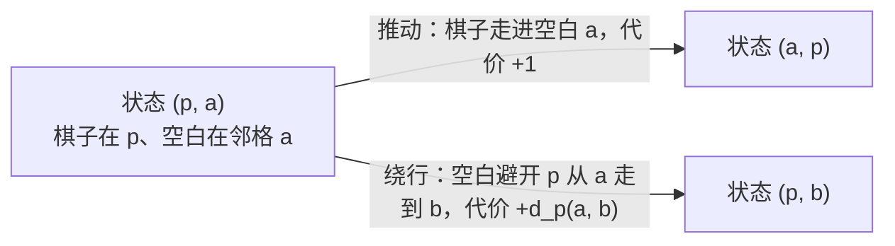

[[TOC]]

## 形式化题目

- 棋盘为 $n \times m$ 网格，每格标记为**固定格**（永远不动）或**可移动格**；恰有一个可移动格上是空白，其余格子各有一枚棋子。每秒执行一次操作：把与空白相邻（有公共边）的任意棋子移进空白，二者交换。
- 固定/可移动的布局在所有询问中保持不变，共 $q$ 次询问；第 $i$ 次给定空白初位置 $E_i$、指定棋子初位置 $S_i$、目标格 $T_i$。
- 对每次询问求：把指定棋子移动到目标格的最少操作次数；不可能完成输出 $-1$。

样例输入与输出：

```text
3 4 2
0 1 1 1
0 1 1 0
0 1 0 0
3 2 1 2 2 2
1 2 2 2 3 2
```

```text
2
-1
```

第一次询问的初始局面（空白 $(3,2)$、目标棋子 $(1,2)$、目标位置 $(2,2)$）：

| 行 \ 列 | 1 | 2 | 3 | 4 |
| --- | --- | --- | --- | --- |
| 1 | ✕ | ● | ○ | ○ |
| 2 | ✕ | ◎ | ○ | ✕ |
| 3 | ✕ | □ | ✕ | ✕ |

图例：✕ 固定格，○ 普通棋子，● 目标棋子（初始在 $(1,2)$），□ 空白，◎ 目标位置（$(2,2)$，当前由普通棋子占据）。

- 第一次询问答案 $2$：空白先向上走一步（$(2,2)$ 的普通棋子下移填补），目标棋子再向下走一步进入 $(2,2)$。
- 第二次询问答案 $-1$：目标格 $(3,2)$ 是只与 $(2,2)$ 相邻的死胡同。空白每次钻进 $(3,2)$ 都只能从 $(2,2)$ 挤进去，把 $(2,2)$ 留给刚从 $(3,2)$ 被顶出来的那枚棋子，此后唯一合法操作又只是把它换回去。而目标棋子踏入 $(3,2)$ 必须同时满足"自己在 $(2,2)$、空白在 $(3,2)$"——这个局面永远不会出现，因此无解。

## 正解

### 思路

**朴素思路与瓶颈。** 最直接的想法是对"整盘棋子怎么摆"做广搜，状态数是组合级的，完全不可行。注意到除目标棋子外的其它棋子没有任何身份要求——空白走到任意可移动格，把那里的棋子顶出来即可——于是状态只需记录二元组 $(p, e)$：目标棋子所在格与空白所在格；转移只有"推动"（空白与棋子交换）和"空白走一步"两种单位代价操作。但这样仍有 $K(K-1) = O(K^2)$ 个状态（$K = nm \leqslant 900$），单次询问 $O(K^2)$，$q = 500$ 时总量约 $4 \times 10^8$，即使 C++ 也很吃力——这就是要消除的瓶颈。

**关键观察。**

1. 除第一次推动外，每次推动后空白都恰好落在棋子的原位置，也就是**与新棋子位置相邻**。空白走到不与棋子相邻的格子时不可能发生推动，它只是在绕向棋子的下一个邻格，中间位置不携带任何信息。
2. 空白在除棋子格外的所有可移动格上都能自由穿行（顶开普通棋子），每步代价恒为 $1$；换言之，"空白从 $a$ 绕到 $b$、全程避开棋子格 $p$"的代价就是在 $F \setminus \{p\}$ 上的最短路，记作 $d_p(a, b)$。
3. 因此状态只需记录"空白在棋子的哪个邻格上"：压缩为 $(p, a)$，其中 $a \in N(p)$（$p$ 的四方向邻格中可移动的格子），总数不超过 $4K$。

**两类转移。** 下图展示压缩状态之间的两条边：



推动边 $(p, a) \to (a, p)$ 是一步真实交换；交换后空白位于 $p$，而 $p$ 与 $a$ 相邻，状态不变量"空白在棋子邻格上"得以保持。绕行边 $(p, a) \to (p, b)$ 把空白 $O(K)$ 的绕行收成一条边，代价直接取最短路 $d_p(a, b)$：逐格走和一步到位等价，但避免了在每条状态边上重复展开行走。

**初始段。** 首次推动前，空白可能离 $S$ 很远。空白从 $E$ 出发、全程避开 $S$ 做一次 BFS，得到到各 $a \in N(S)$ 的距离，把 $\{(S, a)\}$ 作为起点即可。

**为什么用 Dijkstra。** 推动代价为 $1$，而网格上棋子 $p$ 的任意两个邻格不共边（四个方向两两错开），绕行代价 $d_p(a, b) \geqslant 2$ 或不可达——边权不全为 $1$，普通 BFS 与 0-1 BFS 都不适用。用堆跑 Dijkstra，某状态**首次弹出**时若棋子已在 $T$，其代价即答案（首次弹出即最短，所以终点在弹出时判定而不是在入堆时）。

**预处理代价。** $d_p$ 依赖棋子位置 $p$，但棋盘固定：用 `@cache` 以 $(p, a)$ 为键，在第一次用到时才 BFS。整个运行至多 $4K$ 次 BFS、总计 $O(K^2)$，被所有询问摊还共享，单次询问只剩 $O(K \log K)$ 的 Dijkstra。

**正确性。** 充分性：压缩图的每条边都能展开成真实操作序列（推动是一步交换；绕行沿 $F \setminus \{p\}$ 上的最短路逐格顶开普通棋子）。必要性：任何真实操作序列按"推动"切段，推动前空白必在棋子邻格，段内行走用 $d_p$ 最短路边替换不会变长，首次推动前用初始 BFS 距离同理。所以压缩图上的最短路恰好等于原问题的最少步数。

**边界。** $S = T$ 时答案为 $0$（真实数据中存在此类询问）；$S$、$T$、$E$ 落在固定格、或空白根本到不了 $S$ 的邻格时输出 $-1$；样例第二次询问的死锁在压缩图上恰好表现为 $T$ 不可达。

### 代码

代码中 `blank_dist` 是“空白避开棋子格”的单源 BFS，同时服务初始段与绕行距离；`near_dist` 是 `@cache` 缓存的 $d_p(a, \cdot)$，返回值与 `adj[p]` 对齐；`play` 是单次询问的 Dijkstra 主循环。

@include-code(./main.cpp, cpp)

@include-code(./main.py, python)

### 复杂度

- **时间**：单次询问为初始 BFS $O(K)$ 加 Dijkstra $O(4K \log 4K)$，合计 $O(K \log K)$；绕行距离缓存整个运行至多 $4K$ 次 BFS，总计 $O(K^2)$。整体 $O(K^2 + qK \log K)$，与 C++ 正解（压缩状态图 + 绕行最短路 + Dijkstra）同阶。
- **空间**：邻接表、缓存（$\leqslant 4K$ 个键 $\times$ 每键 $\leqslant 4$ 个距离）、单询问状态与堆均为 $O(K)$，峰值远低于 $32$ MiB。
- **实测**：官方样例输出 $2$ / $-1$；`verify.sh` 全量 20 组真实数据 PASS，单组最慢 $0.19$ s、峰值内存 $< 16$ MB。

## 总结

- 其它棋子可互换 → 状态先缩为 (棋子格, 空白格)；再观察"推动后空白恒贴棋子" → 最终只记 (棋子格, 空白邻格)，状态数从 $O(K^2)$ 降到 $O(K)$。
- 空白绕行不逐格展开，收成一条权为 $d_p(a, b)$ 的边；$d_p$ 依赖固定棋盘，用 `@cache` 按需生成、跨询问共享。
- 推动 $+1$ 与绕行 $+d_p$ 边权不等，故用 Dijkstra；终点在首次弹出时判定。
- $S = T$ 直接输出 $0$，不可达输出 $-1$；死锁局面（如样例二）会被图上的不可达自然覆盖。

## 图示解析

这张图串起本题从"整盘配置"到"最少秒数"的建模主线：

```text
整盘配置（组合级，朴素 BFS 不可行）
`- 观察一：其它棋子可互换 → 状态 (棋子格 p, 空白格 e)，仍有 O(K²)/询问
   `- 观察二：推动后空白恒贴棋子 → 压缩状态 (p, a)，a ∈ N(p)，≤ 4K 个
      `- 两类边：推动 +1 / 绕行 +d_p(a,b)（按需 BFS，@cache 跨询问共享）
         `- Dijkstra：首次弹出 p = T 即最少秒数，堆空则 -1
```

先看每层节点代表的推理结论：它先砍掉无身份的普通棋子，再砍掉空白的中间位置。顺着分支检查两类边如何还原真实操作，就能理解压缩图的最短路为什么等于原问题的最少步数。图中只保留正文已论证的关键关系，样例推演和正确性细节以正文为准。
