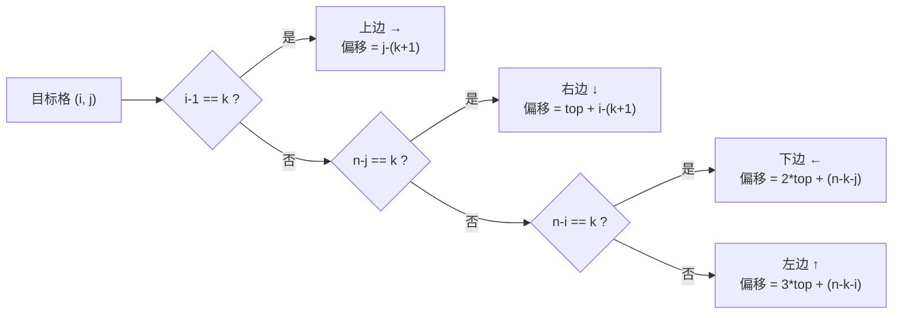

[[TOC]]

## 形式化题目

给定一个 $n \times n$ 的螺旋矩阵：从左上角 $(1,1)$ 出发、初始向右，每次若前方格子未经过则前进，否则右转，按经过顺序依次填入 $1,2,3,\dots,n^2$。求该矩阵第 $i$ 行第 $j$ 列的数。

以 $n = 4$ 为例：

|    | c1 | c2 | c3 | c4 |
| -- | -- | -- | -- | -- |
| r1 | 1  | 2  | 3  | 4  |
| r2 | 12 | 13 | 14 | 5  |
| r3 | 11 | 16 | 15 | 6  |
| r4 | 10 | 9  | 8  | 7  |

## 正解

### 思路

**朴素做法**：直接模拟螺旋填数过程——开一个 $n \times n$ 的数组，用"前进/右转"循环把 $1 \dots n^2$ 依次填入，最后读出 $(i,j)$。这个做法需要 $\Theta(n^2)$ 的时间和空间，$n = 30000$ 时约 $9 \times 10^8$ 格，时间和内存都远超限制（32MB 连矩阵本身都存不下）。

**关键观察**：其实不需要知道整个矩阵，只需要知道 $(i,j)$ 是"行进路线上的第几格"。而螺旋路线有非常规整的分层结构——它由一圈一圈的同心方环组成，由外向内、每圈按"上边 → 右边 → 下边 → 左边"的固定顺序走完：

```
第 0 层（外圈，n=5 示意）      走法顺序
 1   2   3   4   5            上边 →（右上角转向）
16  17  18  19   6            右边 ↓
15  24  25  20   7            下边 ←
14  23  22  21   8            左边 ↑
13  12  11  10   9            回到起点左侧，进入第 1 层
```

于是任意格子的值可以拆成两段相加：

$$\text{值}(i,j) = \underbrace{(\text{前 } k \text{ 层完整圈的格子总数})}_{\text{外圈贡献，整层不透明}} + \underbrace{(\text{它在第 } k \text{ 层内的行进偏移})}_{\text{本层分段累加}} + 1$$

**第一步：定位圈层。** 一个格子到四条外边界的最近距离是 $\min(i-1,\ j-1,\ n-i,\ n-j)$，这就是它所在的圈层号 $k$（外圈为 0，往内递增）。原因是：螺旋从外向内"剥"，一个格子属于第几层，恰好由它离哪条边最近决定。例如上表中 $n=4$、$(2,3)$：$\min(1,2,2,1) = 1$，位于第 1 层（即内圈 $13,14,15,16$）。

**第二步：算外圈贡献。** 第 $m$ 层的边长为 $n - 2m$，一圈的格子数为 $4(n-2m) - 4$（四条边各 $n-2m$ 格，四个角被重复计了 4 次）。所以前 $k$ 层的格子总数为

$$\sum_{m=0}^{k-1} \bigl(4(n-2m)-4\bigr) = 4k(n-k) - 4k^2 + \dots \;\; \text{（代码中直接对 } m \text{ 求和即可）}$$

$O(n)$ 的求和完全够用——比起模拟的 $O(n^2)$，这一步把问题规模从"格子数"降到了"层数"。

**第三步：算本层偏移。** 设第 $k$ 层左上角为 $(k+1, k+1)$，边长 $\text{side} = n - 2k$，上边不含右下转角有 $\text{top} = \text{side} - 1$ 格。按行进方向把本层分成四段，判断目标格落在哪一段、段内走了几步：

| 落在哪条边 | 判定条件 | 段内偏移 |
| ---------- | -------- | -------- |
| 上边（→） | $i-1 = k$ | $j - (k+1)$ |
| 右边（↓） | $n-j = k$ | $\text{top} + (i - (k+1))$ |
| 下边（←） | $n-i = k$ | $2 \cdot \text{top} + (n-k-j)$ |
| 左边（↑） | $j-1 = k$ | $3 \cdot \text{top} + (n-k-i)$ |

仍以 $n=4$、$(2,3)$ 为例：$k=1$、$\text{side}=2$、$\text{top}=1$；它满足 $n-j = 1$（右边），偏移为 $1 + (2-2) = 1$；外圈贡献为 $4 \times 4 - 4 = 12$；故答案为 $12 + 1 + 1 = 14$，与样例一致。

三个步骤都只依赖几个常数次的算术运算（外加一步不超过 $n/2$ 项的求和），完全不需要存储矩阵。

### 代码

@include-code(./main.py, python)

### 复杂度

- 时间复杂度：$O(n)$。瓶颈只在"外圈贡献"那一步对前 $k$ 层求和（$k \leqslant n/2$）；定位层和段内偏移都是 $O(1)$。
- 空间复杂度：$O(1)$，不建矩阵，只用几个标量。

## 总结

本题的朴素模拟是 $\Theta(n^2)$ 时间和空间，$n = 30000$ 时必然超限。正解抓住螺旋"逐层同心方环、每圈固定走上右下左"的结构：先用 $\min(i-1, j-1, n-i, n-j)$ 定位圈层，再用等差式累加算出外圈完整层的格子总数，最后按四段方向公式得到圈内偏移。整个过程只做 $O(n)$ 次算术运算、$O(1)$ 空间，与矩阵规模解耦。

## 图示解析

### 样例 n=4 的分层与定位

下图把 $n=4$ 的样例按圈层拆开，展示 $(2,3)$ 的两段贡献如何拼出答案 14：

```
圈层划分（k = 0 外圈 / k = 1 内圈）     (2,3) 的定位过程

 ┌── 12 ──┐                            ① 层号 k = min(1,2,2,1) = 1
 │ 13 14 15 │   内圈 = 第 1 层          ② 外圈贡献 = 4*4-4 = 12
 │ 16 ┆      │                          ③ 边长 side = 2，top = 1
 └─────────┘                            ④ 落在右边（n-j=1）：偏移 = 1+(2-2) = 1
                                        ⑤ 答案 = 12 + 1 + 1 = 14
```

观察重点：格子 14 的值 = 外圈一整圈的 12 格 + 它在内圈行进路线上的第 2 个位置（偏移 1）。行进顺序在内圈里是 $13 \to 14 \to 15 \to 16$，与公式"右边段：$\text{top} + (i - (k+1))$"算出的偏移完全吻合。

### 偏移公式的方向分段



观察重点：四个判定恰好互斥且覆盖本层所有格子（判定的就是"离哪条边最近/贴着哪条边"），所以走到底必然命中一条。这四个分支就是 `offset_on_layer` 里的四个 `if`，顺序对应行进方向"上 → 右 → 下 → 左"。
