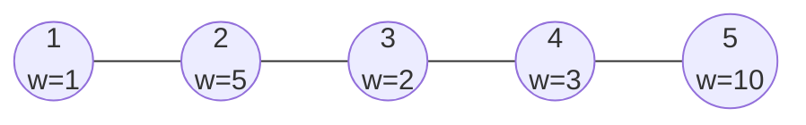
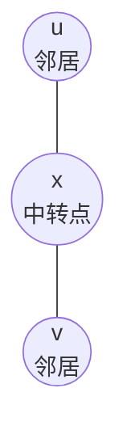

[[TOC]]

## 形式化题目

给定一棵 $n$ 个点的树（$n$ 个点、$n-1$ 条边的无向连通图），每条边长度为 $1$，第 $i$ 个点带正整数权值 $W_i$。

定义：若有序点对 $(u, v)$（$u \neq v$）的距离恰好为 $2$，则它产生 $W_u \times W_v$ 的联合权值。

求：所有距离为 $2$ 的有序点对中，

1. 联合权值的最大值；
2. 所有联合权值之和，对 $10007$ 取模。

数据范围：$1 < n \leqslant 2 \times 10^5$，$0 < W_i \leqslant 10^4$，保证存在距离为 $2$ 的有序点对。

**样例**：下面是样例中的树，$5$ 个点依次带权 $1, 5, 2, 3, 10$：

看点 $3$：它与邻居 $2$、$4$ 的距离都是 $1$，于是点 $2$ 与点 $4$ 的距离是 $2$，产生联合权值 $5 \times 3 = 15$。同理看点 $4$：它的邻居 $3$、$5$ 距离为 $2$，产生 $2 \times 10 = 20$。把所有有序点对算全，最大值是 $20$，总和是 $74$。

## 正解

### 思路

**朴素做法**：对每个点 BFS/DFS 求出它到所有点的距离，收集所有距离恰为 $2$ 的有序点对，逐一计算 $W_u \times W_v$。单次 BFS 是 $O(n)$ 的，总复杂度 $O(n^2)$；$n = 2 \times 10^5$ 时约 $4 \times 10^{10}$ 次运算，完全不可行，必须避免真的"找出每一对"。

**关键观察：距离为 $2$ 的点对必有唯一中转点。** 设 $(u, v)$ 距离为 $2$，中间那个点是 $x$，那么 $u$、$v$ 都是 $x$ 的邻居。树中两点路径唯一，所以把所有点对按中转点分类，一个点对恰好属于一个中转点，不重不漏：

于是问题转化为：**枚举每个点 $x$，只看它自己的邻居集合**，回答两个子问题。

**子问题一（求和）**：设 $x$ 的邻居权值为 $w_1, w_2, \dots, w_k$，$S = \sum w_i$。任取两个不同邻居 $i \neq j$，有序对 $(w_i, w_j)$ 的联合权值是 $w_i w_j$。有序对之和为

$$\sum_{i \neq j} w_i w_j = \Big(\sum_i w_i\Big)^2 - \sum_i w_i^2 = S^2 - \sum_i w_i^2$$

即"平方和的容斥"：全积减去自己乘自己的部分。对每个中转点 $O(k)$ 算出这个值累加即可。

**子问题二（求最大值）**：乘积要大，两个因子都要大，所以经过 $x$ 的最大联合权值一定是邻居权值中**最大值与次大值**的乘积。一遍扫描同时维护 $m_1$（最大）、$m_2$（次大），$O(k)$ 完成。

**注意两点**：

- 求最大值时若 $x$ 的度不足 $2$（没有两个不同邻居），不存在经过 $x$ 的联合权值；初始 $m_1 = m_2 = 0$，则 $m_1 \times m_2 = 0$ 自然不会污染答案（权值均为正）。
- 求和时先在**未取模的整数**下累加，最后才取模。排序点对天然成对出现（$(u,v)$ 与 $(v,u)$ 各计一次），按"有序对"直接累加即可；由 $W_i \leqslant 10^4$、度数之和为 $2(n-1)$，累加和不超过约 $4 \times 10^{18}$，在 `int64`（Python 整数）范围内。若中途对 $10007$ 取模，平方差可能出现"模意义下负数"，还得修正；先算精确值最后取模最稳妥。

### 代码

@include-code(./main.cpp, cpp)

@include-code(./main.py, python)

### 复杂度

每个点作为中转点被枚举一次，其邻居被遍历的次数总和等于度数之和 $2(n-1)$，故时间复杂度 $O(n)$，空间复杂度 $O(n)$（邻接表与权值数组）。

## 总结

- 转化：距离为 $2$ 的点对 $\Leftrightarrow$ 共享中转点的邻居对；按中转点分类后，每个点对恰好被统计一次。
- 求和用 $\big(\sum w\big)^2 - \sum w^2$，一次遍历搞定一整个中转点的所有有序对，避免逐对枚举。
- 求最值只需邻居权值的最大值与次大值。
- 总复杂度 $O(n)$，把 $O(n^2)$ 朴素做法中"逐对"的代价压成了"逐中转点逐邻居"。
- 易错点：答案是**有序**点对（不要除以 $2$）；和要**最后**取模（中途取模会产生负的平方差）；度数小于 $2$ 的中转点不贡献。
