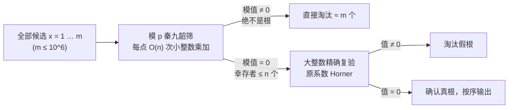

[[TOC]]

## 形式化题目

给定 $n + 1$ 个整系数 $a_0, a_1, \ldots, a_n$，以及正整数 $m$。求所有满足

$$f(x) = a_0 + a_1 x + a_2 x^2 + \cdots + a_n x^n = 0$$

的整数 $x \in [1, m]$，按从小到大输出。系数与 $m$ 都可能极大——本题真实数据中 $n \leqslant 100$、$m \leqslant 10^6$，单个系数的十进制位数可达上万。

**样例**：$f(x) = 1 - 2x + x^2 = (x-1)^2$，在 $[1, 10]$ 内只有 $x = 1$ 使 $f(x) = 0$，答案为 $1$ 个根：$1$。

## 正解

### 思路

**朴素做法与它的瓶颈。** 最直接的想法是：枚举 $x = 1 \ldots m$，把 $f(x)$ 精确算出来看是不是 $0$。问题出在"精确算"上：本题系数可达 $10^{10000}$ 量级，$x$ 可达 $10^6$，一个点的精确值有上万位数字，即使每一步乘加都摊 $O(1)$ 的位数分析也是骗人的——单次精确求值本身就是上万位整数的连乘，$10^6$ 个点乘下来根本算不完。$n$ 和 $m$ 的规模逼我们放弃"精确求值"这个动作本身。

**核心观察：只判"是不是 0"，可以在模意义下判。** 设一个素数 $p$，若整数 $f(x) = 0$，那么

$$f(x) \bmod p = 0$$

必然成立（$0$ 模任何数都是 $0$）。反过来，$f(x) \bmod p = 0$ 时 $f(x)$ 未必真的是 $0$——非根可能"撞"成模意义下的假根。于是可以**在模 $p$ 的世界里做整套判定**：把系数先归约到 $[0, p)$，对每个 $x$ 用秦九韶算法（Horner 法则）求 $f(x) \bmod p$，全程只做机器字范围内的乘法与取模，单点代价从"上万位大数连乘"降到 $O(n)$ 次小整数运算，总代价 $O(nm)$。

秦九韶算法本身也是本题的正式考点。对 $f(x) = a_0 + a_1 x + a_2 x^2$，逐项计算 $x^2$ 再乘系数要做多次乘法；而把它改写成**嵌套形式**：

$$f(x) = a_0 + x\,(a_1 + x\,a_2)$$

求值就变成"从最高次系数开始，反复做 乘 $x$、加下一项"——$n$ 次乘法、$n$ 次加法，没有任何幂运算。以 $n = 2$ 的样例 $f(x) = 1 - 2x + x^2$、$x = 3$ 为例，模 $p = 7$ 的推演如下：

| 步骤 | 读到的系数 | $v \gets v \cdot x + c$ | 结果（$\bmod\ 7$） |
| --- | --- | --- | --- |
| 初始 | — | $v = 0$ | 0 |
| 1 | $a_2 = 1$ | $0 \cdot 3 + 1$ | 1 |
| 2 | $a_1 = -2$ | $1 \cdot 3 + (-2)$ | 1 |
| 3 | $a_0 = 1$ | $1 \cdot 3 + 1$ | 4 |

模 $7$ 意义下 $f(3) = 4 \neq 0$，准确反映 $f(3) = 4$ 不是根；而 $x = 1$ 时同样的三步会得到 $v = 0$，被收进候选集。表格里最值得看的是**"读到的系数"一列是倒着走的**（$a_2 \to a_1 \to a_0$），这正是 Horner 法则与逐项求值最大的实现差异；另一列 $v$ 每步都缩在 $[0, p)$ 内，这就是"全程小整数"的直观含义。

**筛子必须配复验。** 模 $p$ 判定是单向的：真根一定通过，假根也可能通过。若只输出模意义下的根，一个精心构造的非根（例如 $f(x) = p \cdot g(x)$，处处 $f(x) \bmod p = 0$ 但 $f(x)$ 处处非零）就能骗过筛子。所以把幸存者再交还给**精确复验**：候选根至多 $O(n)$ 个（模 $p$ 的意义下，$f(x) \bmod p$ 作为 $x$ 的 $n$ 次多项式在模域里至多 $n$ 个根），每个候选做一次上万位整数的精确 Horner，代价可以忽略。两段组合起来：筛掉 $10^6$ 个点里 $99.9999\%$ 的非根，剩下的用大整数逐一确认——**期望零误判，最坏也只在"大量真根 + 伪装非根"时退化**，真根本来就至多 $n$ 个，复验总量始终有界。

C++ 里没有大整数，"筛 + 双模数复验"就是终态；Python 天生有任意精度整数，复验反而成了免费的正确性保险。

### 代码

@include-code(./main.cpp, cpp)

@include-code(./main.py, python)

### 复杂度

- 时间：模筛 $O(nm)$ 次小整数乘加（$n \leqslant 100$、$m \leqslant 10^6$ 时约 $10^8$ 次机器运算，正是 C++ 正解的量级）；候选根 $\leqslant n$ 个，精确复验 $O(n^2)$ 次大数位运算，可忽略。Python 常数大，同一算法在官方 1s 限时内可能超时，但复杂度与 C++ 正解同阶。
- 空间：$O(n)$ 存系数（模意义一份、原值一份），与 $m$ 无关。

## 总结

本题是 NOIP2014 提高组经典题，考点是**秦九韶算法 + 同余判定**的组合：数据范围攻击的是"精确求值"，于是把"值是否为 0"这个判定整体搬进模 $p$ 世界，用 Horner 法则把单点求值压成 $n$ 次乘加。三个值得带走的经验：一是 Horner 的实现要点是**系数倒序**进入循环，`v = v * x + c` 一行就是嵌套形式的逐层展开；二是"模意义判定 = 单向筛"，真根必中、假根可能漏进来，所以筛子后面必须补一道复验（双模数或这里的大整数精确复验），否则等于把正确性押在数据不卡上；三是 $O(nm)$ 的逐点判定已经封顶——多项式在模域内没有已知的整体"求根公式"能少于逐点检查，这也是本题正解就是暴力加"换域"的全部原因。

## 图示解析

### 筛与验的两段流水线

图里体现的是"漏斗"结构：左边的模筛负责把 $10^6$ 量级的候选快速缩到 $n$ 以内，右边的精确复验只对漏斗出口负责。两段各自单调——模筛**只可能漏进假根、绝不会错杀真根**（因为真根模后必为 $0$），复验**只可能淘汰、绝不会再放行**，所以整条流水线的输出恰好是真根集合。
