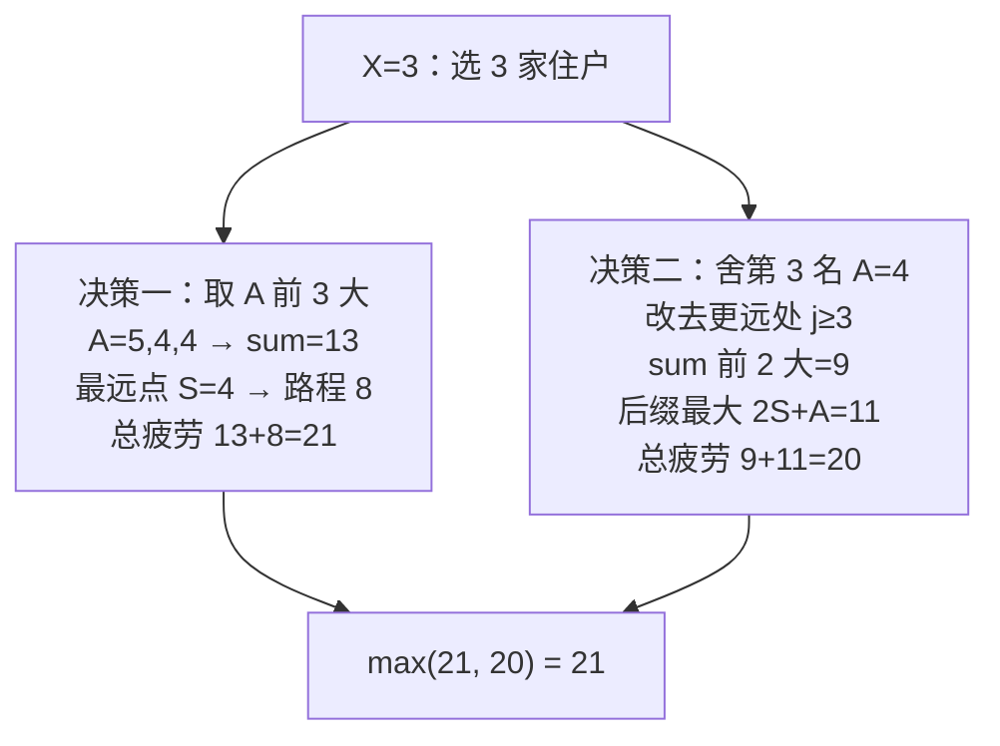

[[TOC]]

## 形式化题目

数轴正半轴上（入口为原点）有 $N$ 个点，第 $i$ 个点位于坐标 $S_i$，带权值 $A_i$。对每个 $X = 1, 2, \dots, N$，从原点出发、依次访问选中的 $X$ 个点再原路返回，路径长度等于最远点距离的两倍。求选中 $X$ 个点时

$$\sum_{i \in \text{选中集合}} A_i \;+\; 2 \times \max_{i \in \text{选中集合}} S_i$$

的最大值。需要输出 $N$ 行，即 $X$ 取遍 $1$ 到 $N$ 的每个答案。

## 正解

### 思路

**朴素做法**：对每个 $X$ 暴力枚举 $C_N^X$ 种选法计算总疲劳值，是指数级复杂度；稍好的暴力是先枚举最远点 $j$、再在前 $j$ 家里选 $A$ 最大的 $X-1$ 家，对每个 $X$ 都重新枚举一遍最远点，复杂度 $O(N^2 \log N)$，只能通过 $N \leqslant 1000$ 的部分分。瓶颈在于：相邻两个 $X$ 的枚举互相独立，大量重复计算。

**分类讨论**：路径代价只由最远点决定，所以把「选 $X$ 家」的最优方案按最远点分类。把所有住户按 $A$ **降序**排序（$A$ 相同则距离大者优先，见后文），记：

- $sum_i$ = 排序后前 $i$ 家的 $A$ 之和（前缀和）；
- $q_i$ = 排序后前 $i$ 家中最远的距离（前缀最大值）；
- $h_i$ = $\max_{j \geqslant i}\,(2S_j + A_j)$（后缀最大值）。

则 $X=i$ 的最优方案只有两种形态：

1. **决策一（最远点就在前 $i$ 大的 $A$ 里）**：既然最远点被前 $i$ 大覆盖，其余名额全部让给 $A$ 更大的住户一定不亏，最优值即 $sum_i + 2q_i$；
2. **决策二（绕开某个 $A$ 排名靠前的住户、换去更远处）**：设被舍弃的是排序位置 $i$ 上的住户，名额分给排序位置 $\geqslant i$ 的某家 $j$（它的 $2S_j + A_j$ 足以弥补损失的 $A_i$），其余 $i-1$ 个名额仍取前 $i-1$ 大的 $A$，最优值即 $sum_{i-1} + h_i$。

**为什么两个决策就覆盖了所有情形**：最优方案里除最远点外的任意一家，都可以被「$A$ 比它大且距离不超过最远点」的住户替换而不变差——排序保证了这样的住户总在它前面。于是除最远点外的 $X-1$ 家必然是「$A$ 前 $X-1$ 大」（决策一）或「$A$ 前 $X-1$ 大再去掉第 $i$ 名」（决策二），各自的最优值就是上面两式。

**为什么排序时 $A$ 相同要取距离大者优先**：决策一取「$A$ 前 $i$ 大」时，同值 $A$ 内部选谁不影响 $sum$，但会影响最远点距离。取距离大者优先后，「排序前 $i$ 项」恰好是「$A$ 前 $i$ 大且距离尽量大的那组」，使 $sum_i + 2q_i$ 成为决策一所覆盖方案中的最优值，不会因同值 $A$ 的排列歧义而算小。样例 2 的 $A=[5,4,3,4,1]$ 中有两个 $4$：若不把 $S=4$ 的住户排在前，$X=3$ 时决策一只会算出 $12+8=20$，漏掉真正的最优 $21$。

**决策二会不会多算**：当 $h_i$ 恰好由第 $i$ 名自己取得（$j=i$）时，$sum_{i-1} + 2S_i + A_i$ 相当于「第 $i$ 名的 $A$ 不算、距离却算它」，似乎重复。但由于排序保证 $A_i$ 不超过前 $i-1$ 名中任何一家，把这一项与决策一比较：

$$sum_i + 2q_i \;\geqslant\; sum_{i-1} + A_i + 2S_i \;=\; sum_{i-1} + 2S_i + A_i,$$

即这种退化情形永远不会超过决策一，取 $\max$ 时被自然压掉，不影响正确性。而 $j > i$（真换点）时方案合法且恰好被枚举到。

最终答案：

$$ans_i = \max\big(\,sum_i + 2q_i,\;\; sum_{i-1} + h_i\,\big)$$

$h$ 数组从右往左一次扫描预处理，每个 $X$ 的答案 $O(1)$ 查出。

以样例 2（$S=[1,2,2,4,5]$，$A=[5,4,3,4,1]$）演示。按 $(-A,-S)$ 排序后：

| 排序位置 $i$ | 距离 $S$ | 疲劳 $A$ | $2S+A$ | 后缀最大 $h_i$ |
|---|---|---|---|---|
| 1 | 1 | 5 | 7 | 12 |
| 2 | 4 | 4 | 12 | 12 |
| 3 | 2 | 4 | 8 | 11 |
| 4 | 2 | 3 | 7 | 11 |
| 5 | 5 | 1 | 11 | 11 |

前缀和 $sum=[5,9,13,16,17]$，前缀最远 $q=[1,4,4,4,5]$，逐行计算：

| $X$ | 决策一 $sum_X+2q_X$ | 决策二 $sum_{X-1}+h_X$ | 答案 |
|---|---|---|---|
| 1 | $5+2=7$ | $0+12=12$ | **12** |
| 2 | $9+8=17$ | $5+12=17$ | **17** |
| 3 | $13+8=21$ | $9+11=20$ | **21** |
| 4 | $16+8=24$ | $13+11=24$ | **24** |
| 5 | $17+10=27$ | $16+11=27$ | **27** |

与样例输出 `12 17 21 24 27` 完全一致。注意 $X=1$ 时决策一只有 7，全靠决策二「直奔 $S=4$、$A=4$ 的住户」拿到 12。

### 代码

@include-code(./main.py, python)

### 复杂度

- 时间复杂度：$O(N \log N)$，来自一次排序；预处理后缀最大值和回答每个 $X$ 均为 $O(N)$。
- 空间复杂度：$O(N)$，存储排序结果、前缀和与后缀最大值数组。

## 总结

本题的关键洞察是：路径代价只由最远点决定，因此最优方案可按最远点分类成「全取 $A$ 前 $X$ 大」与「舍弃某排名靠前者换去更远处」两种形态，分别对应前缀和 + 前缀最远距离、前缀和 + 后缀最大值两组线性预处理量。每个 $X$ 的答案取两决策的最大值即可，总复杂度 $O(N \log N)$，稳过 $N \leqslant 10^5$。排序时 $A$ 相同取距离大者是保证决策一不漏最优的细节。

## 图示解析

### 贪心决策的两条路线

下图展示样例 2 在 $X=3$ 时两条决策路线的比较，说明为什么需要「后缀最大值」来兜底换点方案：

排序后每家住户都自带一个候选贡献 $2S_j + A_j$；后缀最大值数组 $h$ 把「从位置 $i$ 往右任选一家当最远点」的最优值压缩成一次查询。观察两个表格可以发现：$X$ 越大，决策一自然把远处的高 $A$ 住户收进来，两条路线的差距逐渐缩小直到相等；而小 $X$ 时决策一走不了远路，必须靠决策二「直奔远处」补齐，这正是本题必须同时维护两个决策的原因。
