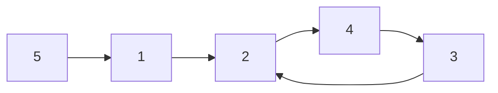

[[TOC]]

## 形式化题目

给定 $n$ 个节点 $1,2,\dots,n$ 与映射 $T$：每个 $i$ 满足 $T_i \neq i$ 且 $T_i \leqslant n$。
把 $i \to T_i$ 看作一条有向边，得到一张**每个点出度恰好为 1** 的有向图。

初始时第 $i$ 个人只知道自己的生日 $i$。每一轮，所有人**同时**把自己当前知道的全部生日
告诉 $T_i$（可以从多人收信息，但只发给一个人）。当有人**从别人那里**听到自己的生日时，
游戏结束。求游戏一共进行了多少轮。

样例：$n=5$，$T=[2,4,2,3,1]$，对应下图，答案为 $3$。

每个点只有一条出边，从任意点出发沿边走最终都会落进一个环：样例中
$2 \to 4 \to 3 \to 2$ 是唯一的环，$1$ 和 $5$ 是挂在环外的链。

## 正解

### 思路

**朴素做法：直接按轮模拟。** 给每个点维护一个"已知生日"集合，每轮把集合内容并进
$T_i$ 的集合，直到某个点的集合里出现自己的编号。但集合只会越并越大：环前的长链上，
信息一轮轮累加，最坏每轮 $\Theta(n^2)$ 的信息量、轮数又可达 $\Theta(n)$，
对 $n \leqslant 200000$ 完全不可行。

**瓶颈在哪儿？** 模拟把"谁知道了哪些**别人的**生日"全算了一遍，而结束条件只关心
**自己的**生日有没有绕回自己。于是改问：第 $i$ 个人的生日什么时候回到 $i$？

**关键观察 1：生日沿一条固定路线走，不分叉。** 每个点出度唯一，生日 $i$ 第 1 轮到达
$T_i$，第 2 轮到达 $T_{T_i}$，……，第 $r$ 轮到达 $T^r(i)$。所以
"$i$ 在第 $r$ 轮听到自己的生日" $\iff T^r(i) = i$。

**关键观察 2：能回到自己 ⟺ 自己在环上，且轮数就是环长。** 从 $i$ 出发沿出边走必然
最终进入环：若 $i$ 不在环上，它的生日只会顺着链流进环里，永不回头；若 $i$ 在环上，
生日绕环一圈恰好回到 $i$，这是第一次，轮数 = 环长 $L$（环上所有点都在第 $L$ 轮听到
自己的生日）。链上的点与答案无关，直接忽略。

**关键观察 3：答案 = 全图最短环的长度。** 游戏在最早满足条件的那一轮结束，因此要取
所有环长度的最小值——取任意一个环或最大环都会错。由于题面保证 $T_i \neq i$，答案
至少为 $2$。

以样例验证：只有节点 $2,3,4$ 在环上，环长都是 $3$；节点 $1,5$ 的生日分别沿
$1 \to 2 \to 4 \to 3 \to 2$、$5 \to 1 \to 2 \to \cdots$ 流入环后再不回头：

| 节点 | 自己生日的传播路线 | 能否回到自己 | 回到的轮数 |
| --- | --- | --- | --- |
| $2$ | $2 \to 4 \to 3 \to 2$ | 能（在环上） | $3$ |
| $4$ | $4 \to 3 \to 2 \to 4$ | 能（在环上） | $3$ |
| $3$ | $3 \to 2 \to 4 \to 3$ | 能（在环上） | $3$ |
| $1$ | $1 \to 2 \to 4 \to 3 \to 2 \to \cdots$ | 不能（链） | — |
| $5$ | $5 \to 1 \to 2 \to 4 \to 3 \to 2 \to \cdots$ | 不能（链） | — |

取最小值，答案 $3$，与样例一致。

**如何 $O(n)$ 找出所有环？** 三色标记，每个点只走一次：

- `0` 未访问、`1` 本轮在路上、`2` 已归档（别的链或环已经处理过）。
- 从每个 `0` 点出发沿出边走，把路过的点标成 `1`，路径压栈并记录每个点在路径中的位置。
- 走到非 `0` 的点就停：撞上 `1` 说明这条链自己闭成了环，环长 = 撞点在路径中的位置到末尾的
  距离；撞上 `2` 说明接上了别人处理过的链/环，不产生新环（那个环已在它自己的遍历中计数）。
- 把本轮整条路径归档成 `2`，此后任何起点都不再进入。

每个点恰好压栈、出栈各一次，总时间 $\Theta(n)$；答案取所有环长的 `min`。

### 代码

@include-code(./main.py, python)

`rings` 是生成器：每发现一个环就 `yield` 其长度，`solve` 用 `min` 收成答案。
`while color[u] == 0` 走链、`color[u] == 1` 判环、路径统一归档，三步对应上面的三条规则；
用迭代而非递归，$n=200000$ 的长链不会爆栈。

读入也值得一看：`read_ints` 直接在字节流上逐位累加，而不是 `split()`——后者会一次性
造出 20 万个小 `bytes` 对象，实测把峰值内存推到 36MB，直接顶破 32MB 限制；换成扫描后
峰值只有 26MB。环长用 `path.index(u)` 现场求，省掉一个 $n$ 大小的 `depth` 数组。

### 复杂度

- **时间** $\Theta(n)$：每个点在 `rings` 中恰好压栈、出栈各一次，`path.index` 的扫描
  总代价也是 $\Theta(n)$，读入是逐字节线性扫描。
- **空间** $\Theta(n)$：`to`、`color` 两个长度 $n{+}1$ 的数组加最坏长度为 $n$ 的路径栈。
  $n=200000$ 实测峰值 26MB（读入不经过 `split`），低于 32MB 限制；单测最大耗时 0.075s，
  远低于 1000ms 限制。

## 总结

把"模拟信息传递"改问成"自己的生日何时绕回自己"，问题就从逐轮扩散变成了**内向基环
森林求最短环**：不在环上的点直接排除，环上点的结束轮数就是环长，答案取最小值。
用三色标记一次遍历即可 $\Theta(n)$ 找全所有环——关键在于识别"出度唯一的图里，
回到自己 = 环"这个等价关系，从而整体消掉模拟的平方级瓶颈。
