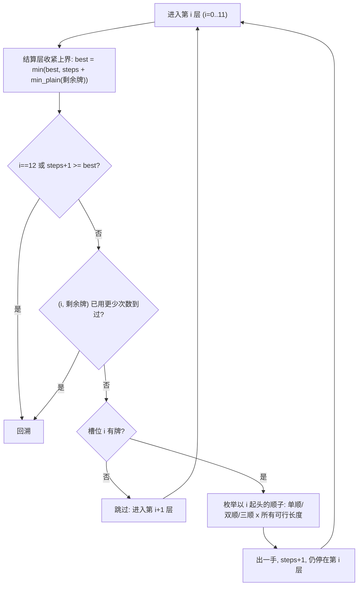

[[TOC]]

## 形式化题目

一手牌是 54 张牌（4 种花色的 3~10、J、Q、K、A、2 加大小王）的一个子集，每张牌至多一张。
点数大小关系为 $3<4<5<\cdots<10<J<Q<K<A<2<$ 小王 $<$ 大王，花色无大小之分。

每次出牌必须恰好是下列 11 种牌型之一：

1. **单张 / 对子 / 三张 / 炸弹**：同一点数的 $1/2/3/4$ 张牌；
2. **三带一 / 三带二**：三张同点牌 $+$ 一张单牌 / 一对；
3. **单顺子**：$5$ 张或更多点数连续的单牌；**双顺子**：$3$ 对或更多点数连续的对子；
   **三顺子**：$2$ 组或更多点数连续的三张牌——三种顺子都**不能含点数 2 和双王**，花色任意；
4. **四带二**：四张同点牌 $+$ 任意两张单牌，或四张同点牌 $+$ 任意两对；
5. **火箭**：小王 $+$ 大王（双王）。

给定一手牌，求把全部牌出完的最少出牌次数。

**样例 1**（8 张牌）的一种最优出法，3 次打光（花色与分组无关，只看点数）：

| 手次 | 牌型 | 具体的牌 | 剩余张数 |
| --- | --- | --- | --- |
| 1 | 单顺子 | 7、8、9、10、J | 3 |
| 2 | 单张 | 5 | 2 |
| 3 | 对子 | A、A | 0 |

**样例 2**（17 张牌）答案是 6。一种达到 6 的出法：单顺子 3-4-5-6-7（1 手）、
四带二 QQQQ 带 5 和 A（1 手）、对子 1010、对子 22、单张 J、单张小王（各 1 手）。
搜索可以证明 5 手打不完（"QQQQ 带 2 张单"之后剩下的对子与单牌无法再合并）。

## 正解

### 思路

**一句话本质**：把出牌拆成两层——**顺子类牌型必须枚举组合，散牌类牌型只取决于剩余牌的直方图、可以精确结算**；
DFS 按点数分层枚举顺子组合，每到一个中间局面就用结算层算出"剩下的牌最少几手"，全程取最小。

**第一步：朴素想法与瓶颈。** 最朴素的做法是搜索"每一手出什么"：每步枚举所有合法牌型与带牌选择，
递归到出完取最小。两个瓶颈立刻出现。其一，**顺子不能贪心**：手牌 `3 4 5 6 7 6 7 8 9 10` 里，
先出最长单顺 `3..10` 会剩下 `6 7` 两张散牌（共 3 手），而出 `3..7` 与 `6..10` 两手顺子直接打光（2 手），
所以顺子的组合必须枚举、不能"每次出最长"。其二，散牌的带牌选择（三带一带哪张、四带二带哪两张……）
再乘上一层分支，两层耦合后状态爆炸。

**第二步：牌型二分。** 观察 11 种牌型：三种顺子是唯一点数相关的牌型，其余 8 种
（单张、对子、三张、三带一、三带二、炸弹、四带二、火箭）只关心"每个点数还剩几张"。
于是：

- **搜索层**只负责顺子类：枚举"出了哪些顺子"的组合；
- **结算层**负责散牌类：给定剩余牌，精确求出打光它的最少手数。

两层相加取最小，就覆盖了所有出法。

**第三步：搜索层——按点数分层的规范枚举。** 把牌压进 15 个槽位：$0\sim11$ 是顺子序
$3,4,\cdots,10,J,Q,K,A$，$12$ 是点数 2，$13/14$ 是小王/大王。DFS 走到第 $i$ 层（$0 \leqslant i \leqslant 11$）时二选一：

- **跳过**：不让点数 $i$ 起头任何顺子，进入第 $i+1$ 层；
- **起头一手**：枚举所有以 $i$ 起头的顺子类——单顺（长度 $\geqslant 5$）、双顺（$\geqslant 3$ 对）、
  三顺（$\geqslant 2$ 组）的全部可行长度，各出一手后**仍停在第 $i$ 层**（同一层可以起头多手）。

这样编码不重不漏：任何一组顺子都能按"起头点数从小到大"逐层落地——更早的消耗只来自本组里
已决定的顺子，第 $i$ 层要用的牌一定还在；反之每条路径出的顺子都合法。第 12 层以后顺子槽位走完，
剩余牌全部交给结算层。三个加速让搜索可控：

1. **中间局面可达**：每个节点"已出的顺子 $+$ 散牌精确结算"都是合法出牌方案，随手收紧全局上界 `best`；
2. **深度剪枝**：再出一手也追不上上界（`steps + 1 >= best`）就回溯；
3. **支配剪枝**：同一个 `(层, 剩余牌)` 已用更少次数到过，就不再展开。

每手顺子至少消耗 5 张牌，$n \leqslant 23$，所以一条路径最多 4 手顺子，搜索树天然很浅。

搜索单个节点的决策流程如下（从进入第 $i$ 层到回溯）：

**第四步：结算层——散牌只按直方图精确结算。** 散牌类里点数完全对称（三张带的单牌可以任选点数），
所以答案只取决于直方图 $(\text{恰好 1 张的点数个数},\ 2\text{ 张},\ 3\text{ 张},\ 4\text{ 张},\ \text{王数})$。
结算分两步。先把每个点数的牌拆成"基础组"（一个基础组就是一手牌的骨架），全部拆法如下：

| 点数张数 | 可行拆法（每项 = 单张组数, 对子组数, 三张组数, 炸弹组数） | 说明 |
| --- | --- | --- |
| 1 张 | (1,0,0,0) | 只能单出 |
| 2 张 | (0,1,0,0)、(2,0,0,0) | 对子，或拆成两张单 |
| 3 张 | (0,0,1,0)、(1,1,0,0)、(3,0,0,0) | 三张，或对+单，或三单 |
| 4 张 | (0,0,0,1)、(1,0,1,0)、(0,2,0,0)、(2,1,0,0)、(4,0,0,0) | 炸弹，或三+单，或两对，或对+两单，或四单 |

再让三张、炸弹**顺带走散组**：三张每手可带 1 个单组（三带一）或 1 个对子组（三带二）；
炸弹每手可带 2 个单组（四带二单）或 2 个对子组（四带二对）。设拆完得到 $(S,P,T,B)$
个单/对/三/炸组，枚举"带单的三张数 $x$"与"带对的三张数 $y$"（各不超过 7），炸弹用剩余散组带满：

$$\text{手数} \;=\; S+P+T+B \;-\; x \;-\; y \;-\; 2\min\!\bigl(B,\ \lfloor (S-x)/2\rfloor + \lfloor (P-y)/2\rfloor\bigr)$$

取所有拆法与 $(x,y)$ 里的最小值。两处不能贪心：其一，**带牌要全局安排**——`333 4444 77 88` 里
若三张见对就带（333+77），只剩 4444、88 共 3 手；全局看是 `4444+77+88`、`333` 只要 2 手；
其二，**拆组本身可能是优解**——`4444 5555 77 88 99` 里若把 99 留作对子，两个炸弹最多带满一个
（`4444+77+88`、`5555`、`99` 共 3 手）；按规则"任意两张单牌"把 99 拆成两单，
`4444+77+88`、`5555+9+9` 只要 2 手。双王单独处理：合火箭 1 手，或当两张单牌（可被三张/炸弹带走），取小。
结算结果与点数无关，按直方图做全局记忆化（`@cache`），同一种直方图只算一次。

**第五步：正确性。** 两头夹逼：一方面，每条搜索路径给出的"顺子手数 $+$ 散牌结算"都是一个真实可行的
出牌方案（结算层的每一种拆法与带法都对应合法牌型），所以全局最小值 $\leqslant$ 真实最优；
另一方面，设最优方案用了顺子集合 $\Sigma$，由第三步的规范枚举，搜索树中必有一条路径恰好出 $\Sigma$ 里的顺子
（结算层不打顺子，$\Sigma$ 之外的牌全由它精确结算），该节点取值 $\leqslant$ 最优值。
两边相等，搜索取到的就是最优解。

**第六步：与样例对照。** 样例 1 的槽位计数里 $7,8,9,10,J$ 各 1 张，起头于槽位 4 的单顺
`7..J` 被枚举到，出完后结算层对手里的 `5`（1 张）与 `A A`（2 张）算出 2 手，合计 $1+2=3$；
「一手顺子都不出」的初始上界是 7 手（6 张单牌各出一次 + 对子 A 一次），被这条路径的 3 手取代，最终输出 3。

### 代码

`slot_of` 把输入映射到 15 个槽位；`SPLITS` 是上表的全部拆法；
`absorb` 枚举 $(x,y)$ 求散牌最少手数，`min_plain` 按直方图记忆化（`@cache`）；
`cuts` 枚举以某槽位起头的全部顺子类，`min_rounds` 是分层 DFS 加三重剪枝；`solve` 负责读入与输出。

@include-code(./main.cpp, cpp)

@include-code(./main.py, python)

### 复杂度

- **搜索层**：12 个顺子槽位分层，每层分支数 $=$ 以该点起头的顺子数 $+1$（跳过），每条路径顺子手数
  $\leqslant 4$（每手至少 5 张，$n\leqslant 23$）。最坏情况随顺子密度指数增长（与经典 C++ 正解同阶的
  组合搜索），剪枝后实测极小：20 组真实数据 DFS 节点合计 **6235 个**（最大单手 2575 个），
  单个节点代价 $O(15)$（重建直方图 + 查缓存）。
- **结算层**：直方图种数受 $h_1+2h_2+3h_3+4h_4+\text{王数}\leqslant 23$ 限制，实测全部数据只有
  **194 种**；每种直方图的拆组聚合状态最多 **40 个**，`absorb` 枚举 $x,y$ 各至多 8 档，
  单次结算近似常数；`@cache` 保证每个直方图只算一次。
- **总时间**：实测每组数据（含 $T=100$ 的文件）$0.017\sim0.03$ s，远低于 1 s 时限（本地校验放宽到 20 s）。
- **空间**：搜索栈深 $\leqslant 12+4=16$，记忆化字典至多百级条目；实测峰值约 15 MB（含 Python 解释器基线），
  满足 32 MB 限制。

## 总结

1. **牌型二分是本题的骨架**：顺子依赖点数连续性、不能贪心，必须枚举组合；其余 8 种牌型只依赖
   "每个点数剩几张"，与点数顺序无关，可以对直方图精确记忆化结算。两层相加取最小。
2. **规范枚举保证不重不漏**：第 $i$ 层只决定"点数 $i$ 是否起头顺子"，出一手后仍留在本层；
   任何顺子组合都能按起头点数从小到大落地。
3. **剪枝全部合法**：中间节点本身就是可行方案（收紧上界）、追不上上界就剪、同局面用更少次数支配。
4. **边界别写漏**：点数 2 与双王不进顺子；单顺 $\geqslant 5$、双顺 $\geqslant 3$ 对、三顺 $\geqslant 2$ 组；
   四带二可以带两单或两对；双王既可合火箭、也可拆成两张单被带走；带牌要全局安排，拆组可能是优解。
