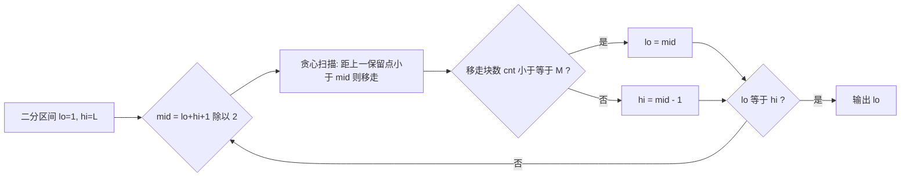

[[TOC]]

## 形式化题目

在数轴上，起点位于 $0$，终点位于 $L$，两者之间有 $N$ 块岩石，第 $i$ 块与起点的距离为 $D_i$，所有 $D_i$ 互不相同且 $0 < D_i < L$。可以移走其中至多 $M$ 块岩石（起点和终点不能移走）。移走之后，从起点出发沿保留的岩石跳到终点，把每相邻两个保留位置之间的距离的最小值记为「最短跳跃距离」。求移走至多 $M$ 块岩石时，最短跳跃距离的最大值。

**样例**：$L=25$，岩石 $\{2,11,14,17,21\}$，$M=2$。移走 $2$ 和 $14$ 后，保留序列为 $0,11,17,21,25$，相邻距离为 $11,6,4,4$，最短跳跃距离为 $4$。可以证明这是最优答案。

## 正解

### 思路

**朴素做法**：枚举移走哪些岩石（组合数 $\binom{N}{M}$，指数级），对每种方案算最小间隔取最大。$N \leqslant 5 \times 10^4$ 时完全不可行，必须换角度。

**第一步：把「最大化最小值」转化为判定问题。** 直接求「最短跳跃距离的最大值」很难，但它具有单调性——如果我们问「最短跳跃距离能否达到 $x$」，那么：

- $x$ 越大，要求越苛刻，可行方案越少；
- 定义 $f(x)$ = 使所有相邻距离 $\geqslant x$ 时**至少要移走的岩石数**，则 $x$ 越大 $f(x)$ 越大。

所以存在一个临界值 $x^\ast$：$f(x) \leqslant M$ 当且仅当 $x \leqslant x^\ast$，而 $x^\ast$ 就是答案。于是**二分答案** $x \in [1, L]$，剩下的关键就是快速计算 $f(x)$。

**第二步：贪心判定。** 从左到右扫描（起点、岩石、终点统一看待），维护「上一块保留岩石的位置」$\mathit{prev}$，初始为 $0$：

- 若当前位置 $p$ 与 $\mathit{prev}$ 的距离 $< x$：移走当前岩石（计数 $+1$），$\mathit{prev}$ 不变；
- 否则保留当前岩石，$\mathit{prev} \gets p$。

为什么移走当前岩石而不是更左边的？当 $p - \mathit{prev} < x$ 时，必须在这段间隙里删掉若干岩石。无论删的是 $p$ 还是它左边的某块，间隙都会变宽；但**删当前岩石**能让后续岩石到上一保留点的距离尽可能大，对后面的判定只赚不亏（交换论证：任何可行方案保留的某块岩石，贪心保留的对应岩石位置不会更靠右，因此贪心用掉的删除次数不会超过任何可行方案）。这样统计出的删除次数就是 $f(x)$ 的最小值。

**终点不能移走怎么办？** 把终点 $L$ 也放进扫描序列。$x \leqslant L$ 时若终点与 $\mathit{prev}$ 的距离 $< x$，说明这一段必然不可行——扫描到终点时它也会使计数 $+1$，而判定条件 $\mathit{cnt} \leqslant M$ 会因为这个多出来的 $1$ 而更严格，不会把不可行的 $x$ 误判为可行；而可行的 $x$ 下终点必然被保留，计数恰好等于真实删除数。结论：**直接把终点当普通位置扫描、判定 $\mathit{cnt} \leqslant M$ 即可**。

用样例验证 $x=4$（可行）与 $x=5$（不可行）：

| 扫描位置 | $x=4$ 时的判定 | $x=5$ 时的判定 |
| :---: | :--- | :--- |
| $2$   | $2-0<4$，移走（cnt=1） | $2-0<5$，移走（cnt=1） |
| $11$  | $11-0\geqslant 4$，保留 | $11-0\geqslant 5$，保留 |
| $14$  | $14-11=3<4$，移走（cnt=2） | $14-11=3<5$，移走（cnt=2） |
| $17$  | $17-11=6\geqslant 4$，保留 | $17-11=6\geqslant 5$，保留 |
| $21$  | $21-17=4\geqslant 4$，保留 | $21-17=4<5$，移走（cnt=3） |
| $25$  | $25-21=4\geqslant 4$，保留 | $25-21=4<5$，移走（cnt=4） |
| 结果  | $\mathit{cnt}=2 \leqslant M=2$ ✓ | $\mathit{cnt}=4 > M=2$ ✗ |

所以答案就是 $4$。

### 代码

@include-code(./main.py, python)

### 复杂度

- 时间复杂度：$O(N \log L)$。二分 $O(\log L)$ 轮（约 $30$ 轮），每轮贪心扫描 $O(N)$，总计约 $1.5 \times 10^6$ 次操作。
- 空间复杂度：$O(N)$ 存放岩石位置。

## 总结

- 「最大化最小值」类问题的标准套路：**二分答案 + 贪心/搜索判定**。判定函数必须单调（这里 $f(x)$ 随 $x$ 单调不减）。
- 贪心判定口诀：从左往右扫，与上一块**保留**的岩石距离不足 $x$ 就移走当前岩石——移走靠右的一块永远不会更差。
- 终点不可移走的约束不需要特判：把终点加入扫描序列后，不可行的 $x$ 会天然使计数超标。
- 易错点：扫描必须从第一块岩石开始（包含所有 $N$ 块），漏掉第一块会导致答案偏大。
