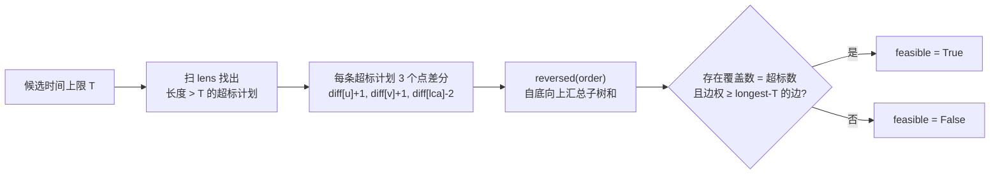

[[TOC]]

## 形式化题目

给定一棵 $n$ 个点、$n-1$ 条带权边的树，边权 $0 \leqslant t \leqslant 1000$；以及 $m$ 条运输计划，第 $j$ 条计划给出端点 $(u_j, v_j)$，飞船沿两点间唯一路径飞行，用时为路径边权之和。

可以选择恰好一条边改成虫洞（驶过用时变为 $0$）。$m$ 个计划同时出发，全部完成的时刻等于各计划用时的最大值。求在最优选择下，这个最大值的最小值。

样例的树与三条计划如下：

```text
2 --(3)-- 1 --(4)-- 6
           |
          (7)
           |
           3
          / \
      (6)/   \(5)
        4     5
```

| 计划 | 路径 | 用时 |
| --- | --- | --- |
| 1 | 3 → 6 | $7 + 4 = 11$ |
| 2 | 2 → 5 | $3 + 7 + 5 = 15$ |
| 3 | 4 → 5 | $6 + 5 = 11$ |

若把边 `1-3`（权 $7$）改成虫洞，三条计划的用时变成 $4, 8, 11$，最大值为 $11$；可以验证任何选择都无法把最大值压到 $11$ 以下，所以答案是 $11$。

## 正解

### 思路

**朴素做法与瓶颈。** 直接枚举哪条边变虫洞（$n-1$ 种选择），每种选择下逐条计划重算路径长度、取最大值，最后在所有选择里取最小——最坏从 $O(nm)$ 起步，在 $n, m = 3 \times 10^5$ 的规模下完全不可行。瓶颈有两处：候选边太多，路径求和太慢。下面三步分别拆掉它们。

**第一步：把"选边"变成二分。** 时间上限 $T$ 越大越容易完工，可行性关于 $T$ 单调，答案就是最小的可行 $T$；且 $0 \leqslant T \leqslant \max_j len_j$——不放虫洞时每条计划用时都不超过最长航程。于是只需实现判定 `feasible(T)`（代码里的 `feasible(limit)`）：能否让全部计划在 $T$ 内完成。

**第二步：判定不需要枚举边——虫洞必须是"超标计划"的公共边。** 固定 $T$ 后，原长度 $\leqslant T$ 的计划无论如何已经达标；原长度 $> T$ 的**超标计划**必须被虫洞救活——一条路径不经过虫洞边，长度就不变，所以虫洞边必须被**所有**超标计划共同经过。而虫洞对每条超标计划的减时相同（都是 $w_e$），因此只要最长的那条降到 $T$ 以内即可。设超标计划的最长航程为 `longest`，被全部超标计划覆盖的边中最大边权为 `best`，则

$$可行 \iff 超标计划数 = 0 \quad\text{或}\quad best \geqslant longest - T$$

在样例上验证这个判据：取 $T = 11$，只有计划 2 超标，缺口 $= 15 - 11 = 4$，它的路径 $2\!-\!1\!-\!3\!-\!5$ 上最大边权是边 `1-3` 的 $7 \geqslant 4$，可行；取 $T = 10$，三条计划全超标，但计划 1 的路径边集 $\{3\!-\!1,\, 1\!-\!6\}$ 与计划 3 的 $\{4\!-\!3,\, 3\!-\!5\}$ 交集为空，公共边不存在，不可行。

**第三步：两个只做一次（或每轮线性）的落地工具。**

- **路径长度用 LCA 变成公式**：$len_j = dist[u_j] + dist[v_j] - 2 \cdot dist[lca(u_j, v_j)]$。倍增预处理后每条计划 $O(\log n)$ 拿到长度；长度与虫洞放哪无关，$m$ 条**只算一次**，二分里直接查表。
- **公共边用树上边差分一次求出**：对每条超标计划做三个单点修改

  $$\text{diff}[u] {+}{+}, \quad \text{diff}[v] {+}{+}, \quad \text{diff}[lca(u,v)] {-}{=}\; 2$$

  自底向上做子树求和后，`diff[x]` 恰好等于边 $(parent[x], x)$ 被多少条超标计划覆盖：一条路径穿过该边当且仅当两端点恰有一端落在 $x$ 子树内，此时子树和为 $1$；两端同侧时 LCA 也在子树内，两个 $+1$ 被 $-2$ 抵消为 $0$。覆盖数等于超标计划数的边就是公共边，汇总时顺手取这些边的最大权 `best`，与最长超标航程的缺口 `need = longest - T` 比较即可。

判定流程的数据流如下：



观察要点：`diff[x] == over` 的边即公共边；只要其中最大权 `best >= longest - T`，最长超标航程就恰好能压到 $T$，判可行。

**二分区间还能再收窄（Python 的关键）。** 上界取 `max_len`：此时超标集为空，恒可行。下界设被选边为 $e$、最长计划为 $p^*$：$p^*$ 不经过 $e$ 时答案 $\geqslant max\_len$；经过 $e$ 时答案 $\geqslant max\_len - w_e \geqslant max\_len - max\_w$，其中 $max\_w$ 是**全局**最大边权。两种情况都 $\geqslant max\_len - max\_w$，而边权上界是 $1000$，所以二分区间宽度 $\leqslant 1000$，**至多 10 轮**收敛——比在 $[0, 3 \times 10^8]$ 上二分的约 29 轮省掉三分之二的判定开销。

### 代码

Python 落地有三个细节：链形数据深达 $3 \times 10^5$，建树用显式栈**迭代**而非递归，避免爆栈；差分数组在每轮汇总时顺手 `diff[v] = 0`，判定之间**原地清零复用**；倍增表逐层列表推导构建，$m$ 条计划的 LCA 与长度只算一次。

@include-code(./main.py, python)

### 复杂度

- 预处理：迭代 DFS $O(n)$；倍增表 $O(n \log n)$；$m$ 条计划的 LCA 与长度 $O(m \log n)$。
- 每轮判定：扫计划 $O(m)$ + 差分汇总 $O(n)$，共 $O(n + m)$；二分至多 $\lceil \log_2 1001 \rceil = 10$ 轮。
- 总时间 $O((n + m) \log n)$，与 C++ 正解同阶；空间 $O(n \log n + m)$。

用数据仓真实测试验证：20/20 测例输出与标准答案完全一致，最大测例（$n = m = 3 \times 10^5$）本地 2.4s、峰值内存 313MB。OJ 限时 1000ms / 32MB，Python 侧存在 TLE/MLE 风险（按仓库规则允许），算法复杂度与正解同阶。

## 总结

- "最小化最大值" + 可行性单调 → 二分答案，把"枚举 $n-1$ 条边"压成约 10 轮判定。
- 虫洞必须救活**所有**超标计划 → 虫洞边必是公共边；"公共边里的最大权 $\geqslant$ 最长超标航程的缺口"就是完整的可行性判据。
- LCA 把"沿路径求和"变成 $O(1)$ 公式且只算一次；树上边差分把"逐条计划沿路径标边"变成每条 3 个单点修改，每轮汇总 $O(n+m)$。
- Python 要点：迭代建树防爆栈、判定间差分原地清零、利用边权 $\leqslant 1000$ 收紧二分区间。

## 图示解析

整道题的推导路线：

```text
朴素：枚举每条边变虫洞，逐条计划重算路径长        O(n*m)
        |
        | 瓶颈：候选边 n-1 条 × 每条计划重算
        v
关键观察
  1. 可行性关于时间上限 T 单调          → 二分答案
  2. 超标计划必须都被虫洞穿过            → 虫洞 = 超标计划的公共边
  3. len = dist[u]+dist[v]-2*dist[lca]  → LCA 预处理一次
  4. 点差分 + 子树求和 = 每条边覆盖数    → 树上差分找公共边
  5. 边权 <= 1000 → 区间宽 <= 1000      → 至多 10 轮判定
        |
        v
正解（main.py）
  迭代 DFS 建树 → 倍增表 → m 条计划的 lca/len 只算一次
  feasible(T): 超标计划点差分 → reversed(order) 汇总 + 清零
               覆盖数 == 超标数的边取最大权 best
               可行 <=> best >= longest - T
        |
        v
时间 O((n+m) log n)，空间 O(n log n + m)
```

观察要点：中间五条观察各自消掉一个瓶颈——二分消掉"枚举边"，公共边消掉"逐条判断边"，LCA 消掉"沿路径求和"，差分消掉"逐条标边"，区间收紧消掉"轮数"。串起它们的枢纽是**覆盖数**：差分统计出的每条边被几条超标计划穿过，覆盖数等于超标数的边才有资格当虫洞，再比较它的权值与缺口即可。
