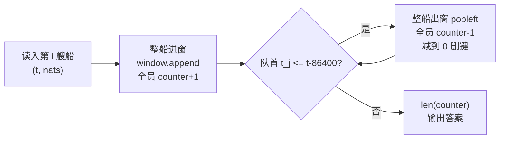

[[TOC]]

## 形式化题目

给定 $n$ 艘船，第 $i$ 艘船在时刻 $t_i$（秒）到达，载 $k_i$ 名乘客，国籍为 $x_{i,1},\dots,x_{i,k_i}$；$t_i$ 单调不减。对每个 $i$，统计满足

$$t_i - 86400 < t_j \leqslant t_i$$

的所有船 $j$（$1 \leqslant j \leqslant i$）上的乘客共来自多少个**不同国籍**，输出 $n$ 行。

样例 2 的窗口滑动过程（窗口为开左闭右区间 $(t-86400,\ t]$）：

| 查询 $i$ | $t_i$ | 窗口 | 窗口内的船 | 国籍多重集 | 答案 |
| :--: | :--: | :--: | :-- | :-- | :--: |
| 1 | $1$ | $(-86399, 1]$ | 船1 | $\{1,2,2,3\}$ | $3$ |
| 2 | $3$ | $(-86397, 3]$ | 船1、船2 | $\{1,2,2,3,2,3\}$ | $3$ |
| 3 | $86401$ | $(1, 86401]$ | 船2、船3 | $\{2,3,3,4\}$ | $3$ |
| 4 | $86402$ | $(2, 86402]$ | 船2、船3、船4 | $\{2,3,3,4,5\}$ | $4$ |

第 3 行是题眼：船 1（$t=1$）恰好落在左端点上（$86401-86400=1$），因左端是**开区间**而被移出，国籍 1 不再计入——出窗判定必须是 `t <= t_i - 86400`。

样例 1 则全程在 24 小时内：第 1 艘船到达时窗口内只有它自己，国籍 $\{4,1,2,2\}$ 去重得 $3$；第 2 艘船到达后窗口内两船合计 $\{4,1,2,2,2,3\}$ 去重得 $4$；第 3 艘船带来国籍 3（已有），答案仍为 $4$。

## 正解

### 思路

**朴素做法。** 对每个 $i$，从第 1 艘船重扫到第 $i$ 艘，把满足 $t_j > t_i - 86400$ 的船的乘客国籍全部塞进集合，输出集合大小。单个查询最坏扫完全部船和全部乘客，总计 $O(n \cdot (n + \sum k_i))$，在 $n = 10^5$、$\sum k_i = 3 \times 10^5$ 下约 $10^{10}$，完全不可行。

**瓶颈。** 相邻两次查询的窗口几乎完全重合：第 $i$ 次相对第 $i-1$ 次只发生两件事——右端新纳入第 $i$ 艘船，左端划出满足 $t_j \leqslant t_i - 86400$ 的若干旧船。朴素做法却把整个窗口从零重建了一遍。优化方向就是**把"重建"改成"两端增量维护"**。

**观察 1：$t_i$ 递增 ⇒ 窗口两端单调右移，整船进出。** 因为 $t_i$ 不减，$t_i - 86400$ 也不减：过期的船永远堆在窗口最左端，一片连续的队首，弹到第一个不满足的船即可。于是用一个 `deque` 按时间升序存窗口内的船 `(t, nats)`——船 $i$ 进窗时整船 `append`，过期时整船 `popleft`，不需要逐乘客判断去留。

**观察 2：计数器代替集合，答案变成 $O(1)$。** 维护 `counter[国籍] = 窗口内该国籍人数`：进窗每人 `+1`，出窗每人 `-1`，**减到 0 立即删键**。这样 `len(counter)` 恒等于窗口内不同国籍数，每轮查询无需遍历计数表。删键这步不可省——不删的话 `len` 会把已离开窗口的国籍也算进去。

**观察 3：每个乘客只进一次、出一次，总工作量线性。** 一艘船的 $k_i$ 个乘客在进窗时各 `+1` 一次、出窗时各 `-1` 一次，全程共 $2\sum k_i$ 次增删。总复杂度 $O(n + \sum k_i)$，比朴素做法少了整整 $n$ 倍。

每轮"进窗 → 出窗 → 查询"的数据流如下：



观察要点：三个动作里只有前两个碰数据，且都按"船"为单位整进整出；`counter` 删零键保证 `len()` 与"不同国籍数"恒等。

### 代码

Python 落地有两个针对 32MB 内存限制的细节：输入用 `sys.stdin.buffer` 的**行迭代器流式消费**（`read_ships` 生成器），不在内存里驻留整份输入，窗口滑过后旧船的国籍列表即被回收；输出逐行 `write`，不攒整份答案。窗口与计数逻辑集中在 `window_answers` 生成器里，`solve` 只做读入、调用、输出。

@include-code(./main.py, python)

### 复杂度

- 时间：进窗 $\sum k_i$ 次 `+1`、出窗全程 $\sum k_i$ 次 `-1`、每轮查询 $O(1)$，合计 $O(n + \sum k_i)$，与 C++ 正解（队列 + 计数数组）同阶。
- 空间：窗口队列与计数器最坏 $O(\sum k_i + \text{国籍值域})$；流式读入保证窗口外的数据不占内存。
- 实测：20/20 真实测例输出全部一致，最大测例（$n = 95009$、$\sum k_i = 300000$）本地 0.10s、峰值内存 16.8MB，均在 OJ 的 1000ms/32MB 之内（OJ 硬件不同仍存在轻微 TLE/MLE 风险，按仓库规则允许）。

## 总结

- $t_i$ 单调 ⇒ 时间窗口两端单调右移：过期船永远在队首，`deque` 整船进出即可，不必逐乘客判断。
- "不同国籍数"用字典计数维护：进 `+1`、出 `-1`、**归零删键**，`len(dict)` 直接就是答案。
- 每个乘客只处理常数次，总复杂度 $O(n + \sum k_i)$，是朴素重扫 $O(n(n+\sum k_i))$ 的 $1/n$。
- 左端点是开区间，出窗条件取 `t <= t_i - 86400`（取等即出），样例 2 第 3 轮就是这个边界。

## 图示解析

整道题的推导路线：

```text
朴素：每个 i 重扫前 i 艘船 + 集合去重            O(n * (n + sum k))
        |
        | 瓶颈：相邻窗口几乎重合，却每轮从零重建
        v
关键观察
  1. t_i 递增 → 窗口两端单调右移      → deque 整船进出，队首即过期船
  2. 计数代替集合、归零删键           → len(dict) 即答案，O(1) 查询
  3. 每乘客只进一次出一次             → 总增删 2*sum k，线性
        |
        v
正解（main.py）
  read_ships:   行迭代器流式读入，不驻留整份输入（省内存）
  window_answers: append 进窗(+1) → while 队首过期出窗(-1, 删零键)
                  → yield len(counter)
  solve:        读入 → 生成器 → 逐行 write 输出
        |
        v
时间 O(n + sum k)，空间 O(sum k + 国籍值域)，实测 0.10s / 16.8MB
```

观察要点：三处观察各消掉朴素做法的一部分代价——单调性消掉"找过期船"，计数器消掉"重建集合"，线性增删消掉"重复扫乘客"；剩下的就是把三个动作按"整船"为单位串成一条流水线。
