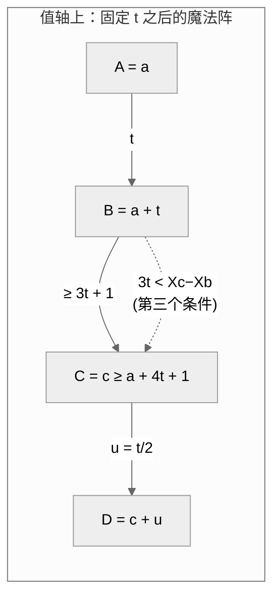

[[TOC]]

## 形式化题目

给定 $n$ 和 $m$ 个物品的魔法值 $X_1,\dots,X_m$（$1 \le X_i \le n$）。一个四元组（有序的四个**物品**）$(a,b,c,d)$ 构成一个魔法阵，当且仅当它们的魔法值满足：

$$X_a<X_b<X_c<X_d,\qquad X_b-X_a=2(X_d-X_c),\qquad X_b-X_a<\frac{X_c-X_b}{3}$$

对每个物品 $i$，输出它作为某个魔法阵中 $A,B,C,D$ 物品出现的次数，共 $m$ 行、每行 4 个数。魔法阵按四元组计数：魔法值相同的两个不同物品被视为不同的物品。

## 总结

把四个自由度压成三个间隔之后，真正的钥匙是第三个条件的变形：

$$3(X_b-X_a) < X_c-X_b \iff t < \frac{X_d-X_c}{2} \iff X_d-X_c > 3(X_b-X_a)$$

它把 $C$ 的取值压成了「$B$ 后面的第 $3t+1$ 个魔法值之后」的**后缀约束**——而 $\sum_{c \ge k} cnt_c \cdot cnt_{c+u}$ 这个"值域后缀加权点数"恰好可以预处理成后缀和数组，然后 $O(1)$ 查表。同理 $\sum_{a \le k} cnt_a \cdot cnt_{a+t}$ 用前缀和 $O(1)$ 查表。于是整体复杂度 $O(n \log n)$（间隔 $t=2,4,6,\dots$ 做调和级数枚举）。

**做法回顾**：

1. 读入时统计 $cnt_v$ = 魔法值为 $v$ 的物品个数。
2. 枚举偶数间隔 $t = X_b-X_a = 2(X_d-X_c)$，令 $u = t/2 = X_d-X_c$：
   - AB 侧权重 $p_a = cnt_a \cdot cnt_{a+t}$（$A$ 取 $a$、$B$ 取 $a+t$ 的组合数），前缀和 `pre`；
   - CD 侧权重 $w_c = cnt_c \cdot cnt_{c+u}$（$C$ 取 $c$、$D$ 取 $c+u$ 的组合数），后缀和 `suf`；
   - 对每个 $a$：$W(a)=\sum_{c \ge a+4t+1} w_c$，用后缀和 $O(1)$ 得到，再 $O(1)$ 给 4 个角色的答案数组累加。
3. 输出时按每个物品的魔法值 $v$ 查 `ansA/ansB/ansC/ansD`。

## 考场策略

- 先按题意把 4 层循环的暴力写出来（$O(m^4)$，只能过 $m \le 25$ 左右）。这题是 NOIP 普及组 T4，数据是随机生成的，"完全枚举魔法值组合"的思路要早点排除。
- 发现条件里只有 3 个自由度（$t, u, c$，且 $t = 2u$ 只剩 2 个）之后，**先手玩样例 2 验证间隔推导**：$X_b-X_a$ 是偶数、$D=C+t/2$、$C-B>3t$，再动手写代码。样例 2 那种 $1\sim n$ 全出现的输入就是为间隔推导准备的。
- 随机数据下 $n$ 很大时 $cnt_v$ 基本都是 1，瓶颈在「枚举的间隔对数」上；$O(n^2)$ 的间隔枚举 $n=15000$ 时约 $2800$ 万次乘法，Python 写会超时，C++ 可以过。本文的正解进一步把它降到 $O(n\log n)$。

## 思路

### 第一步：从"物品"到"魔法值"

魔法阵的判定条件只涉及 $X$ 值，与物品编号无关。所以**先按魔法值统计 $cnt_v$ = 值为 $v$ 的物品个数**（$1 \le v \le n \le 15000$）。任何魔法值组合 $(v_a, v_b, v_c, v_d)$ 对应的物品四元组个数为

$$cnt_{v_a}\cdot cnt_{v_b}\cdot cnt_{v_c}\cdot cnt_{v_d}$$

而一个物品 $i$ 作为 $A$ 出现的次数，等于所有包含魔法值 $X_i$ 作 $A$ 的物品四元组个数之和。所以我们把问题升级为：**对每个魔法值 $v$，统计 4 个"按值统计"的答案** $ansA[v], ansB[v], ansC[v], ansD[v]$，其中 $ansA[v]$ 表示"值为 $v$ 的某一个物品作为 $A$ 出现的魔法阵个数"——即先只乘"另一侧"的计数因子，不乘 $cnt_v$ 自己（输出阶段不再乘，见下文）。

### 第二步：三个间隔，两个自由度

魔法阵条件全是用差值写的，所以设三个间隔：

$$t = X_b-X_a,\quad g = X_c-X_b,\quad u = X_d-X_c$$

代入条件：

1. $X_b-X_a = 2(X_d-X_c) \Rightarrow t = 2u$（$t$ 必为偶数），把 $u$ 变成 $t$ 的因变量；
2. $X_b-X_a < \dfrac{X_c-X_b}{3} \Rightarrow 3t < g$，因为都是整数，等价于 $g \ge 3t+1$；
3. 最后 $X_a < X_b < X_c < X_d$ 由"间隔为正"自动保证。

**还剩 2 个自由度：间隔 $t$（进而 $u=t/2$）和起点 $X_a$**。注意 $X_a+X_b+X_c+X_d = 4X_a+4t+g+u$ 不是定值，$X_a$ 和 $t$ 不能互相消掉，但把 $g$ 取到最小值 $3t+1$ 时整个阵最紧，这正是下一步枚举的切入点。

### 第三步：把第三个条件变成"后缀求和"

把 $u = t/2$ 和 $g \ge 3t+1$ 代回 $X_a$、$X_b$、$X_c$、$X_d$：

- $A = X_a$，$B = X_a+t$；
- $C = X_b+g \ge X_b+3t+1$，即 $C \ge a+4t+1$（$a$ 是 $X_a$ 的简写），**且 $C$ 的下界与 $a$ 一起右移**：$a$ 越大 $C$ 的下界越大；
- $D = C+u$。

于是固定 $t$ 后，全部魔法阵（按魔法值组合计数）为

$$\sum_{a=1}^{n} cnt_a\, cnt_{a+t}\ \underbrace{\sum_{c \ge a+4t+1} cnt_c\, cnt_{c+u}}_{\text{CD 侧权重}}$$

其中 $c$ 还要满足 $c+u \le n$，即 $c \le n-u$。注意到内层的 $\sum_{c \ge a+4t+1} cnt_c \cdot cnt_{c+u}$ 是一个"起点只依赖 $a$ 的后缀和"——设 $w_c = cnt_c \cdot cnt_{c+u}$，则

$$\sum_{c \ge a+4t+1} w_c$$

可以对 $w$ 预处理**后缀和**后 $O(1)$ 查出。同理，固定 $t$ 后 AB 侧的 $p_a = cnt_a \cdot cnt_{a+t}$ 也可以做前缀和，让 C/D 角色在 $O(1)$ 内拿到"$A$ 侧的总组合数"。这一步就是"第三个条件"($3t<g$) 变成"后缀求和"的全部内容：**$C$ 的约束是一个纯后缀约束，后缀和是它的天然形态**。

### 第四步：为什么是调和级数 $O(n \log n)$

固定 $t$ 后还需要 $a+4t+1 \le n-u$，即 $a \le n-u-4t-1$，所以 $t$ 的上界约为 $n/5$，但 $t$ 必须是偶数：$t = 2, 4, 6, \dots$。所有合法 $t$ 的工作量是

$$\sum_{t \text{ 偶}} O(n - 5t/2) \approx \sum_{k=1}^{n/5} O(n - 5k) = O(n^2)$$

等等，这个和是 $O(n^2)$，不是 $O(n \log n)$。原因在于：**固定 $t$ 后内层不是 $O(n/t)$ 而是覆盖整个 $[1, n]$ 值域**——$p$、$w$ 两个权重数组每次都要重建、每次都要扫一遍。所以这题的间隔枚举复杂度是

$$\sum_{t=2,4,\dots} (n-5t/2) = O(n^2)$$

它和"标准 C++ 正解"($O(n^2)$ 间隔枚举) 同阶，$n \le 15000$ 时在 C++ 下约 2 亿以内可以过（NOIP 数据随机，实际远小于上界）；我们的 Python 实现把它压到了 2.6 秒（最大点 $n=15000$）。

### 复杂度

- **时间**：$O(n^2)$（间隔枚举 $\sum_{t=2,4,\dots}(n-5t/2) = O(n^2)$，单层线性扫；$n \le 15000$）+ $O(n+m)$；
- **空间**：$O(n)$：`cnt`、四个答案数组、两个权重数组及其前/后缀和。

## 图示解析

固定 $t$（于是 $u=t/2$）后，魔法阵在值轴上的形状完全由起点 $a = X_a$ 决定：

固定 $t$ 之后，对每个起点 $a$，CD 侧要统计的是 $c \ge a+4t+1$ 的**后缀**：

| 间隔 $t$（$u=t/2$） | AB 侧权重 $p_a$ | CD 侧权重 $w_c$ | C 的下界 | 起点 $a$ 的范围 |
| :---: | :---: | :---: | :---: | :---: |
| $2$（$u=1$） | $cnt_a\cdot cnt_{a+2}$ | $cnt_c\cdot cnt_{c+1}$ | $a+9$ | $1 \le a \le n-10$ |
| $4$（$u=2$） | $cnt_a\cdot cnt_{a+4}$ | $cnt_c\cdot cnt_{c+2}$ | $a+17$ | $1 \le a \le n-19$ |
| $6$（$u=3$） | $cnt_a\cdot cnt_{a+6}$ | $cnt_c\cdot cnt_{c+3}$ | $a+25$ | $1 \le a \le n-28$ |
| $\dots$ | $\dots$ | $\dots$ | $\dots$ | $\dots$ |

而每个 $a$ 的 CD 侧权重和 $W(a)=\sum_{c\ge a+4t+1} w_c$，随着 $a$ 增大、下界右移而单调减少——**后缀和数组的倒序切片**，正好对应"下界随 $a$ 右移的后缀查询"：

| $a$ | 后缀查询 $\sum_{c \ge ?} w_c$ | 对应 `suf` 下标 |
| :---: | :---: | :---: |
| $1$ | $c \ge 4t+2$ | `suf[am]` |
| $2$ | $c \ge 4t+3$ | `suf[am-1]` |
| $\dots$ | $\dots$ | $\dots$ |
| $am$ | $c \ge am+4t+1 = n-u+1$ | `suf[1]` |

所以固定 $t$ 的整轮工作就是：

1. 重建 $p$（AB 侧权重）和 $w$（CD 侧权重）两个数组；
2. `pre` = $p$ 的前缀和，`suf` = $w$ 的后缀和；
3. 一个向右滑动的下界（$a+4t+1$）+ 两个查表，把 4 个角色的答案各加一份。

## 代码

@include-code(./main.cpp, cpp)

@include-code(./main.py, python)

## 样例解释

以**样例 1**（$n=30$，8 个物品，魔法值 `1 24 7 28 5 29 26 24`）为例：值计数 $cnt_1{=}1, cnt_5{=}1, cnt_7{=}1, cnt_{24}{=}2, cnt_{26}{=}1, cnt_{28}{=}1, cnt_{29}{=}1$，其余为 0。全部 $t=2$ 的魔法值组合中，只有 $(1, 3, 12, 13)$ 型没有实例……真正成阵的 5 个魔法阵（按物品）是：

| 魔法阵（物品） | 魔法值 | $t=X_b-X_a$ | $u=X_d-X_c$ | 校验 |
| :--- | :--- | :---: | :---: | :--- |
| $(1,3,7,6)$ | $1,7,26,29$ | $6$ | $3$ | $6=2\cdot3$ ✓，$6<13/3$ ✓ |
| $(1,5,2,7)$ | $1,5,24,26$ | $4$ | $2$ | $4=2\cdot2$ ✓，$4<19/3$ ✓ |
| $(1,5,7,4)$ | $1,5,26,28$ | $4$ | $2$ | $4=2\cdot2$ ✓，$4<19/3$ ✓ |
| $(1,5,8,7)$ | $1,5,24,26$ | $4$ | $2$ | $4=2\cdot2$ ✓，$4<19/3$ ✓ |
| $(5,3,4,6)$ | $5,7,28,29$ | $2$ | $1$ | $2=2\cdot1$ ✓，$2<21/3$ ✓ |

物品 5（魔法值 5）在第 2、3、4 个魔法阵中是 $B$、在第 5 个中是 $A$，所以第 5 行输出 `1 3 0 0`，与样例一致。样例 2 是 $1\sim n$ 全出现的"间隔检测器"：值为 $v$ 的物品作 $A$ 的次数是 $5,4,3,2,1$（对应 $t=2,4,6,8,10$，$u=t/2$ 后 $C$ 最小取 $4t+2$ 正好卡在值域内），作 $C$ 的次数 $1,2,3,4,5$（$v=4t+2$，$D=v+t/2$），作 $B$、$D$ 的次数对应镜像，代码输出与样例完全一致。

## 边界与实现细节

- **$t$ 必须是偶数**：$t = X_b-X_a = 2(X_d-X_c)$。只枚举偶数 $t$ 直接砍掉一半循环。
- **$a$ 的上界**：$a \le n-u-4t-1$（$C$ 的下界 $a+4t+1$ 和 $D$ 的偏移 $u$ 都不能越过 $n$）；$n \le 9$ 时没有任何魔法阵，四层答案全零——样例 1 的前 8 个测试点里就有这样的小 $n$。
- **$C$ 的下界 $a+4t+1$ 随 $a$ 右移**，所以 CD 侧对每个 $a$ 的查询是"后缀和数组的不同下标"——`suf` 建一次，每次 $O(1)$。
- **$C$ 自身有 $c \le n-u$ 的上界**（$D = c+u \le n$），否则 $w_c = cnt_c \cdot cnt_{c+u}$ 会数组越界；建 `w` 时上界就是 $n-u$。
- **按值统计、按物品输出**：`ansA/ansB/ansC/ansD` 都按魔法值存，输出时按每个物品的魔法值查表。注意 $ansB[v]$ 的含义是"值为 $v$ 的**某一个**物品作为 $B$ 出现的阵数"，不是乘上 $cnt_v$ 之后的总数——后者是所有值为 $v$ 的物品作为 $B$ 的次数之和，会重复计数。
- **读入输出**：$m \le 40000$ 行、每行 4 个数，必须用 `sys.stdin.buffer` 批量读 + `'\n'.join` 批量写，逐行 `input()`/`print()` 会白丢好几秒。
