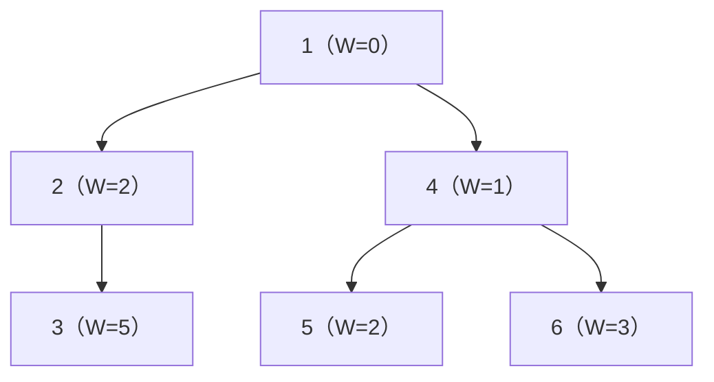
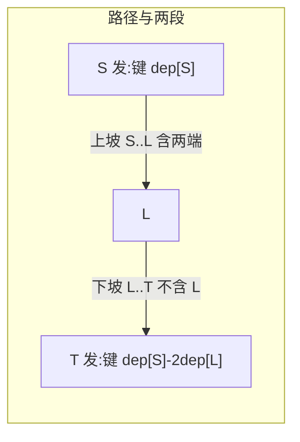
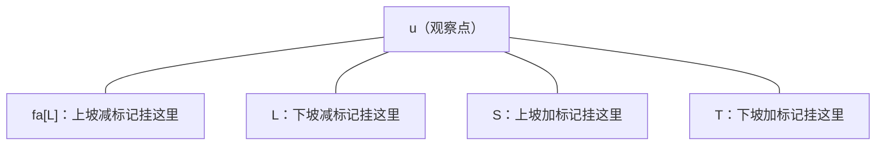

[[TOC]]

## 形式化题目

给一棵 $n$ 个点的树，每个点 $j$ 有一个观察时刻 $W_j$。有 $m$ 个玩家，第 $i$ 个玩家第 $0$ 秒从 $S_i$ 出发，沿树上唯一简单路径每秒走一条边跑向 $T_i$，**恰好到达 $T_i$ 时停止**（不能提前停在终点等待）。

点 $j$ 的观察员能看到玩家 $i$，当且仅当玩家 $i$ 在第 $W_j$ 秒恰好位于点 $j$。求每个点能看到多少个玩家。

样例 1 的树与三条路径（点旁括号内是 $W_j$）：

玩家 1 走 $1 \to 4 \to 5$，玩家 2 走 $1 \to 2 \to 3$，玩家 3 走 $2 \to 1 \to 4 \to 6$。
逐点核对（格子 = 玩家到达该点的时刻，`×` 表示不在路径上）：

| 点 $j$（$W_j$） | 玩家 1：$1\to5$ | 玩家 2：$1\to3$ | 玩家 3：$2\to6$ | 答案 |
| --- | --- | --- | --- | --- |
| 1 (0) | 0 ✓ | 0 ✓ | 1 | **2** |
| 2 (2) | × | 1 | 0 | 0 |
| 3 (5) | × | 2 | × | 0 |
| 4 (1) | 1 ✓ | × | 2 | **1** |
| 5 (2) | 2 ✓ | × | × | **1** |
| 6 (3) | × | × | 3 ✓ | **1** |

表格的行是观察点、列是玩家，格子是到达时刻；时刻恰好等于行首 $W_j$ 才打 ✓。
观察重点：点 3 虽在玩家 2 路径上，但 $W_3 = 5 > 2$，玩家早就跑过去了；点 1 的两个 ✓ 都是"起点即观察点、$W=0$"的边界情形。

## 正解

### 思路

#### 朴素做法与瓶颈

最直接的做法：对每个玩家沿路径逐点走一遍，在每个点 $u$ 检查"到达 $u$ 的时刻是否等于 $W_u$"。单条路径长度可达 $O(n)$，总代价 $O(nm)$；本题 $n, m \leqslant 3 \times 10^5$，约 $9 \times 10^{10}$ 次操作，完全不可行。

瓶颈在于：**每个玩家把贡献平摊到路径上每个点**，而询问（每个观察点）却只要一个总数。要让"发贡献"变成 $O(1)$，就必须让每个点**主动来认领**属于自己的贡献。

#### 关键转化：把"时刻相等"写成两条深度等式

玩家路径经过折点 $L=\mathrm{lca}(S,T)$，拆成两段。设 $dep$ 为深度（根深度 0），玩家走一条边花 1 秒，于是：

- **上坡段** $S \to L$（含两端）：点 $u$ 在这一段上的时刻是 $dep[S] - dep[u]$。"时刻等于 $W_u$" 即

$$dep[u] + W_u = dep[S].$$

- **下坡段** $L \to T$（不含 $L$）：设 $D = dep[S]+dep[T]-2\,dep[L]$ 为全程长度，点 $u$ 的时刻是 $D - (dep[T]-dep[u])$，化简后“时刻等于 $W_u$” 即

$$W_u - dep[u] = dep[S] - 2\,dep[L].$$

两个等式的形状完全一致：**左边是只跟点 $u$ 有关的一个数（键），右边是只跟玩家路径有关的一个数（桶）**。于是转化完成：

> 点 $u$ 被玩家看到 ⟺ $u$ 在路径上，且点键 $dep[u]+W_u$（上坡）或 $W_u-dep[u]$（下坡）出现在该路径放进某个桶里的标记中。

图中每个箭头是一段路径：上坡段的贡献由 $S$ 发出（键 $dep[S]$），下坡段的贡献由 $T$ 发出（键 $dep[S]-2\,dep[L]$）；
观察重点：**贡献的发出位置只有每段的一个端点**，这正是下一步能做差分的原因。

#### 从"路径逐点"到"子树统计"

把视角反过来：每个玩家只做两次"发标记"——

- 上坡标记（键 $k_1 = dep[S]$）挂在点 $S$；
- 下坡标记（键 $k_2 = dep[S] - 2\,dep[L]$）挂在点 $T$。

则"点 $u$ 在路径上且键匹配"恰好等价于"**标记挂在 $u$ 的子树内**"（子树 = 先序连续区间）：

- 上坡：$u \in [S..L]$ ⟺ $S$ 在 $u$ 子树内，且 $L$ 不是（$fa[L]$ 在子树外）；折点 $L$ 自身的到达时刻属于下坡等式，所以上坡段在 $L$ 处要扣掉——把一个键同为 $k_1$ 的"减标记"挂在 $fa[L]$。$L$ 为根时没有 $fa[L]$，标记自然丢失，无需特判。
- 下坡：$u \in (L..T]$ ⟺ $T$ 在 $u$ 子树内且 $L$ 也在 $u$ 子树内——把"减标记"直接挂在 $L$，同一次子树统计顺便完成"且"条件。

于是每个观察点的答案就是**子树内四个桶的二分计数**：

$$ans_u = \#\{S \in sub(u),\, dep[S] = dep[u]+W_u\} - \#\{fa[L] \in sub(u),\, dep[S] = dep[u]+W_u\} + \#\{T \in sub(u),\, k_2 = W_u-dep[u]\} - \#\{L \in sub(u),\, k_2 = W_u-dep[u]\}.$$

观察重点：$fa[L]$ 画在 $u$ 子树边界之外、$L$ 画在边界之内——上坡段的"折点不算"和下坡段的"折点要算、且必须 $L$ 也在子树内"这两处最容易写错的边界，被两个减标记的位置一次性解决。

#### LCA 与实现

- LCA 用 **Tarjan 离线**：询问挂在两个端点上，DFS 进入点 $u$ 时检查另一端是否已进入，是则答案为该端当前并查集代表；回溯离开 $u$ 时把 $u$ 并入父亲。整个 LCA 求解与 DFS 融为一体，$O((n+m)\alpha)$。
- Python 无递归深度保障，用**邻居迭代器栈**写迭代 DFS（栈顶孩子优先 = 真先序），同时拿到先序 `order`。
- 子树统计：先序时间戳 `tin` + 子树大小 `size`，把子树变成区间 `[tin[u], tin[u]+size[u]-1]`；四个桶内排序 `tin` 后，每个点两次二分即可，总 $O(n \log m)$。
- 键值范围：$dep[u]+W_u \in [1, 2n]$，$W_u - dep[u] \in [-(n-1), n]$，桶用 `defaultdict(list)` 免去手工偏移。

### 代码

@include-code(./main.py, python)

### 复杂度

- **时间复杂度**：DFS + Tarjan 离线 LCA $O\bigl((n+m)\alpha(n)\bigr)$，差分标记 $O(m)$，子树统计 $O(n \log m)$，总计 $O\bigl((n+m)\log m\bigr)$，与 C++ 正解同阶。
- **空间复杂度**：$O(n+m)$（邻接表、并查集、四个标记桶）；本实现 Python 对象开销较大（最大组实测约 350 MB），按约定允许 MLE；官方 1 s 限时下 Python 侧可能 TLE（本地最大组 0.87 s），算法阶数不受影响。

## 总结

- 看到"路径上点的到达时刻是否等于点权"，先按 lca 把路径拆成上坡、下坡两段，各写出一个**左边只依赖点、右边只依赖路径**的等式，统计问题立刻变成"点的键是否出现在路径桶里"。
- 路径逐点贡献 → **树上差分**：加标记挂段端点，减标记挂段边界外一格（$fa[L]$ 与 $L$），"折点算不算"这类边界由挂点位置自然表达。
- 询问"子树内有多少个某键标记"可以用 DFS 进出场合差分，也可以用先序 `tin` + 子树区间 + 桶内二分；后者在 Python 里更省状态。
