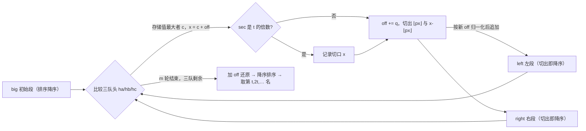

[[TOC]]

## 形式化题目

给定 $n$ 个非负整数 $a_1,\dots,a_n$（蚯蚓长度）、非负整数 $q$、有理数 $p = u/v \in (0,1)$ 以及轮数 $m$。进行 $m$ 轮，每轮对当前全体数构成的多重集执行：

1. 取出最大值 $x$（并列时任取一个）；
2. 把 $x$ 替换为 $\lfloor px \rfloor$ 与 $x - \lfloor px \rfloor$ 两个数（等于 $0$ 的段也保留）；
3. 除这两个新生数外，其余所有数同时加 $q$（新生段不参加本轮的 $+q$）。

需要输出两个抽样序列：

- 每轮取出的 $x$ 中，第 $t, 2t, 3t, \dots$ 轮对应的那些（共 $\lfloor m/t \rfloor$ 个）；
- $m$ 轮结束后全部 $n+m$ 个数按从大到小排序，第 $t, 2t, 3t, \dots$ 名（共 $\lfloor (n+m)/t \rfloor$ 个）。

## 正解

### 思路

#### 1. 朴素模拟与它的两个瓶颈

最直接的想法是把全体蚯蚓放进一个「能取最大、能插入」的结构（比如堆）：每轮取出最大、插入两段，这一步只要 $O(\log N)$，其中 $N = n+m$（排序数组取最大 $O(1)$，但插入仍是 $O(N)$）。但别忘了第 3 步——**其余全体还要 $+q$**：

- 真的逐个改，每轮 $O(N)$，$m$ 轮共 $O(mN)$；按最大规模 $m = 7\times10^6$、$N = 7.1\times10^6$ 估算约 $5\times10^{13}$ 次操作，完全不可行；
- 用堆也躲不掉：统一加 $q$ 会破坏堆序，仍然要逐个调整。

所以瓶颈很明确：**「全体 $+q$」每轮一次 $O(N)$** 与 **「每轮找最大」** 必须一起解决，因为前者会摧毁后者赖以加速的序结构。

#### 2. 全局偏移量：把「全体 +q」记成一个变量

观察到增量只与「经过了几轮」有关，与蚯蚓是哪一条无关：一条蚯蚓被加的总量始终是 $q \times$「它出生后经历的轮数」。于是不再逐条修改，而是维护一个累计增量 $off$（初始 $0$，每轮结束 $+q$），每条蚯蚓只存**存储值** $c$，约定：

$$\text{真实长度} = c + off.$$

- 初始蚯蚓在 $off = 0$ 时入队，$c = a_i$；
- 每轮结束 $off \mathrel{+}= q$，就等价于「其余全体 $+q$」，而所有存储值纹丝不动；
- 新生两段不参加本轮 $+q$，所以要**先** $off \mathrel{+}= q$、**再**以新 $off$ 归一化入队：左段 $c_L = \lfloor px\rfloor - off$，右段 $c_R = x - \lfloor px\rfloor - off$，保证入队瞬间 $c + off$ 恰好等于切出的真实长度。

更关键的是：比较两条蚯蚓时 $off$ 是公共项，**比真实长度等价于比存储值**。找最大从此不用碰 $off$。

#### 3. 三个降序队列：每轮 O(1) 取最大

按存储值取最大，只需知道每个「来源」的最大存储值，而来源恰好只有三段。（有了偏移量当然也可以把全部存储值扔进堆里做 $O(m\log m)$；但下面会证明三段各自单调，于是每轮只比三个队头就行，模拟主体降到 $O(m)$——这正是 Python 版能按正解同阶跑完的关键。）

- **初始段**：读入后排序一次即降序；
- **左段、右段**：按切出顺序各自单调不增——这是本题的核心引理。

**为什么两段天然降序？** 记第 $k$ 轮切时的累计增量 $off_k = (k-1)q$、取走的存储值为 $s_k$（真实长度 $x_k = s_k + off_k$），切后 $off_{k+1} = off_k + q$，入队值 $l_k = \lfloor px_k\rfloor - off_{k+1}$，$r_k = x_k - \lfloor px_k\rfloor - off_{k+1}$。

- **$s_k$ 不增**：取走 $s_k$ 后，留下的旧值都 $\le s_k$（$s_k$ 是当轮最大）；新生两段 $l_k \le x_k - off_{k+1} = s_k - q \le s_k$（用 $\lfloor px_k \rfloor < x_k$），$r_k \le x_k - off_{k+1} = s_k - q \le s_k$（用 $\lfloor px_k\rfloor \geqslant 0$）。故 $s_{k+1} \le s_k$。
- **左段不增**：记 $g = s_{k+1}-s_k \leqslant 0$，则 $x_{k+1}-x_k = g+q$。由 $\lfloor a\rfloor - \lfloor b\rfloor \leqslant a-b+1$ 得

  $$l_{k+1}-l_k = \lfloor px_{k+1}\rfloor - \lfloor px_k\rfloor - q \leqslant p(g+q)+1-q \leqslant pq+1-q = 1-q(1-p) < 1 \quad (q \geqslant 1),$$

  差值是整数且 $<1$，只能 $\leqslant 0$；$q=0$ 时 $off$ 恒为 $0$，$\lfloor px_k\rfloor$ 就是单调函数作用在不增的 $s_k$ 上，直接不增。
- **右段不增**：由 $\lfloor a\rfloor - \lfloor b\rfloor \geqslant a-b-1$ 得

  $$r_{k+1}-r_k = g - \big(\lfloor px_{k+1}\rfloor - \lfloor px_k\rfloor\big) \leqslant g - \big(p(g+q)-1\big) = g(1-p)-pq+1 \leqslant 1-pq < 1 \quad (q \geqslant 1),$$

  同样整数差 $\leqslant 0$；$q=0$ 时 $r_k = \lceil(1-p)s_k\rceil$，随 $s_k$ 不增而不增。

于是三段都是**只出不进的存储值降序队列**：任意时刻全局最大就是三个队头之一，每轮 $O(1)$ 比出最大、推进该队指针、把新切的两段追加到左右队尾即可。平局时先比到谁就取谁，题面允许任取。

样例 1（$q=1$，$p=1/3$）逐轮验证三个序列的单调性——下表同时演示归一化记账：

| 秒 $k$ | 切时 $off$ | 切口 $x$（输出值） | 存储值 $s_k = x-off$ | 新生两段（世界长度） | 新段存储值 |
| --- | --- | --- | --- | --- | --- |
| 1 | 0 | 3 | 3 | 1, 2 | 0, 1 |
| 2 | 1 | 4 | 3 | 1, 3 | -1, 1 |
| 3 | 2 | 4 | 2 | 1, 3 | -2, 0 |
| 4 | 3 | 4 | 1 | 1, 3 | -3, -1 |
| 5 | 4 | 5 | 1 | 1, 4 | -4, -1 |
| 6 | 5 | 5 | 0 | 1, 4 | -5, -2 |
| 7 | 6 | 6 | 0 | 2, 4 | -5, -3 |

读法：第 2 列是公共偏移 $off$，第 3 列（真实切口）虽然一路涨到 6，但第 4 列存储值 $3,3,2,1,1,0,0$ 单调不增；新段存储值按「左列 $0,-1,-2,-3,-4,-5,-5$、右列 $1,1,0,-1,-1,-2,-3$」分别不增，与上面的引理完全吻合——这正说明比较存储值与比较真实长度等价。样例输出的第一行 $3,4,4,4,5,5,6$ 正是第 3 列；第二行 $6,6,6,5,5,4,4,3,2,2$ 则是第 7 轮结束后三队剩余值加回 $off$、降序排序的结果（$t=1$ 全部输出）。

#### 4. 收尾

$m$ 轮后把三队剩余的存储值统一加 $off$ 还原成真实长度（加常数不改变大小序），整体降序排序，按 `rest[t-1::t]` 抽出第 $t, 2t, \dots$ 名；切口序列则在循环里每逢第 $t$ 轮记录一次。两行各自独立地从头按 $t$ 计数（样例 2 强调第二行不接第一行没输出的余数），任何一行没有数要输出时也各打一个空行（样例 3 的第一行）。

### 代码

@include-code(./main.cpp, cpp)

@include-code(./main.py, python)

### 复杂度

- **时间复杂度**：$O(n\log n + m + (n+m)\log(n+m))$——排序两次、主循环 $m$ 轮每轮 $O(1)$，与 C++ 正解同阶。
- **空间复杂度**：$O(n+m)$——三队列合计存储 $n+2m$ 个整数，终态再拼接 $n+m$ 个。

## 总结

- 「每轮全体 $+q$」与「每轮取最大」互相牵制：用全局偏移量 $off$ 统一记账，真实长度 $=$ 存储值 $+ off$，加 $q$ 退化成一个变量自增，比较退化成比存储值。
- 存储值坐标下，初始段、左段、右段各自都是降序的只出队列，三队头比较即全局最大，模拟主体 $O(m)$。
- 抽样输出（第 $t,2t,\dots$ 轮 / 第 $t,2t,\dots$ 名）分别用 `sec % t == 0` 与切片 `rest[t-1::t]` 处理，两行为空时也各输出一个空行。

## 图示解析

下图展示正解的数据流：三个存储值降序队列供出队头，切割结果回填左右两队，终态统一还原排序。

读者应注意到：$off$ 只在右侧的记账步骤里自增一次，从不进入队列内容；左右两队既有「被取走」也有「被追加」，但取的永远是队头、加的永远是队尾，所以队内降序始终成立。
