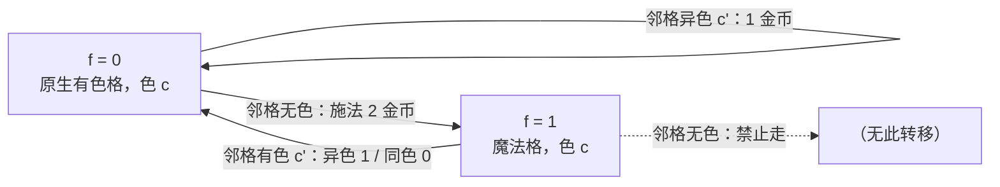

[[TOC]]

## 形式化题目

给定 $m \times m$ 网格，其中 $n$ 个格子有颜色 $0$（红）或 $1$（黄），其余格子无色，起点 $(1,1)$ 保证有色。只能沿上下左右四方向移动，且**任何时刻脚下必须有色**。从格子 $u$ 走到相邻格子 $v$：两格颜色相同花费 $0$，不同花费 $1$。此外可以花 $2$ 施展魔法：把相邻的一个**无色**格子临时染成**自己指定的颜色**，然后才能踩上去。魔法有两条限制：

1. **不能连续使用**：站在魔法染出的格子上时不得再施法，必须先走回一个原生有色格；
2. **离开即失效**：一旦离开魔法格，它恢复无色，不能被当成普通中转点反复踩。

求从 $(1,1)$ 走到 $(m,m)$ 的最小总花费；不可达输出 $-1$。

样例 1 的棋盘与最优路线如下，格内是"颜色 + 到达序号"，"魔"表示该无色格被临时染黄：

| $x \backslash y$ | 1 | 2 | 3 | 4 | 5 |
| --- | --- | --- | --- | --- | --- |
| 1 | 红① | 红② | $\cdot$ | $\cdot$ | $\cdot$ |
| 2 | $\cdot$ | 黄③ | 魔④ | $\cdot$ | $\cdot$ |
| 3 | $\cdot$ | $\cdot$ | 黄⑤ | 红⑥ | $\cdot$ |
| 4 | $\cdot$ | $\cdot$ | $\cdot$ | 黄⑦ | 魔⑧ |
| 5 | $\cdot$ | $\cdot$ | $\cdot$ | $\cdot$ | 红⑨ |

这条路线共 10 个动作：$0+1+2+0+0+1+1+2+0+1 = 8$。两座"魔法桥" $(2,2)\to(2,3)$、$(4,4)\to(4,5)$ 各花 $2$；第一次施法落地 $(2,3)$ 后，经原生有色格 $(3,3)$、$(3,4)$ 走到 $(4,4)$ 才第二次施法——两次施法之间确实站在过原生有色格上，满足"不能连续使用"；其余开销全是换色费。

## 正解

### 思路

**朴素想法。** 把棋盘当普通网格跑最短路：无色格也能走，只付同色 $0$ / 异色 $1$ 的换色费。这是错的——无色格必须花 $2$ 施法才能踩，而且"不能连续施法"意味着**能不能走某条边取决于上一步站在什么格子上**。所以裸的格子坐标 $(x,y)$ 不是充分的状态。

**瓶颈：历史信息怎么压缩？** 两条魔法规则合起来只问一件事：你现在站的是原生有色格还是魔法格？

- 原生有色格：下一步**允许**施法（可走向无色格，付 $2$）；
- 魔法格：下一步**禁止**施法（只能走向有色格），且离开后此格作废。

于是只需在状态里并入一位 $f$：$f=0$ 表示站在原生有色格，$f=1$ 表示站在魔法格。"上一步走了哪"这类完整历史不再需要。

**魔法颜色固定为施法者颜色。** 施法时可指定任意颜色，但这条通道的总费用与指定色几乎无关：设施法者色 $c$、之后要走向有色格 $c'$，指定色 $x$ 的费用是 $2 + [c \neq x] + [x \neq c']$（$[P]$ 是指示符：条件 $P$ 成立记 $1$，否则记 $0$）——取 $x = c$ 或 $x = c'$ 都恰好等于 $2 + [c \neq c']$，取与两者都不同的颜色则只会更贵。所以 **WLOG 令魔法格颜色 $=$ 施法者颜色**，状态里直接携带脚下颜色 $c$ 即可，无穷的"指定颜色"决策被消掉。

**建图跑最短路。** 状态 $(x, y, f, c)$，边权只有 $0/1/2$ 三档，非负，堆 Dijkstra 即可（$0$ 边较多，0-1-2 分层 BFS 也行，实现收益不大）。转移正是模型的三条规则：

读者应重点看两件事：其一，$f=0$ 有三条出边、$f=1$ 只有一条——"魔法不能连续施法"就落在那条虚线禁止边上；其二，魔法状态落地后全部回到 $f=0$，"离开即失效"由转移结构天然保证：不存在连续踩两个魔法格的路径。

起点状态为 $((1,1), 0, c_{1,1})$。Dijkstra **首次弹出**任意 $(m,m)$ 状态即答案（不同 $f$ 的到达方式都是合法终点，可直接比较花费；终点无色时也只能以 $f=1$ 到达，同样被覆盖）；堆空则不可达输出 $-1$。

### 代码

@include-code(./main.cpp, cpp)

@include-code(./main.py, python)

### 复杂度

- 状态数 $V \leqslant n + 2m^2$（$n$ 个 $f=0$ 状态 + 无色格至多 $2m^2$ 个魔法状态，按携带颜色区分），每状态 $4$ 条出边；时间 $O((n + m^2) \log m^2)$，$m \leqslant 100$ 时约 $2 \times 10^4$ 状态、$10^5$ 级堆操作，与标准 C++ Dijkstra 正解同阶。
- 空间 $O(m^2)$：`dist` 字典与堆各存 $O(V)$。本仓库 20 组真实数据单组耗时 $\leqslant 0.02\,\mathrm{s}$、峰值约 $15\,\mathrm{MB}$，远低于 $1000\,\mathrm{ms}$ / $32\,\mathrm{MB}$ 限制。

## 总结

- 本题唯一的建模跳跃是发现**裸坐标不充分**：魔法规则让"下一步能做什么"依赖上一步，压缩成一位 $f\in\{0,1\}$（原生有色格 / 魔法格）后，历史信息恰好够用、状态不膨胀。
- 施法指定色是无穷决策，但通道费 $2 + [c \neq x] + [x \neq c']$（$[P]$ 为指示符）在 $x \in \{c, c'\}$ 时取到同一最小值，固定为施法者颜色即不劣——这一步把问题收成确定的三类边：同色 $0$、异色 $1$、施法 $2$。
- 非负小整数权 → 堆 Dijkstra；"首次弹出终点即答案"让终点有色/无色无需特判；堆空输出 $-1$。
- 验证：官方样例 $8$ / $-1$ 与题面逐步核对一致；data 仓 20 组真实测试数据全部 PASS（单组 $\leqslant 0.02\,\mathrm{s}$、约 $15\,\mathrm{MB}$）。
