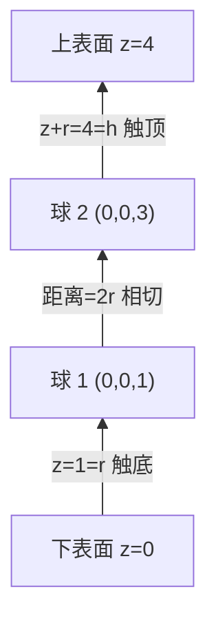

[[TOC]]

## 形式化题目

高度为 $h$ 的奶酪占据 $0 \leqslant z \leqslant h$ 的空间（水平方向视为无限大），内部有 $n$ 个半径同为 $r$ 的球形空洞，第 $i$ 个空洞球心为 $(x_i, y_i, z_i)$。连通规则：

- 两空洞相连：球心距离 $\leqslant 2r$（相交或相切）；
- 空洞接下表面：$z_i - r \leqslant 0$，即 $z_i \leqslant r$；
- 空洞接上表面：$z_i + r \geqslant h$。

问下表面 $z=0$ 与上表面 $z=h$ 是否属于同一个连通块。

样例三组的判定依据如下（比较全部用整数，无浮点误差）：

| 组 | 参数 | 空洞球心 | 关键判定 | 输出 |
| --- | --- | --- | --- | --- |
| 1 | $h=4,\ r=1$ | $(0,0,1)$、$(0,0,3)$ | $z_1=1 \leqslant r$ 触底；$z_2+r=4=h$ 触顶；距离 $=2=2r$ 相切 | `Yes` |
| 2 | $h=5,\ r=1$ | $(0,0,1)$、$(0,0,4)$ | 分别触底、触顶，但距离 $=3 > 2r$，两球不相连 | `No` |
| 3 | $h=5,\ r=2$ | $(0,0,2)$、$(2,0,4)$ | $z_1=2 \leqslant r$ 触底；$z_2+r=6 \geqslant h$ 触顶；距离平方 $=8 \leqslant 16$ 相交 | `Yes` |

三组的差别只在"边"上：第 1、3 组三个判定条件（触底、触顶、球对相连）全部成立，通路连通；第 2 组前两个条件成立但球对之间距离超过 $2r$，链条在中间断开，所以输出 `No`。

## 正解

### 思路

**朴素做法**：按定义枚举所有球对建无向图，再从下表面出发 BFS/DFS 看能否到达上表面。这个做法已经是 $O(n^2)$，但有三个可以打磨的点。

**第一步，把比较变成整数运算。** 直接算 $\sqrt{(x_1-x_2)^2+(y_1-y_2)^2+(z_1-z_2)^2}$ 再和 $2r$ 比较会引入浮点误差——坐标到 $10^9$ 时距离平方到 $4\times10^{18}$，恰好相切的边界很可能被判成相离。两边平方得到 $(x_1-x_2)^2+(y_1-y_2)^2+(z_1-z_2)^2 \leqslant 4r^2$，全程整数；题面说"相切或相交"都算连通，所以取 $\leqslant$ 而不是 $<$。

**第二步，用并查集代替建图 + BFS。** 这里只需要回答"是否连通"，不需要路径，而边是逐对"发现"的：发现一对相交就合并一次。上下表面也不必参与两两枚举——它们与球的连通条件可以直接算出（$z_i \leqslant r$、$z_i+r \geqslant h$），于是给并查集额外加两个虚拟节点：`bottom`、`top`。每个球按条件挂到对应虚拟节点上，最后只需问 `find(bottom) == find(top)`，整个判定收缩成一次根比较，省掉邻接表和队列。

**第三步，缩小枚举窗口。** 把球按 $z$ 升序排序。对球 $i$，任何与它相连的球 $j>i$ 都必须满足 $z_j - z_i \leqslant 2r$（否则球心距离已经大于 $2r$），而排序后 $z$ 单调递增，内层循环扫到 $z_j - z_i > 2r$ 就可以 `break`——远距离球对被整段跳过。

下图展示样例 1 连成的通路：两个球各自触到一个表面，彼此又相切，因此下表面与上表面同根。

四个节点、三条边就构成完整通路，样例 2 则因为中间那条边缺失而断开：连通性判定的关键从来不是图有多大，而是把每条合法边都恰好合并一次。

### 代码

@include-code(./main.py, python)

### 复杂度

- **时间**：排序 $O(n \log n)$，球对枚举最坏 $O(n^2)$，并查集操作近似 $O(1)$，故每组 $O(n^2)$，与 C++ 正解同阶；$n=1000,\ T=20$ 时最坏约 $10^7$ 次比较。
- **空间**：$O(n)$，球心列表加长度 $n+2$ 的父数组。

## 总结

把几何连通规则翻译成图：球是点，"相切/相交"是边，上下表面用虚拟节点承接。实现上有三个要点——平方比较避开浮点误差、并查集在线合并省掉邻接表、按 $z$ 排序后用窗口剪掉不可能相交的球对。最终每组数据 $O(n^2)$ 判定一次连通即可。
