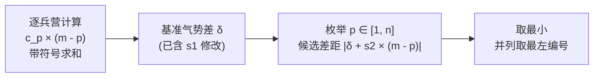
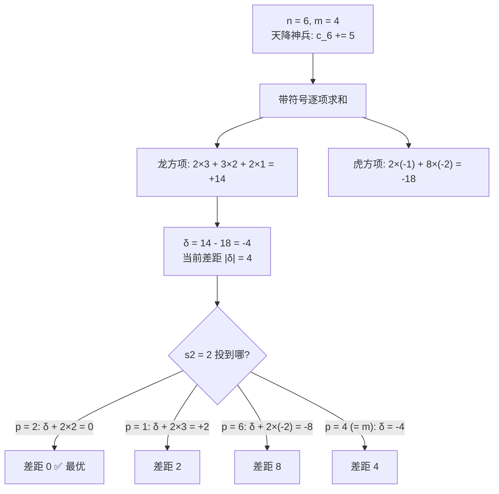

[[TOC]]

## 形式化题目

线段上有 $n$ 个兵营，编号 $1 \sim n$，第 $i$ 个兵营有 $c_i$ 位工兵；给定分界点 $m$（$1 < m < n$）。

- 兵营 $p$ 对气势的贡献量为 $c_p \times |p - m|$；
- 兵营 $p < m$ 的贡献记入龙方，$p > m$ 的记入虎方，$p = m$ 不记入任何一方。

先做一次修改：$c_{p_1} \mathrel{+}= s_1$。之后必须再把 $s_2$ 位工兵投放到某个兵营 $p_2$（相当于 $c_{p_2} \mathrel{+}= s_2$），使修改后龙、虎两方气势之和的差的绝对值 $|\text{龙气势} - \text{虎气势}|$ 最小。输出最优的 $p_2$；若多个位置同为最优，输出最小的编号。$p_2 = m$（即两方都不加入）也是合法选择。

数据范围：$n \leqslant 10^5$，$c_i, s_1, s_2 \leqslant 10^9$，时限 1s，内存 32MB。

先看样例 1（$n=6, m=4$，天降神兵前）：

| 兵营 $p$ | 1 | 2 | 3 | 4 | 5 | 6 |
| --- | --- | --- | --- | --- | --- | --- |
| 工兵数 $c_p$ | 2 | 3 | 2 | 3 | 2 | 3 |
| 到 $m$ 的距离 | 3 | 2 | 1 | 0 | 1 | 2 |
| 势力归属 | 龙 | 龙 | 龙 | — | 虎 | 虎 |

每个兵营的气势 = 第二行 × 第三行，再按第四行分边求和：龙方 $2\times3+3\times2+2\times1=14$，虎方 $2\times1+3\times2=8$。天降神兵在 $p_1=6$ 处加 $s_1=5$ 后，虎方变成 $8+(3+5)\times2=18$，与题面描述一致。

## 正解

### 思路

**朴素做法**：修改完 $c_{p_1}$ 之后，对每个候选位置 $p_2 \in [1, n]$，重新把 $n$ 个兵营的气势分边求和一遍，比较 $|$龙 $-$ 虎$|$，取最小值。单次求和是 $O(n)$，总复杂度 $O(n^2)$。$n \leqslant 10^5$ 时约 $10^{10}$ 次运算，必然超时——虽然本题允许 Python TLE，但正确的算法不该是平方级的。

**消除瓶颈**：固定 $c_{p_1} \mathrel{+}= s_1$ 之后，基础气势差是一个定值；换个 $p_2$ 只是给这个定值加一项修正，不需要每次从头求和。

推导这一步的关键是**带符号合并**。气势本来是两个非负的和，差值有减法；与其维护两个大数再相减，不如把每个兵营的贡献直接带上符号：

$$
\delta = \sum_{p=1}^{n} c_p \times (m - p)
$$

- $p < m$ 时 $(m-p) > 0$，这一项是龙方贡献；
- $p > m$ 时 $(m-p) < 0$，这一项是虎方贡献的相反数；
- $p = m$ 时恰为 $0$，自动出局。

于是"龙气势 $-$ 虎气势"就是这一个和式，龙虎差距就是 $|\delta|$。

在此基准上把 $s_2$ 人投到 $p$，新差距为

$$
\bigl|\delta + s_2 \times (m - p)\bigr|.
$$

它只含一个随 $p$ 变化的项，所以从左到右扫一遍 $p \in [1, n]$、共 $n$ 个候选即可：一边扫一边维护当前最小值和取到它的最左编号。扫描时把初值设为 $p = m$ 的效果（$|\delta|$，即"投到 $m$ 等于不改变气势"），这样连"$p_2 = m$ 是否合法"都不用单独讨论。样例 1 中 $\delta = 14 - 8 = -4$，投 $p=2$ 加上 $2\times(4-2)=4$ 后差距恰为 $0$，正是题解所说的平衡点。

下图画出了这个"定值 + 单项修正"的结构：

样例 2 是同样的计算在另一个方向上的应用：龙方 $11$、虎方 $16$，$\delta = -5$；投 $s_2 = 1$ 人到 $p = 1$ 号兵营后 $\delta + 1 \times (5-1) = -1$，差距只剩 $1$，这是全部候选里最小的（比如投到 $p = 2$ 只能补回 $3$，差距 $2$），所以答案为 $1$。

两个实现细节：

1. **绝对值符号由位置决定**。$p < m$ 时龙方加人会让 $\delta$ 变大，$p > m$ 时虎方加人让 $\delta$ 变小，两侧各是单调的；但直接对每个 $p$ 算 $|\delta + s_2(m-p)|$ 取 min 就不需要讨论单调段，代码更短也不易错。
2. **编号取最小**。只有严格小于当前最优才更新（`cur < best`），并列时自动保留最左边的编号；初值取 $p=m$ 也保证了并列时 $m$ 能被更左的合法位置覆盖。

**正确性**：对固定的 $p$，候选差距公式就是把"整个棋盘重新求和"的结果（两项求和的差等于差的和），逐一枚举所有 $p$ 不重不漏，所以取到的最小值就是答案。

### 代码

@include-code(./main.py, python)

### 复杂度

- 时间复杂度：求 $\delta$ 一遍 $O(n)$，枚举 $p_2$ 一遍 $O(n)$，总计 $O(n)$，与 $n \leqslant 10^5$ 完全匹配。
- 空间复杂度：$O(n)$ 存兵营数组，其余只用常数个整数。
- 数值范围：$|\delta| \leqslant 10^5 \times 10^9 \times 10^5 = 10^{19}$，已超出有符号 64 位整数上限（约 $9.2 \times 10^{18}$）、逼近无符号上限；C++ 用 `long long` 不保险，需要 `unsigned long long` 或 `__int128`。Python 的 `int` 是任意精度整数，天然无此顾虑。

## 总结

- 把"两个气势求差"折叠成**一个带符号的和式** $\delta = \sum c_p(m-p)$，是这道题从 $O(n^2)$ 到 $O(n)$ 的唯一关键一步：固定基准后，换投放位置只是加一项 $s_2(m-p)$。
- $m$ 号兵营在带符号视角下贡献恒为 $0$，"投到 $m$"自然成为枚举的合法候选，不需要任何特判。
- 更新答案用严格小于，并列最优自动落在最小编号上。
- C++ 需要用 `long long` 甚至 `__int128` 应对 $10^{19}$ 量级的气势差；Python 无溢出问题，只需注意一次读完输入、避免逐行读入的常数。

## 图示解析

上表把样例 1 的完整计算流程拆成四步：先逐兵营带符号求和得到 $\delta = -4$（虎方占优），再对若干代表位置计算"投放修正"后的差距。可以观察到：往龙侧（$p < m$）投放让 $\delta$ 增大、往虎侧投放让 $\delta$ 减小、投到 $m$ 则不变；$p=2$ 恰好把差距补到 $0$。实际代码会把 $p = 1 \sim 6$ 全部扫一遍，这里只画出有代表性的几个位置。
