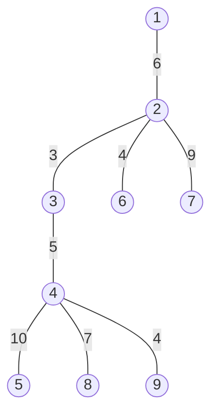
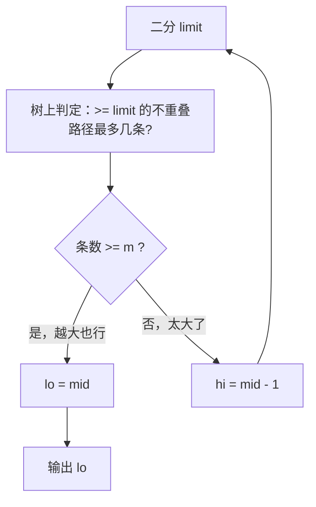

[[TOC]]

## 形式化题目

给定一棵 $n$ 个结点的树，每条边有一个正整数长度。要求选出 $m$ 条树上的简单路径（每条边至多属于一条路径），使得其中最短的路径长度尽可能大。求这个最大值。

**样例 2 推演**（$m = 3$，边长标在图上）：

把边长加起来容易验证：路径 $1 \to 7$ 长 $15$，路径 $6 \to 3 \to 4 \to 9$ 长 $16$，路径 $8 \to 5$ 长 $17$，三条路径两两不共用边，最短的是 $15$——这也是所有方案里的最大值。

## 正解

### 思路

**第一步：把"最短的最长"变成判定问题。** 直接决定 $m$ 条赛道怎么走很难，但如果我们先假设一个目标长度 $\mathrm{limit}$，问题就变成了一个判断题：

> 能否在树上选出 $m$ 条边互不重叠的简单路径，每条长度都 $\geqslant \mathrm{limit}$？

这个判定有一个关键的单调性：$\mathrm{limit}$ 越大，能修出的赛道条数只会越少。于是"能修出 $m$ 条 $\geqslant \mathrm{limit}$ 的赛道"对 $\mathrm{limit}$ 单调，可以**二分答案**：二分 $\mathrm{limit} \in [1, \sum l_i]$，找到满足条件最大的 $\mathrm{limit}$ 输出即可。剩下的问题只有一个——如何在树上一遍算出"$\geqslant \mathrm{limit}$ 的不重叠路径最多有几条"。

**第二步：树形贪心求最大条数。** 任取一个结点为根，自底向上处理。对每个结点 $u$，它的子树里能凑出的赛道只有两类：

1. **完全落在子树内**的赛道，在处理 $u$ 之前就结算掉；
2. **一端在 $u$ 的子树里、另一端向父亲延伸**的"半成品"：从某个子孙出发走到 $u$ 的一条单链，它是该子树中某点跳到 $u$、再到祖先的路径前缀。

于是每个结点只需向父亲汇报一个信息：**子树伸上来的单链**。这些单链两两之间可以在 $u$ 处拼起来（两条单链首尾相接，就得到一条完整的赛道），也可以被父亲继续延长。设处理 $u$ 时收到的单链长度列表为 $\mathrm{rests}$（每条是"子结点传上来的链 + 到 $u$ 的那条边"）：

- 某条链长度**已经 $\geqslant \mathrm{limit}$**：它自己就是一条完整赛道，直接结算。不用再管它——留一条链去配它，纯属浪费（对方被白吃掉）。
- 其余的链长度都 $< \mathrm{limit}$，**单干不行，只能两两拼**。把 $\mathrm{rests}$ 排序，双指针从两端向中间扫：最短 + 最长若能凑到 $\mathrm{limit}$，就配对成一条赛道；否则最短的那条谁也配不上（它和最长的都不行，和别的更不行），只能弃掉。这就是经典的**救生艇贪心**，能证明配出的是最多的对数。

未配对、未被弃掉的链里，**最长的那条**作为 $u$ 向父亲汇报的"剩余单链"——传得越长，将来在祖先那里被拼成赛道的希望越大。

**两个易错的实现细节**（都踩过坑）：

- **弃掉不等于永远消失。** 若 $u$ 处所有链恰好两两配满，双指针结束时刻意不剩链，但一个"最长被弃链"其实值得一记：比如单链 $\{6, 5, 3\}$、$\mathrm{limit} = 8$，贪心配出 $(3,6)$ 后什么都不传，可 $6$ 本身留在 $\mathrm{rests}$ 里若改配 $(3,5)$，就能把 $6$ 传上去。正确写法是：配对数取最大 $p$，在此前提下"弃掉"的链里取最长的；由于交换论证可证"弃掉较大的链、留下较小的"只会让配对更难，**能弃的最大值随被弃链的下标单调**，所以对弃谁再套一个二分，找到删掉后仍配得出 $p$ 对的最长链即可（全配满时记 $0$）。

| 结点 | 收到单链 | $\mathrm{limit}=8$ 时 | 剩余链 |
| --- | --- | --- | --- |
| $u$ | $[6, 5, 3]$ | 配 $(3,6)$，弃 $5$ | $6$（弃 $5$ 改配 $(3,5)$）|
| 根 | $[4, 2, 4]$ | 配 $(2,4)$，弃 $4$ | $4$ |
| 根 | $[8, 7]$ | 单干 $8$，配 $(7, ?)$ 不行 | $7$ |

- **$\geqslant \mathrm{limit}$ 的链直接单干结算**，不能参与配对后再被"剩下"——这是第一版贪心漏掉的情况，导致长链被无辜配对、答案偏小。

整个流程用一张图总结：

树形判定的执行顺序：先用一次 BFS 求出"父结点先于子结点"的访问序，再**倒序**遍历——保证计算某结点时它的所有子结点都已经把单链汇报上来了。$n \leqslant 5 \times 10^4$ 且树可能退化成链，Python 必须避免递归 DFS，这个访问序写法恰好是一棵树的"递归转迭代"。

### 代码

代码中 `max_pairs` 是救生艇双指针，`pair_chains` 负责单个结点的分配并返回 `(结算条数, 传给父亲的剩余链)`，`max_tracks(limit)` 就是树形判定本身，主流程是一段标准二分。

@include-code(./main.py, python)

### 复杂度

- 单次判定：每个结点进队一次，$\mathrm{rests}$ 排序的总代价是 $\sum d_u \log d_u = O(n \log n)$；结点内"弃谁"的二分多乘一层 $\log$，但同样只作用在 $d_u$ 条链上，总计仍 $O(n \log n)$。
- 二分次数：$O(\log \sum l_i) \leqslant O(\log(5 \times 10^4 \times 10^4)) \approx 29$ 次。
- 总复杂度 $O(n \log n \log \sum l_i)$，与 C++ 正解同阶，Python 常数偏大但真实数据全部通过；空间 $O(n)$。

## 总结

- "最短的最长" → 二分答案 $\mathrm{limit}$，把最优化变成树上判定：$\geqslant \mathrm{limit}$ 的不重叠路径最多能选出几条。
- 树形贪心自底向上：每条子树单链要么自成一赛道（$\geqslant \mathrm{limit}$），要么按救生艇双指针两两拼接；弃链时在配对数不变的前提下二分出能弃的最长链传给父亲。
- 两个坑：$\geqslant \mathrm{limit}$ 的链要直接单干；全配满时别把本可传上去的链弄丢。
- 复杂度 $O(n \log n \log \sum l_i)$。

## 图示解析

**单链在结点处的四种归宿**（树形贪心的核心动作）：

| 归宿 | 条件 | 动作 | 对答案的贡献 |
| --- | --- | --- | --- |
| 单干 | 链长 $\geqslant \mathrm{limit}$ | 直接结算，不再上报 | $+1$ |
| 配对 | 两条链长之和 $\geqslant \mathrm{limit}$ | 结算这一对 | $+1$ |
| 上传 | 未配对、未被弃、且最长 | 长度传给父亲 | $0$（将来在祖先处变现）|
| 弃掉 | 未配对但已确定不划算 | 只在上传候选里登记长度 | $0$ |

以样例 2 走一遍 $\mathrm{limit} = 15$ 的判定（自底向上，省略无事的叶子）：

| 结点 | 收到的单链 | 分配 | 结算 | 剩余链 |
| --- | --- | --- | --- | --- |
| $4$ | $[10, 7, 4]$ | $10$ 单干；$(4, 7)$ 拼不上，弃 $4$ 上传 $7$ | $1$ | $7$ |
| $3$ | $[7 + 5,\ 3] = [12, 3]$ | 都不够，上传 $12$ | $0$ | $12$ |
| $6$ | $[4]$ | 上传 | $0$ | $4$ |
| $7$ | $[9]$ | 上传 | $0$ | $9$ |
| $2$ | $[12 + 3,\ 4 + 4,\ 9] = [15, 8, 9]$ | $15$ 单干；$(8, 9)$ 拼不上 | $1$ | $9$ |
| $1$ | $[9 + 6,\ 6] = [15, 6]$ | $15$ 单干 | $1$ | — |

三处结算共 $3$ 条，恰好等于 $m$，$\mathrm{limit} = 15$ 可行；$\mathrm{limit} = 16$ 时按同样规则只能凑出 $2$ 条，二分收敛到 $15$，正是样例答案。观察重点：结点 $2$ 处那对 $(8, 9)$——它们都不是被弃的"最短链"，只是和为 $17 < \mathrm{limit}$ 不够，这种链越往上传越容易被更高的祖先拼起来，这正是"树形"的意义。
