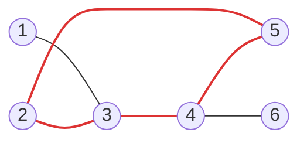

[[TOC]]

## 形式化题目

给定 $n$ 个城市、$m$ 条道路的无向连通简单图，其中 $m = n-1$ 或 $m = n$（图是一棵树或一棵基环树）。一次旅行按以下规则产生一个长度为 $n$ 的记录序列：

- 任选一个城市作起点，起点的编号记入序列；
- 每一步可以沿一条道路走到一个**没去过**的城市，把它的编号记入序列；
- 或者沿"第一次进入当前城市时经过的那条道路"原路后退——**后退不记录**；
- 回到起点时可以结束、也可以继续走，但旅行结束时每个城市都必须被访问过。

求所有合法旅行方案产生的记录序列中，字典序最小的那一个。

题面样例 2（$m = n$）的图如下，红色粗边构成图中唯一的环：



两个样例的正确走法：样例 1 是树，从 1 出发总走最小未访问邻居——$1 \to 3$，$3$ 的未访问邻居是 $2,4$，先走 $2$，再进 $5$，退回 $3$ 后走 $4$，最后进 $6$，得到 `1 3 2 5 4 6`。样例 2 中，若在城市 2 处仍走最小未访问邻居 5，得到 `1 3 2 5 4 6`；而最优方案要求在 2 处**空手后退**回 3，再走 $3 \to 4$、$4 \to 5$（在 5 处无路可走、退回 4）、$4 \to 6$，得到 `1 3 2 4 5 6`。这个“不肯后退”的陷阱正是本题的难点。

## 正解

### 思路

**朴素想法。** 从 1 出发，每步走向编号最小的未访问邻居，走投无路时沿第一次进入的边后退。样例 1 上它直接正确，样例 2 上它在城市 2 处走进 5，得到次优的 `1 3 2 5 4 6`。

**瓶颈：环上"谁是孩子"没有定下来。** 旅行里有一种自由度：当前城市某个没去过的邻居，这一次**不进**，等以后从别的道路进入——树上不存在这种选择（孩子的子树只能经它进入，必须当场走完），环上才有。所以不能无条件贪心，必须把这个选择显式枚举。

**观察一：记录序列 = 某棵生成树的先根序。** 每个城市（除起点外）第一次被进入时经过一条边，这些边互不相同、恰 $n-1$ 条、且把所有点连成一片，所以构成一棵生成树 $T$；记录序列正是 $T$ 的先根序，各点的孩子按访问先后排列。反过来，给定任意生成树和任意孩子顺序都能实现：沿树边前进、沿父边后退即可，而树边都在原图中。于是"任意后退策略的旅行"被收敛成组合对象 $(T,\ \text{孩子顺序})$。

**观察二：固定树后，孩子升序即字典序最小。** 先根序里，每个孩子及其子树是**一段连续块**，块首元素就是孩子编号本身。把块按块首升序拼接，第一个不同位置落在第一个不同的块首上，取值最小——对深度归纳可知每个点都让孩子升序访问。这等价于"总走最小未访问邻居"的贪心，一次 $O(n)$ 走完。

**观察三：起点必为 1。** 序列首元素就是起点，$1$ 是最小编号，且图连通、从 1 出发必能走完。

**观察四：候选生成树只有 $c$ 棵（$c$ = 环长）。** $m = n-1$ 时图本身就是树，生成树唯一。$m = n$ 时连通 + $n$ 点 $n$ 边 ⇒ 恰一个环；生成树必须删掉一条边且保持连通，被删边必在环上；反之删环上任一边仍连通且恰 $n-1$ 条边。故候选 = 环上全部 $c$ 条边。

四条观察合起来：**起点取 1，对每棵候选生成树跑一次“孩子升序”贪心得到先根序，取字典序最小者。**

**为什么这样就对（两头夹）。** 一方面，每个候选序列都真实可走（沿树前进、沿父边后退），所以它们的最小值仍是合法方案；另一方面，任取一个合法方案，它的首次进入边集必是某棵候选树，而该方案的序列按观察二不会优于这棵树的升序先根序，后者又不小于所有候选的最小值。两头一夹，输出既合法又不劣于任何合法方案，恰为字典序最小。

**样例 2 推演。** 下表把 4 条环边依次删去、各跑一次升序贪心（起点均为 1）：

| 删掉的环边 | 升序贪心得到的序列 |
| --- | --- |
| $(2,3)$ | 1 3 4 5 2 6 |
| $(3,4)$ | 1 3 2 5 4 6 |
| $(4,5)$ | 1 3 2 5 4 6 |
| $(5,2)$ | 1 3 2 4 5 6 |

最后一行最小，与答案一致。关键在删掉 $(5,2)$：生成树里点 2 只剩父邻居 3，贪心走到 2 时只能空手后退——这正是朴素贪心不肯做的事；5 被推迟到从 4 进入，于是 2 和 4 之间不再被 5 插开。其余三行都因为"2 当场进了 5"或"4 被提前"而更大。

**算法流程。** 读入建邻接表并**逐点升序排序**（升序贪心就是顺序扫描）；$m = n$ 时先用显式栈 DFS 找环——撞到"已访问的非父邻居"即闭环，沿 parent 链回溯取出环上全部边；随后对候选边集（树情形只有"不删边"一项）逐个调用栈式贪心，把得到的先根序逐个与当前最优比较，取字典序最小后输出。

### 代码

@include-code(./main.cpp, cpp)

@include-code(./main.py, python)

### 复杂度

- **时间**：建图与逐点排序 $O(n \log n)$。$m = n-1$：一次贪心 $O(n)$。$m = n$：找环 $O(n)$，枚举 $c \leqslant n$ 条环边、每次贪心扫描全图 $O(n)$，合计 $O(cn) = O(n^2)$，最坏 $n = 5000$ 时约 $2.5 \times 10^{7}$ 次邻接扫描——与标准 C++ 正解（枚举删边）同阶。实测（本机 python3.14，数据仓 25 组真实测例）：树的 $n = 5000$ 测例约 0.02 s，$n = 1000$ 的环测例约 0.22 s，$n = 5000$ 的环测例约 3.5–3.9 s。OJ 限 1000 ms，Python 大测例可能 TLE（按 python-oj-short 约定允许），算法本身不受影响。
- **空间**：$O(n + m)$，邻接表、visited 与两条显式栈均为线性，实测峰值 $\leqslant 18$ MB（限 32 MB）。

## 总结

这道题的关键是把"带后退的旅行"翻译成可枚举的组合对象：**记录序列就是某棵生成树的先根序**，起点必为 1；固定树之后，让每个点的孩子按编号升序访问（等价于总走最小未访问邻居）就得到该树字典序最小的先根序。于是问题只剩"枚举候选生成树"——树只有 1 棵；基环树恰一个环，生成树恰是"删掉环上一条边"的 $c$ 棵，逐个跑贪心取最小即可。最坏 $O(n^2)$，与标准正解同阶。注意样例 2 的陷阱：贪心必须允许"在 2 处空手后退"，而这种自由度恰好由"删掉 $(5,2)$ 这条环边"来表达。实测 25 组真实测例全部一致，最大测例约 3.9 s、峰值约 18 MB（限 1000 ms / 32 MB）。

## 图示解析

这张图串起本题从输入到答案的主线：

```text
输入 n 个点、m 条边（m = n-1 或 m = n）
|- 邻接表逐点升序排序 → 升序贪心 = 顺序扫描
|- m = n ? 找唯一的环：撞到已访问的非父邻居即闭合，沿 parent 回溯取环边
|- 候选生成树：树情形唯一 1 棵；环情形 = 逐条删掉环边，共 c 棵
`- 每棵候选树跑栈式贪心（总走最小未访问邻居）→ 先根序 → 取字典序最小输出
```

先看每层分支代表的推理结论：排序服务于贪心，找环服务于候选枚举，最后一行才是真正的求值。整条路线没有搜索分支——所有"走还是退"的选择都被观察四收敛成最多 $c$ 次独立的线性贪心，这正是"朴素贪心为什么错、枚举为什么对"的图形化总结。
