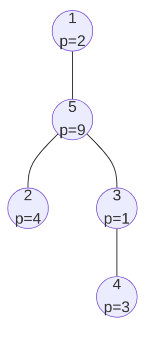

[[TOC]]

## 形式化题目

给定 $n$ 个结点的一棵树，结点 $i$ 驻军的花费为 $p_i$。需要选出一个结点集合 $S$（驻军方案），使得树上每条边至少有一个端点属于 $S$，即树的带权顶点覆盖；目标是最小化 $\sum_{i \in S} p_i$。

有 $m$ 个互相独立的询问。第 $j$ 个询问给出两个不同的结点 $a, b$ 以及两个取值 $x, y \in \{0, 1\}$：强制 $a$ 的驻军状态为 $x$（$1$ 必须驻军，$0$ 不得驻军）、$b$ 的状态为 $y$，只在这一个约束下求最小开销；若该约束与"每条边至少一端驻军"冲突，则输出 $-1$。

## 正解

### 思路

**朴素做法。** 树形 DP 一次就能算出无约束的最小开销：设 $f_0(u)$、$f_1(u)$ 分别表示结点 $u$ 不驻军 / 驻军时其子树的最小开销，子结点集合为 $ch(u)$，则

$$f_0(u)=\sum_{v \in ch(u)} f_1(v), \qquad f_1(u)=p_u+\sum_{v \in ch(u)} \min\bigl(f_0(v), f_1(v)\bigr).$$

直观理解：$u$ 不驻军时，边 $(u,v)$ 只能靠 $v$ 覆盖，$v$ 必须驻军；$u$ 驻军时边 $(u,v)$ 已被覆盖，$v$ 可以自由取小。整个 DP 是 $O(n)$ 的。

**把询问的约束拆到路径上。** 对一次询问，设 $c = \operatorname{LCA}(a, b)$。强制 $a$、$b$ 的状态后，受影响的部分只有三块：

1. 路径 $a \to c$（不含 $c$）；
2. 路径 $b \to c$（不含 $c$）；
3. $c$ 自身的悬挂子树与 $c$ 以上的整棵树，这部分只依赖 $c$ 的状态。

第 3 块可以用换根 DP 预处理。记 $\operatorname{con}(v, s)$ 为"父结点状态为 $s$ 时子树 $v$ 的贡献"：

$$\operatorname{con}(v, s) = \begin{cases} \min(f_0(v), f_1(v)) & s = 1 \\ f_1(v) & s = 0 \end{cases}$$

设 $g_s(u)$ 为除 $u$ 的子树外整棵树的最小开销（$u$ 状态为 $s$），按先根序自顶向下递推（$p$ 为 $u$ 的父亲）：

$$g_0(u) = g_1(p) + f_1(p) - \operatorname{con}(u, 1), \qquad g_1(u) = \min\Bigl(g_0(p) + f_0(p) - f_1(u),\; g_1(p) + f_1(p) - \operatorname{con}(u, 1)\Bigr).$$

含义是：$u$ 不驻军时边 $(p,u)$ 只能靠父亲驻军；$u$ 驻军时父亲两种状态都行，取更小者；两种情形都要把 $u$ 子树那份从父亲的账里扣掉，避免重复计算。记 $T_s(u) = f_s(u) + g_s(u)$，它就是"$u$ 状态固定为 $s$、其余全部自由取优"的全树开销。

**路径段的转移可以结合。** 关键观察：一段路径在"两端状态固定"时，段内（含各结点的悬挂子树）的最小开销只由两端状态决定，且**这样的转移是可结合的**。把路径段 $\{u, \dots, \text{top 的前一个点}\}$ 在底端状态 $x$、顶端状态 $y$ 下的最小开销记为矩阵元 $M[x][y]$，那么"先走下半段、再走上半段"就是一次 min-plus 矩阵乘法：

$$\bigl(M_{\text{下}} \otimes M_{\text{上}}\bigr)[x][y] = \min_z \Bigl( M_{\text{下}}[x][z] + M_{\text{上}}[z][y] \Bigr),$$

其中 $z$ 是接缝处结点的状态。朴素做法每次询问沿路径逐点做这个链式 DP，最坏 $O(n)$；既然转移可结合，就可以像 LCA 一样**倍增**预处理：$f[k][u]$ 表示从 $u$ 向上 $2^k$ 层这段路径（含 $u$、不含顶端祖先）的 $2 \times 2$ 转移矩阵。

合并时有一个必须处理的细节：$v = \operatorname{anc}[u][2^{k-1}]$ 在上半段里是底端，矩阵里带的是 $f_s(v)$ **整棵子树**；但下半段已经算过 $v$ 在路径下方那个孩子 $w$ 的子树，因此要扣掉一份：

$$f[k][u][x][y] = \min_z \Bigl( f[k-1][u][x][z] + f[k-1][v][z][y] - \operatorname{con}(w, z) \Bigr).$$

$k=0$ 的初始矩阵就是单个结点：$f[0][u][x][y] = f_x(u) + [x \lor y]$（$[\cdot]$ 表示两端同时为 $0$ 时为 $+\infty$，即边 $(u, p(u))$ 必须被覆盖）。

**回答一次询问。** 先把较深的一端抬到同一深度，再让两端同步上跳到 $c$ 的正下方，每跳一步就用 min-plus 乘法累积一行矩阵，共 $O(\log n)$ 步。设两端最终分别停在 $d_a$、$d_b$（即 $c$ 在两条路径上的儿子；若某一端本身就是 $c$，则该端贡献退化为恒等），对 $c$ 的状态 $m \in \{0, 1\}$ 取最小值：

$$\text{ans} = \min_m \Bigl( A_x[m] + B_y[m] + T_m(c) - \operatorname{con}(d_a, m) - \operatorname{con}(d_b, m) \Bigr),$$

其中 $A_x$、$B_y$ 是两条路径累积出的矩阵行（已含强制状态），$T_m(c)$ 覆盖 $c$ 的悬挂子树与 $c$ 以上的整棵树——$c$ 的账里包含两个路径孩子，而它们的开销已算在路径段里，所以要各扣掉 $\operatorname{con}(d, m)$ 一份。若结果超出可行上界则输出 $-1$（路径上的边约束会让不可行情形一路保持 $+\infty$）。

### 代码

@include-code(./main.py, python)

### 复杂度

- 预处理：子树 DP 与换根 DP 各 $O(n)$，倍增表与路径矩阵 $O(n \log n)$。
- 每次询问：两次抬升共 $O(\log n)$ 跳，每跳 $O(1)$ 的 $2 \times 2$ 矩阵乘法，故 $O(\log n)$。
- 总复杂度 $O((n + m) \log n)$，与 $n, m \leqslant 10^5$ 同阶；倍增表与矩阵占 $O(n \log n)$ 空间。

## 总结

本题的模型是树上的带权顶点覆盖：两状态树形 DP 一次 $O(n)$ 求出无约束最优。询问引入两个结点的强制状态后，约束只沿两条到 LCA 的路径传播，LCA 以上的部分用换根 DP 压成只与 LCA 状态有关的 $T_s(c)$。路径段"两端状态固定"的最优化对应可结合的 $2 \times 2$ min-plus 转移，于是用倍增把朴素的逐点链式 DP 提升为每次询问 $O(\log n)$；合并两半时记得把接缝结点在路径下方的悬挂子树扣掉一份，这是本题最容易出错的地方。

## 图示解析

样例的树形（边权无，括号内为驻军花费）：

三个询问的约束与结果（询问互相独立）：

| 询问 | 约束 | 最优驻军方案 | 开销 |
| --- | --- | --- | --- |
| 1 | 1 不驻军、3 不驻军 | 4、5 驻军 | 12 |
| 2 | 2 驻军、3 驻军 | 1、2、3 驻军 | 7 |
| 3 | 1 不驻军、5 不驻军 | 边 $(1,5)$ 两端都不驻军 | -1 |

询问 1 中，$c = 1$ 恰是被强制的一端：$a$ 端退化为恒等行，路径段只有 $b$ 端的 $3 \to 1$（结点 $3, 5$），累积矩阵行 $B[0][m] = 12$；$c$ 的账 $T_0(1) = 10$ 已含结点 5 子树，扣掉 $\operatorname{con}(5, 0) = f_1(5) = 10$ 后得到 $12 + 10 - 10 = 12$。

询问 2 中 $c = 5$，两端各自只有一段矩阵（$\{2\}$ 与 $\{3\}$），最后对 $m$ 取小：$m = 0$ 时 $4 + 1 + T_0(5) - f_1(2) - f_1(3) = 5 + 7 - 4 - 1 = 7$；$m = 1$ 时为 $4 + 1 + T_1(5) - \operatorname{con}(2,1) - \operatorname{con}(3,1) = 5 + 10 - 0 - 1 = 14$，故答案 $7$。

询问 3 中 $c = 1$、$b = 5$ 的状态为 $0$：$b$ 端矩阵行 $B[0][m] = f_0(5) + [0 \lor m]$ 只有 $m = 1$ 才有限（$5$ 不驻军则边 $(1,5)$ 只能靠 $1$ 覆盖），但 $a = c = 1$ 又强制 $m = 0$，两边矛盾，累加值保持 $+\infty$，输出 $-1$。
