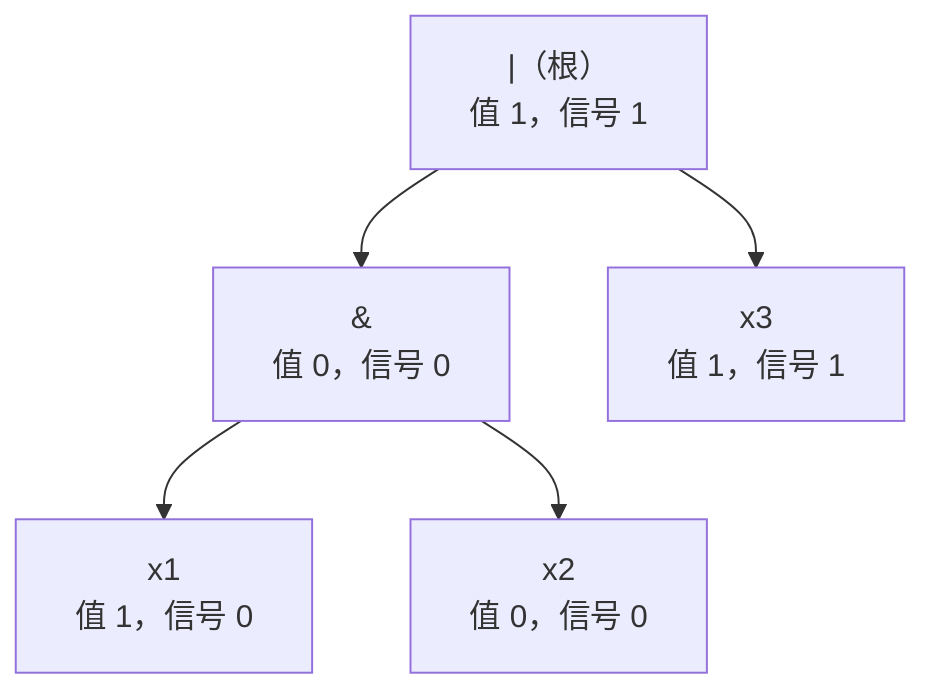

[[TOC]]

## 形式化题目

给定一个后缀（逆波兰）表达式，操作数是变量 $x_1,\dots,x_n$，取值为 $0/1$，每个变量在表达式中**恰好出现一次**且各有一个初值。运算只有三种、从左往右结合：

- `a b &`：与，仅当两者都为 $1$ 时结果为 $1$；
- `a b |`：或，仅当两者都为 $0$ 时结果为 $0$；
- `a !`：取反，$0$ 变 $1$、$1$ 变 $0$。

有 $q$ 次询问，每次给出一个下标 $i$，把 $x_i$ 的取值取反（**临时修改**，不影响后续询问）后，求整个表达式的值；输出每次询问的结果。

样例 1 的后缀式 `x1 x2 & x3 |` 对应中缀 $(x_1 \mathbin{\&} x_2) \mid x_3$，初值 $(1,0,1)$：询问 1 翻 $x_1$ 得 $(0\&0)|1=1$；询问 2 翻 $x_2$ 得 $(1\&1)|1=1$；询问 3 翻 $x_3$ 得 $(1\&0)|0=0$，即输出 `1 1 0`。样例 2 的 `x1 ! x2 x4 | x3 x5 ! & & ! &` 对应 $(!x_1) \mathbin{\&} \bigl(!\bigl((x_2 \mid x_4) \mathbin{\&} (x_3 \mathbin{\&} (!x_5))\bigr)\bigr)$，输出 `0 1 1`。

## 正解

### 思路

**朴素做法与瓶颈。** 每次询问把变量取反后重新求值：单次 $O(|s|)$，$q$ 次共 $O(q|s|)$，最坏 $10^{5}\times10^{6}=10^{11}$，跑不动。退一步先建好树、每次只沿"叶子到根"的路径增量更新结点值，单次 $O(\text{深度})$；但链状表达式（一串 `&` 左结合）深度 $O(n)$，总 $O(nq)=10^{10}$，同样超时。瓶颈在于回答一次询问的代价仍与树的规模或深度挂钩。

**关键观察：变量只出现一次，翻转的影响只有一条路径，且可以静态判定。** 翻转 $x_i$ 时，从它的叶子到根的**唯一路径**之外的子树不含 $x_i$、值不变；路径上每道门的**兄弟子树**也不含 $x_i$，兄弟值保持原值。于是"翻转能不能穿过这道门"不需要真的翻转重算，用原表达式已求出的值就能判断：

- `!`：孩子翻则自己翻，**恒穿过**；
- `&`：输出锁死为 $0$ 的情形是兄弟为 $0$，故**兄弟为 $1$ 才穿过**；
- `|`：输出锁死为 $1$ 的情形是兄弟为 $1$，故**兄弟为 $0$ 才穿过**。

**定义翻转信号 $d(v)$：把结点 $v$ 的值取反，根的值是否也取反。** 按穿过条件自顶向下递推：

$$d(\text{root}) = 1, \qquad d(\text{child}) = d(\text{parent}) \wedge \bigl[\text{child 的翻转能穿过 parent}\bigr]$$

递推合法的原因：翻转 child 若过不了这道门，parent 的值不变、根自然不变；若过了，parent 的值取反而其余输入与原情形完全相同，根的结果就等于"原情形下单独翻转 parent"，即 $d(\text{parent})$。逐层归纳即得 $d(v)$ 恰为"翻转 $v$ 是否让根取反"，且判定只用兄弟原值——变量唯一出现保证它不受污染。

**预处理三步 + 询问查表：**

1. **建树**：后缀表达式用栈一遍扫描建出表达式树；按 token 顺序编号，孩子一定先于父结点产生；
2. **正序求值**：孩子编号小于父编号，正序扫一遍就是拓扑序，得到每个结点的原值（穿过条件的依据）；
3. **逆序下传信号**：根编号最大、父大于子，逆序扫一遍（反拓扑序）把 $d$ 按递推式下传到所有叶子。

此后每次询问 $O(1)$ 作答：**答案 $= \text{根的值} \oplus d(\text{被翻转变量的叶子})$**。

下图在样例 1 的表达式树上标出每个结点的原值与信号 $d$：

根是或门：判断左孩子 `&` 的信号要看兄弟 $x_3=1$，"兄弟为 $0$"不成立，信号在根就被吸收，`&` 子树信号全为 $0$；判断右孩子 $x_3$ 要看兄弟 `&` 的值 $0$，条件成立，信号传到 $x_3$。对应到三个询问：

| 询问 | 翻转的变量 | 该叶子的信号 $d$ | 答案 $= 1 \oplus d$ |
| :--: | :--: | :--: | :--: |
| 1 | $x_1$ | 0 | 1 |
| 2 | $x_2$ | 0 | 1 |
| 3 | $x_3$ | 1 | 0 |

翻 $x_1$、$x_2$ 答案不变，翻 $x_3$ 答案取反，与样例输出 `1 1 0` 完全一致。

### 代码

@include-code(./main.py, python)

`build()` 对应第 1 步：`op_of`/`child`/`leaf_val` 是结点三元组，`var_leaf` 按 token 内的变量下标登记叶子（出现顺序与下标无关），`stack[0]` 即根；`fill_values()` 对应第 2 步，正序枚举、叶子取初值、内部结点交给 `calc()` 合成；`fill_sens()` 对应第 3 步，`sens[root] = 1` 起步逆序下传，其中 `pass_l`/`pass_r` 就是穿过条件（与门取兄弟原值、或门取兄弟的非），`NOT` 分支不读右孩子。注意下标约定：正文变量是 1 基的 $x_1,\dots,x_n$，代码里 `var_leaf[i - 1]` 与询问行的 `int(...) - 1` 都先减 1；`!` 结点没有右孩子，`child` 右位存 `-1`，求值时以 0 占位（`calc` 对 NOT 只用左值）。

### 复杂度

- **时间**：建树、求值、信号下传三遍扫描各 $O(|s|)$，询问每条 $O(1)$，合计 $O(|s| + n + q)$，与正解同阶；朴素的 $O(q|s|)$ 与爬树的 $O(nq)$ 都被消除。
- **空间**：token 列表与结点数组 $O(|s| + n)$。
- 实测 20 组真实数据全部输出一致，最慢测例 0.124s、峰值约 84MB（OJ 限制 1000ms / 128MB，本地为 Python 放宽计时口径；Python 若在 OJ 上 TLE/MLE 按仓库约定可接受，算法本身与 C++ 正解同阶）。

## 总结

- **变量唯一出现**是全题支点：翻转只沿一条路径传播、兄弟子树值不变，"翻转能否穿过这道门"因此可用原值静态判定——非恒穿过、与看兄弟为 $1$、或看兄弟为 $0$。
- 把"翻转是否传到根"抽象成信号 $d(v)$ 自顶向下递推，三遍 $O(|s|)$ 扫描换每次询问 $O(1)$：建树 → 正序求值 → 逆序下传。
- 后缀表达式按 token 编号天然给出拓扑序：**正序求值、逆序下传**，无需递归或父指针，也避开了链状深树的深度瓶颈。
- 易错点：叶子必须按**变量下标**登记（出现顺序≠下标顺序）；`!` 是一元运算，右孩子要占位且两种扫描都不能碰它。
