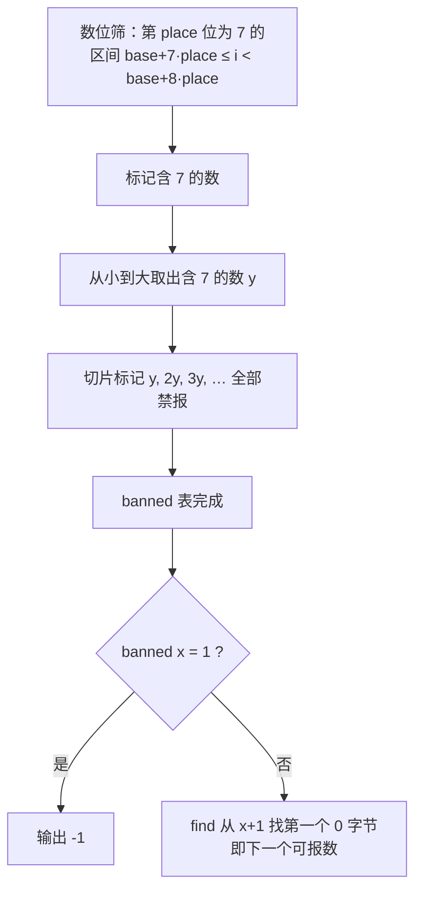

[[TOC]]

## 形式化题目

定义 $p(x) = 1$ 当且仅当 $x$ 的十进制表示中含有数字 $7$。规定一个正整数 $x$ **不能被报出**，当且仅当存在正整数 $y, z$ 使得 $x = yz$ 且 $p(y) = 1$（即 $x$ 有一个含数字 $7$ 的因子）。

给定 $T$ 个询问，每个询问给出一个正整数 $x$：

- 若 $x$ 不能被报出，输出 $-1$；
- 否则输出严格大于 $x$ 的最小**可以**被报出的正整数。

数据范围：$1 \leqslant T \leqslant 2 \times 10^5$，$1 \leqslant x \leqslant 10^7$。

## 正解

### 思路

**朴素做法与瓶颈。** 最直接的想法是：对每个询问 $x$，试除 $2 \sim \sqrt{x}$ 判断它是否有含 $7$ 的因子；若 $x$ 合法，再从 $x+1$ 开始逐个数向后试探。单次询问判因子是 $O(\sqrt{x})$，总计约 $2 \times 10^5 \times 3 \times 10^3 = 6 \times 10^8$ 次运算，而且同一个数在不同询问里被反复判断——判断结果明明可以共享，却每次都重算。这说明该题应该**离线预处理**，把「哪些数能报」一次性算清楚。

**关键转化。** 注意「不能报出」这个坏性质是沿因子传递的：

$$x \text{ 不能报} \iff p(x)=1 \ \text{或}\ x = y \cdot z \text{（其中 } p(y)=1\text{）}$$

也就是说，禁报数集合 = $\{ \text{所有含 } 7 \text{ 的数} \}$ 的全部倍数的并集。这与埃氏筛「素数的倍数是合数」的结构一模一样，只是把筛子从素数换成了**含数字 $7$ 的数**。于是合法数集合可以一次筛出：

1. 先筛出所有十进制含 $7$ 的数。一个数的第 $place$ 位（$place = 1, 10, 100, \ldots$）等于 $7$，等价于它落在区间 $[base + 7 \cdot place,\ base + 8 \cdot place)$ 内，其中 $base$ 每 $10 \cdot place$ 一轮。对这些区间整体打标记即可，不必逐数检查数位。
2. 再从小到大取出每个含 $7$ 的数 $y$，把 $y, 2y, 3y, \ldots$ 全部标记为禁报。**从小到大**处理保证：当一个数作为「较大因子」出现时，含 $7$ 的更小因子早已把它标记过，不会遗漏。

**查询。** 预处理出 `banned[]` 标记数组后，若 `banned[x]` 为真输出 $-1$；否则从 $x+1$ 开始找第一个未标记的位置。相邻合法数的间隔很小——$10^7$ 以内最大的空洞是 $(6999998,\ 8000000)$，宽 $1000002$（$6999999 \sim 7999999$ 全部禁报）——所以线性往后扫的均摊代价可以忽略。

**为什么上界取 $1.2 \times 10^7$。** 答案必须落在筛表内。$10^7$ 以内最大的禁报空洞不超过 $10^6 + 2$，而 $x \leqslant 10^7$ 时最大的合法 $x$ 是 $10^7$ 本身（$10^7 = 2^7 \times 5^7 \times \cdots$，因子不含数字 $7$），它的下一个合法数是 $10000001$。为覆盖「下一个答案」可能越过 $10^7$ 的情况，取 $N = 1.2 \times 10^7$ 即安全。

下面这张表展示筛表在 $[1, 100]$ 内的样子（■ = 禁报，· = 可报），可以直观看到「含 7 的数本身 + 它们的倍数」如何合并：

| 区间 | 禁报数 | 来源 |
| --- | --- | --- |
| $1 \sim 6$ | 无 | 全部可报 |
| $7, 17, 27, 37, 47, 57, 67, 70 \sim 79, 87, 97$ | 含数字 7 | 数位筛直接标出 |
| $14, 21, 28, 35, 42, 49, \ldots$ | 7 的倍数 | 筛子 $y=7$ |
| $28, 56, 84, \ldots$（若非 7 倍数也含 7 因子，如 $28 = 7 \times 4$） | 7 的倍数 | 筛子 $y=7$，与上行重叠 |
| $70 \sim 79$ | 全段禁报 | 数位筛区间标记 |

观察重点：$70 \sim 79$ 这一段是「数位筛」用一次**区间**标记直接覆盖的，不需要逐数判断数位；而像 $21 = 7 \times 3$、$35 = 7 \times 5$ 这样的数由筛子 $y=7$ 的倍数标记补齐。两类标记叠在一起，恰好就是「含 7 因子」的完整集合。

### 代码

@include-code(./main.py, python)

### 复杂度

设 $N = 1.2 \times 10^7$。

- **预处理**：数位部分是 $O(N \ln N)$ 的字节区间写（`bytearray` 切片，常数极小）；筛倍数部分是 $\sum_{y \text{ 含 } 7} N/y = O(N \log \log N)$ 量级的元素标记，同样由切片批量完成。实测 Python 下预处理约 $1.4\,\mathrm{s}$。
- **查询**：单次为「到下一个合法数的距离」，$10^7$ 内最大 $10^6 + 2$，总和远小于 $O(T \cdot N)$；实现用 `bytes.find`（C 实现），查询阶段总计不到 $0.1\,\mathrm{s}$。
- **空间**：`bytearray(N+1)` 约 $12\,\mathrm{MB}$，在 $128\,\mathrm{MB}$ 限制内。

Python 实现 1s 时限下预处理可能超时（python-oj-short 允许）；同样的筛法在 C++ 中用 `vector<bool>` + 双重循环即可轻松通过。

## 图示解析

### 筛法流程

流程图展示了预处理的两步：先用区间标记解决「数位含 7」，再像埃氏筛一样用这些数当筛子标记所有倍数。查询只剩两次数组访问：查 $x$ 自己是否被标记、往后找第一个未被标记的位置。

用样例 1 走一遍查询：$x=6$ 时 $7$ 被数位筛标记，`find` 越过它得到 $8$；$x=33$ 时 $34 = 17 \times 2$ 被 $y=17$ 标记、$35 = 7 \times 5$ 被 $y=7$ 标记，扫到 $36$ 才遇到第一个 `0` 字节，故答案为 $36$；$x=69$ 之后 $70 \sim 79$ 由数位筛的整段区间标记覆盖，答案 $80$；$x=300 = 75 \times 4$ 自身已被标记，直接输出 $-1$。

## 总结

- 坏性质「有含 7 的因子」沿乘法传递，与埃氏筛结构同构：把含数字 7 的数当筛子，$O(N \log \log N)$ 筛出全部禁报数。
- 含 7 的数本身用「按位打区间标记」批量求出，避免逐数检查数位。
- 查询 $O(1)$ 次 `find`：合法就找下一个未标记位置，否则输出 $-1$。
- 关键边界：$x$ 禁报输出 $-1$；答案可能落在 $10^7$ 之外（$10^7$ 的答案是 $10000001$），筛表上界取 $1.2 \times 10^7$。
