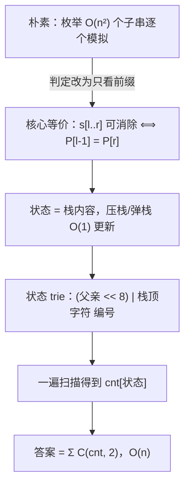

[[TOC]]

## 形式化题目

给定长度为 $n$ 的小写字母串 $s$。一次操作可以删除串中一对**相邻且相同**的字符，删除后左右两段拼接。若能经过若干次操作把串变为空串，则称该串**可消除**。

求 $s$ 的所有非空连续子串中，可消除子串的个数。

样例：$s=$ `accabccb` 的可消除子串恰有 5 个——`cc`（第 2、3 位）、`acca`、`cc`（第 6、7 位）、`bccb`、`accabccb`。注意"每种字符都出现偶数次"并不充分，例如 `abab` 没有相邻相同字符，不可消除。

## 正解

### 思路

**朴素做法与瓶颈。** 最直接的思路是枚举 $O(n^2)$ 个子串，逐个跑一遍"删相邻相同对"的模拟，最坏 $O(n^3)$；即使固定左端点向右扩展、复用上一次的栈，也仍是 $O(n^2)$。对 $n = 2 \times 10^6$ 而言，必须让判定**只依赖前缀信息**，换子串时不再重算。

**第一步：归约与栈。** 从左往右扫描，当前字符等于栈顶就弹栈（消掉这一对），否则压栈，扫完后的栈就是归约结果。需要说明"先删哪一对"不影响结果：归约规则只有 $aa \to \varepsilon$ 一种，可能出现的峰只有两类——两个待删位置不相交（操作可交换，显然能合并），或者重叠成 `aaa`（删前两个与删后两个都剩下 `a`，也能合并）；而归约使串长严格递减、必然终止。由 Newman 引理，归约合流，**结果与删除顺序无关**，栈模拟给出的就是唯一不可约结果。记前缀 $s[1..i]$ 的归约结果（栈内容）为 $P_i$，$P_0 = \varepsilon$。归约还有一个显然的拼接性质：模拟 $XY$ 就是先模拟 $X$ 停在 $f(X)$、再接着模拟 $Y$，故 $f(XY) = f(f(X)\,Y)$。

**第二步：核心等价——子串可消除 $\iff$ 两端前缀状态相同。**

$$s[l..r]\ \text{可消除} \iff P_{l-1} = P_r$$

- ($\Rightarrow$) 若 $f(s[l..r]) = \varepsilon$，则 $P_r = f(P_{l-1} \cdot s[l..r]) = f(P_{l-1} \cdot f(s[l..r])) = f(P_{l-1}) = P_{l-1}$。
- ($\Leftarrow$) 设 $Q = f(s[l..r])$ 已不可约，$P_r = P_{l-1}$ 即 $f(P_{l-1} \cdot Q) = P_{l-1}$。把归约看作"每个字母都是对合元"的自由群消去、不可约形就是正规形，由 $[P_{l-1}][Q] = [P_{l-1}]$ 得 $[Q] = 1$；$Q$ 已是不可约形，正规形为单位元只能是 $Q = \varepsilon$。

这一步把"判定任意子串"降为"比较两个前缀状态"：判定代价从 $O(\text{长度})$ 变成 $O(1)$。

**第三步：同状态计数。** 只有 $n+1$ 个前缀状态 $P_0, \ldots, P_n$。每个状态出现 $c$ 次，就贡献 $\binom{c}{2}$ 个点对 $(l-1, r)$，与可消除子串一一对应，所以

$$\text{答案} = \sum_{x} \binom{c_x}{2}$$

$P_i$ 与 $P_{i-1}$ 只差一次压栈或弹栈，$O(1)$ 更新，一遍扫描记下每个状态的出现次数，最后求和即可。

**第四步：状态怎么比较（状态 trie 编码）。** 状态就是栈内容，直接比字符串太慢。把所有出现过的栈内容建成一棵字典树：根是空栈，压栈 = 走到（当前节点, 字符）的孩子（没有就新建），弹栈 = 回到父亲。节点按首次出现顺序编号，用 `where[(父亲编号 << 8) | 栈顶字符] = 节点编号` 收敛相同内容：相同栈内容沿相同路径到达，必得同一编号；编码里父亲编号与字符位宽不重叠、是单射，不同内容必得不同编号。于是"状态相等"就是"编号相等"——这正是 C++ 题解里滚动哈希要干的事，但精确、无碰撞。弹栈不需要查表：编码的高 8 位就是父亲编号。

**样例走一遍。** 下表列出 `accabccb` 每个前缀的栈状态与编号：

| 前缀（前 $i$ 个字符） | 0 | 1 | 2 | 3 | 4 | 5 | 6 | 7 | 8 |
| --- | --- | --- | --- | --- | --- | --- | --- | --- | --- |
| 内容 | $\varepsilon$ | `a` | `ac` | `a` | $\varepsilon$ | `b` | `bc` | `b` | $\varepsilon$ |
| 编号 | 0 | 1 | 2 | 1 | 0 | 3 | 4 | 3 | 0 |

分组计数：空状态出现 3 次贡献 $\binom{3}{2} = 3$，状态 `a`、`b` 各 2 次各贡献 1，合计 5。三个空状态点对 $(0,4)$、$(0,8)$、$(4,8)$ 分别对应子串 `acca`、`accabccb`、`bccb`，点对 $(1,3)$、$(5,7)$ 对应两个 `cc`——正好与题解样例解释一致。

### 代码

@include-code(./main.py, python)

### 复杂度

- **时间** $O(n)$：每个字符一次常数次字典/列表操作，结尾对 $\leqslant n + 1$ 个节点求和。实测本机随机 $n = 2 \times 10^6$ 约 $0.56\,\mathrm{s}$，真实数据最大三组约 $0.15\,\mathrm{s}$/组（本地限时 $20\,\mathrm{s}$，为 OJ $1000\,\mathrm{ms}$ 的 10 倍放宽，全部 PASS）。
- **空间** $O(n)$：节点表、计数表、查表规模都以"不同栈内容数" $\leqslant n + 1$ 为界。Python 峰值约 $300\,\mathrm{MB}$，会超过 OJ 的 $128\,\mathrm{MB}$——python-oj-short 允许 Python MLE，仓库本地验证也不做内存硬限制；C++ 同算法用 `unordered_map` 存栈哈希或用 `vector` 存 trie 孩子，约 $100\,\mathrm{MB}$ 可过。

## 总结

- 可消除性是"前缀敏感"的性质：$s[l..r]$ 可消除 $\iff$ 两端前缀归约状态 $P_{l-1} = P_r$，判定代价从 $O(\text{长度})$ 降到 $O(1)$。
- 归约唯一性靠局部峰合并（不相交可交换、`aaa` 可合并）+ 必然终止，栈模拟即正规形；"$[P][Q] = [P] \Rightarrow Q = \varepsilon$"补上反向证明。
- 答案 = 同状态前缀点对数 $= \sum \binom{c}{2}$，一遍扫描 $O(n)$ 出结果。
- 相同栈内容用状态 trie 的 `(父亲 << 8) | 栈顶字符` 编码收敛成同一编号，精确比较、免哈希；弹栈直接取编码高位。
- 边界：空前缀栈顶字节为 0，永不与小写字母相等，空栈不会被弹穿；$n = 1$ 答案为 0。

## 图示解析

这张路线图串起本题从"朴素枚举"到"$O(n)$ 计数"的推导主线：

顺着箭头读：第一个箭头是全文最关键的一步，它把"子串级"判定整体换成"前缀级"比较；中间两步解决"前缀状态怎么表示与比较"，最后一步把判定退化成纯计数。图中只保留正文已证明的关系，样例的具体状态见上文表格。
