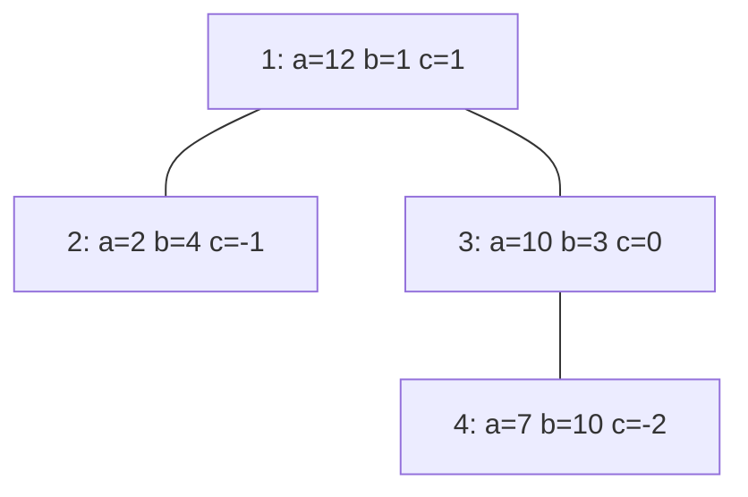

[[TOC]]

## 形式化题目

给定 $n$ 个点的树，$1$ 号点是入口。每片地块 $i$ 有目标高度 $a_i$ 与生长参数 $b_i, c_i$。种植过程：

- 第 $1$ 天必须在 $1$ 号点种下一棵高 $0$ 的树；之后每天选一个**未种**且与已种地块**相邻**（单条边相连）的地块种树，直到 $n$ 天全部种完。
- 第 $x$ 天（绝对天数，从第 $1$ 天起算）地块 $i$ 的树长高 $g_i(x) = \max(b_i + x \cdot c_i,\ 1)$，从种下当天开始累计。

求最小的 $D$，使存在合法的种植顺序，每棵树在第 $D$ 天的高度都不低于 $a_i$。

**样例 1**：下图是样例的树形结构，节点标签给出各点的 $a_i,\ b_i,\ c_i$。

一种 5 天完成的方案（与题面样例解释一致），表格逐天记录种植动作与当天生长后的累计高度：

| 天 | 当天种植 | 1 号 | 2 号 | 3 号 | 4 号 |
| --- | --- | --- | --- | --- | --- |
| 1 | 1 号 | 2 | — | — | — |
| 2 | 3 号 | 5 | — | 3 | — |
| 3 | 4 号 | 9 | — | 6 | 4 |
| 4 | 2 号 | 14 | 1 | 9 | 6 |
| 5 | （已种完，只生长） | 20 | 2 | 12 | 7 |

第 5 天四棵树分别达到 $20 \geqslant 12$、$2 \geqslant 2$、$12 \geqslant 10$、$7 \geqslant 7$，输出 $5$。

## 正解

### 思路

**朴素做法与瓶颈。** 固定天数 $D$ 时，最直接的验证是枚举所有合法种植顺序（父点先于子点的排列，数量指数级），逐棵算第 $D$ 天的高度；退化成"每天在可种点中任选一个"的搜索同样是指数的。瓶颈在于顺序与高度耦合在一起，需要把两者拆开。

**第一步：把顺序拆成每棵树自己的"最晚种下日"。** 第 $p$ 天种下的树到第 $D$ 天的高度是

$$S(p) = \sum_{x=p}^{D} \max(b_i + x c_i,\ 1)$$

每天生长量都不小于 $1$，所以 $S(p)$ 随 $p$ 增大严格减小——**早种永远不亏**。于是固定 $D$ 后每棵树独立地存在一个最晚种下日

$$t_i = \max\{\, p \leqslant D : S(p) \geqslant a_i \,\}$$

若从第 $1$ 天种也到不了 $a_i$，则该 $D$ 直接判不可行。问题转化为：能否给每个点安排互不相同的种植日 $\mathrm{pos}(i) \leqslant t_i$，且 $1$ 号点在第 $1$ 天、父点先于子点。

令 $m = D - p + 1$（连续生长天数），$S$ 关于 $m$ 严格递增，且 $S$ 是 $m$ 的分段二次函数，所以**不必再对每个 $D$ 套一层二分**，直接解 $S(m) \geqslant a_i$ 的最小 $m$ 即可 $O(1)$ 得到 $t_i$：

- $c = 0$：每天固定长 $b$，$m = \lceil a/b \rceil$；
- $c > 0$：每项都是 $b + xc$，$2S(m) = \big(2b + c(2D+1)\big)m - c m^2$，解二次不等式取较小根向上取整；
- $c < 0$：记 $k = \lfloor (b-1)/(-c) \rfloor$，第 $k$ 天之后每天只长 $1$；尾段按 $1$ 米直接累加，不足时对线性段 $n = m - (D-k)$ 同样解二次方程。

**第二步：合法顺序就是树的拓扑序。** 已种集合始终是含 $1$ 号点的连通子树，而树上两点间唯一路径必经过父点，所以父点一定先于子点被种；反过来任意"父先于子"的顺序都能逐日实现（每天种的点，其父点已在已种集合里）。因此约束就是 $\mathrm{pos}(\text{父}) < \mathrm{pos}(\text{子})$，且 $1$ 号点在第 $1$ 天。

**第三步：截止时间要沿祖先链下压。** 只按各点自己的 $t_i$ 排日程会出错：点 $i$ 若排在第 $\mathrm{pos}(i)$ 天，它的每个后代 $w$ 至少要等到 $\mathrm{pos}(i) + (d_w - d_i)$ 天才种得下（$d$ 为深度），而 $w$ 又必须满足 $\mathrm{pos}(w) \leqslant t_w$，于是 $i$ 实际受到全子树的限制

$$\mathrm{pos}(i) \leqslant t_w - (d_w - d_i) \qquad (w \text{ 取遍 } i \text{ 的子树，含 } i \text{ 自己})$$

取最紧的一个，定义**压缩截止时间**（子树内最紧的后代截止被"下压"到 $i$ 身上）：

$$T_i = \min\big(\, t_w - (d_w - d_i) \,\big) = d_i + \min_{w \in \text{子树}(i)} (t_w - d_w)$$

**第四步：判定定理。** 把 $T_1, \dots, T_n$ 升序记为 $T_{[1]} \leqslant \cdots \leqslant T_{[n]}$，合法日程存在 **当且仅当** 对每个 $j$ 都有 $T_{[j]} \geqslant j$：

- **必要性**：任何合法日程中每个点都满足 $\mathrm{pos}(v) \leqslant T_v$（上式对每个后代 $w$ 成立，取最紧的即得）。$T$ 最小的 $j$ 个点需要 $j$ 个互不相同的天数，且每个都不超过 $T_{[j]}$，这些天只能取自 $[1, T_{[j]}]$，故 $T_{[j]} \geqslant j$。
- **充分性**：按 $T$ 升序把第 $j$ 个点安排在第 $j$ 天。祖先的 $T$ 严格小于后代（深度多 $1$、取 min 的范围只缩不扩），所以这个顺序天然父先于子；又 $\mathrm{pos}(v) = \mathrm{rank}(v) \leqslant T_v \leqslant t_v$，截止也满足；$n$ 天恰好各用一次。$1$ 号点的 $T$ 最小（深度 $0$ 且取全树 min），总是排第 $1$ 天，与"第 $1$ 天只能种 $1$ 号点"吻合。

在样例上分别代入 $D = 4$ 与 $D = 5$ 验证判定（先对每点算 $t_i$，再按下压式算 $T$）：

| 点 | 深度 $d$ | $t_i\ (D{=}4)$ | $T_i\ (D{=}4)$ | $t_i\ (D{=}5)$ | $T_i\ (D{=}5)$ |
| --- | --- | --- | --- | --- | --- |
| 1 | 0 | 2 | 0 | 3 | 1 |
| 2 | 1 | 3 | 3 | 4 | 4 |
| 3 | 1 | 1 | 1 | 2 | 2 |
| 4 | 2 | 2 | 2 | 3 | 3 |

$D = 4$ 时升序 $T = [0, 1, 2, 3]$，第 $1$ 个 $0 < 1$，不可行；$D = 5$ 时升序 $T = [1, 2, 3, 4]$ 全部不小于下标，可行，且按升序给出的种植顺序恰好是 $1 \to 3 \to 4 \to 2$，与样例解释一致。

**第五步：二分答案。** $D$ 越大每棵树生长期越长，$t_i$ 不减、判定单调（可行集是后缀），对 $D$ 在 $[1, 10^9]$ 二分（题面保证 $10^9$ 天内有解）。

### 代码

@include-code(./main.py, python)

### 复杂度

- **时间**：二分约 $30$ 轮，每轮 $O(n)$ 求各点 $t_i$、$O(n)$ 一次后序取子树 min、$O(n \log n)$ 排序，合计 $O(n \log n \cdot \log 10^9)$；$n \leqslant 10^5$，实测最大测例约 $1.8\,\mathrm{s}$（本地单测例限时 $20\,\mathrm{s}$，20 组真实数据全部 PASS；OJ 限时 $1000\,\mathrm{ms}$ 对 Python 偏紧）。
- **空间**：$O(n)$ 存树与三个数组，实测峰值约 $100\,\mathrm{MB} < 128\,\mathrm{MB}$（$a_i$ 达 $10^{18}$、求根判别式到 $10^{36}$ 量级，Python 整数免溢出；C++ 中需用 `__int128` 或比较前先做溢出保护，其余做法相同）。

## 总结

- 固定 $D$ 后"早种不亏"，每棵树有独立的最晚种下日 $t_i$；$S(m)$ 是分段二次且随 $m$ 递增，用求根公式 $O(1)$ 解出，避免二分套二分。
- 合法种植顺序恰是树的拓扑序（父先于子）；点 $i$ 的真实截止被全子树下压为 $T_i = d_i + \min_{w \in \text{子树}(i)} (t_w - d_w)$。
- 判定定理：$T$ 升序第 $j$ 个排第 $j$ 天可行 $\iff T_{[j]} \geqslant j$ 对所有 $j$ 成立；必要性是鸽笼，充分性给出显式日程（$T$ 升序天然是拓扑序）。
- 边界：$n = 1$ 时判定退化为 $t_1 \geqslant 1$；$c < 0$ 时生长量会掉到 $1$，按尾段处理；任一棵在第 $1$ 天种也达不到 $a_i$ 时该 $D$ 立即判负。
- 验证：样例输出 $5$，仓库 20 组真实测试数据（`tree1`–`tree20`）输出全部一致。
