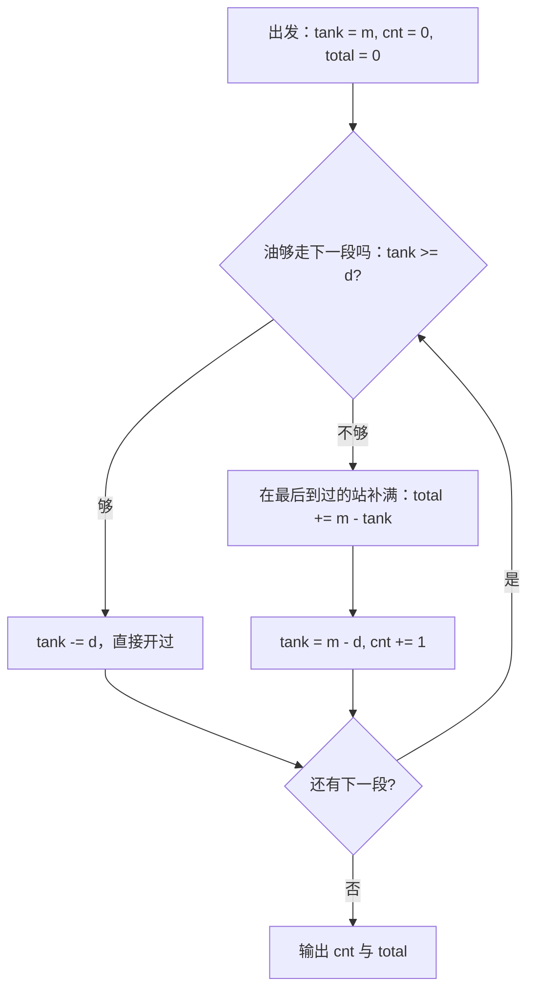

[[TOC]]

## 形式化题目

沿途有 $n+2$ 个站：第 $0$ 站为 $A$、第 $n+1$ 站为 $B$、中间 $n$ 个是加油站，第 $i-1$ 站与第 $i$ 站相距 $d_i$（$i = 1..n+1$）。油箱容量与满箱续航同为 $m$：1 升跑 1 公里，所以续航公里数与容量升数数值相同。从 $A$ 出发时油箱是满的，此后每次加油都加满。求从 $A$ 到 $B$ 的一个**加油次数最少**的方案，输出它的加油次数与加油总量；有多组数据，读到文件尾，每组输出一行。

注意出发那一箱既不计入次数、也不计入总量——样例答案 $25 = 12 + 13$，不含出发时的 15。

样例 $m = 15$、距离依次 $5, 7, 5, 2, 6, 4$ 的逐段推演（列含义：进段前还剩多少油、这一段怎么处理、开过后还剩多少）：

| 段 | 区间 | 距离 $d$ | 进段前油量 | 决策 | 出段后油量 |
| --- | --- | --- | --- | --- | --- |
| 1 | $A \to 1$ | 5 | 15 | 油够，直接开 | 10 |
| 2 | $1 \to 2$ | 7 | 10 | 油够，直接开 | 3 |
| 3 | $2 \to 3$ | 5 | 3 | 不够：在站 2 补满，补入 $15 - 3 = 12$（第 1 次） | 10 |
| 4 | $3 \to 4$ | 2 | 10 | 油够，直接开 | 8 |
| 5 | $4 \to 5$ | 6 | 8 | 油够，直接开 | 2 |
| 6 | $5 \to B$ | 4 | 2 | 不够：在站 5 补满，补入 $15 - 2 = 13$（第 2 次） | 11 |

全程只在第 3、6 段前被迫加油：共 2 次，总量 $12 + 13 = 25$，输出 `2 25`。

## 正解

### 思路

**一句话本质**：能不加就不加，要加就加满，加在最后到过的站上——三个决定把整条路线唯一确定，没有任何自由度。

朴素做法有两条，都不可取：

- **逢站加满**：每到一个加油站就补满再走。$O(n)$、可行，但把"检查"变成了"必加"，次数是能到达 $B$ 的方案里最多的。
- **枚举加油方案**：从 $2^n$ 个站子集里挑可行且次数最少的，逐个模拟验证。$n \leqslant 50$ 已不可行，实数距离也让"临界站"无从二分。

要压掉多余次数，能动的自由度只有两个——**什么时候加**和**加多少**，逐一收紧：

1. **时机：只要油还够下一段，就绝不加油。** 加油唯一的作用是把油量抬回 $m$，而满箱续航 $m$ 是硬上限：早加并不能突破这个上限，下一次缺油的时刻不会因此提前，却会白白多计一次。所以把任意方案的加油尽量往后推迟永远不会变差。
2. **油量：要加就加满。** 题面规定每次加满；即便不规定，加得越满，坚持到下一次被迫加油的间隔只会长不会短，次数不会变多，而满箱恰好是上限。
3. **地点：被迫那一刻你正站在最近到过的站，只能在那里加。**

三者合起来，算法就是一遍扫描：从满箱出发逐段消耗，油量不够走下一段时在当前站补满，继续。补多少由记账直接给出——补入量 $= m -$ 当前油量（把油抬回满箱），补完立刻开过这段，油量变成 $m - d$：

判断只有一个 `tank >= d`：两个分支分别对应"直接消耗"与"先补满再消耗"，最后都汇到"还有下一段"，说明这是逐段推进的单遍过程；补满分支里**先记账再消耗**的顺序不能反，记账时用的必须是补前的旧油量。

**为什么次数最少**（交换论证）。任取一个可行方案 $P$，设它第 $i$ 次加油在站 $o_i$（出发那一箱记作第 0 箱），贪心的第 $i$ 次加油在 $g_i$，归纳证明 $g_i \geqslant o_i$：

- **基础**：两者出发状态相同（$A$ 满箱）。从出发到 $o_1$，$P$ 全靠这一箱，油量演化与贪心完全相同，所以贪心也到得了 $o_1$；贪心只在油不够下一段时才停下加油，故它的第 1 个加油点 $g_1 \geqslant o_1$。
- **归纳**：油只随距离减少，满箱从更靠后的站出发，可达范围只增不减。$P$ 满箱于 $o_i$ 能到达 $o_{i+1}$（方案可行，即两点间距离 $\leqslant m$），而 $g_i \geqslant o_i$，所以贪心满箱于 $g_i$ 也到得了 $o_{i+1}$；由基础步同样的推理，$g_{i+1} \geqslant o_{i+1}$。
- **收尾**：$P$ 加完第 $k$ 次油后从 $o_k$ 满箱开到 $B$；贪心在 $g_k \geqslant o_k$ 满箱，去 $B$ 的路更短，同样到达，且用油次数 $\leqslant k$（若贪心在到达 $o_{i+1}$ 前后就已开到 $B$，则它连第 $i+1$ 次油都不必加，次数更少、结论更强）。

$P$ 是任意可行方案，故贪心次数最少。补入总量则是该方案"缺多少补多少"的自然记账。

**评测口径**：上面的"可行"要求每段 $\leqslant m$（否则加满也开不过去，物理解不存在），但真实数据 10 个测例**全部**含超过 $m$ 的段——如 `p6` 首段 $36 > m = 30$、`p7` 中 $m = 2$ 而每段都超（最短的也有 10）——题面又没有定义"无解"时输出什么。评测因此按参考实现的**机械递推**给出答案：缺油就先把油抬回 $m$（补入 $m -$ 当前油量），再开过这段，油量允许被减成负数；负数表示这段本来开不过去，欠的油记在下一次补油里。贪心时机与这条递推式合起来就是下面的代码，10 个测例与评测输出逐一一致。

### 代码

`min_refuel` 是核心循环：`tank` 为当前油量，`tank >= d` 直接消耗；否则在当前站补满（`total += capacity - tank`）并立刻开过这段（`tank = capacity - d`），次数加一。`solve` 只做读入与输出：一个 token 迭代器把多组数据读到文件尾，每组切出 $n+1$ 段距离；`num` 只在 token 带小数点时才转 `float`（题面写"实数"，实测全为整数），`fmt` 把整值的 `.0` 去掉，与样例的整数输出保持一致。

@include-code(./main.py, python)

### 复杂度

- 时间复杂度：每组数据对 $n+1$ 段各扫描一次，每段 $O(1)$，单组 $O(n)$；全部测例合计 $O(\sum n)$。实测最慢约 0.02 s，远低于 1000 ms 的限制。
- 空间复杂度：$O(n)$，存放一段距离列表与输出行，其余为 $O(1)$ 标量；峰值 14.8 MB，低于 128 MB 的限制。

## 总结

一维扫描的贪心模板：**能不加就不加，要加就加满，加在最后到过的站**。两个自由度分别被"推迟加油永不亏"（满箱续航是硬上限，早加不改善未来）和"加满只会拉长间隔"锁死，路线随之唯一确定；交换论证用"$g_i \geqslant o_i$"的归纳说明这样得到的次数不大于任何可行方案。记账只有三行：油够就减，不够就 `total += m - tank`、`tank = m - d`、`cnt += 1`。两个易错点：出发的满箱不计入答案；评测数据含超过续航的段，必须按机械递推实现（`tank` 可为负），否则与评测口径不符。实测 10 个测例全部一致，最慢约 0.02 s、峰值 14.8 MB。
