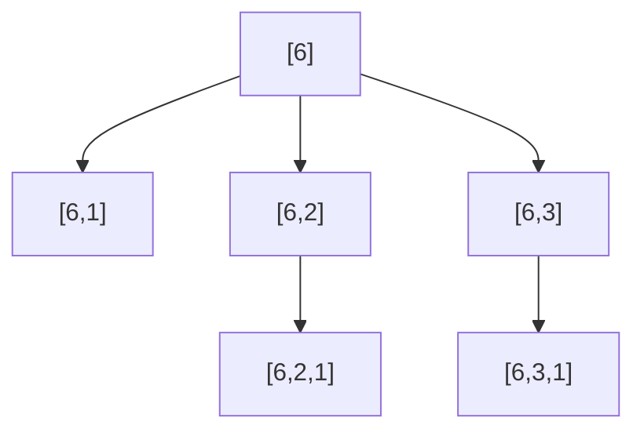

[[TOC]]

## 形式化题目

给定正整数 $n$。称一个正整数数列是合法的，当且仅当：

1. 只含一个数字 $n$ 的数列合法；
2. 在一个合法数列的末尾追加一个正整数 $y$，且 $y \leqslant \dfrac{x}{2}$（$x$ 为追加前的末项），得到的数列仍合法。

求合法数列的总数，答案只保留最低 $5$ 位（不足 $5$ 位直接输出）。$1 \leqslant n \leqslant 10^5$。

## 正解

### 思路

**把数列看成一条链。** 一个合法数列一定是这样生成的：从 $n$ 开始，每一步把末项 $x$ 变成某个 $y \in [1, \lfloor x/2 \rfloor]$。也就是说，"追加一个数"只依赖**当前末项**是多少，而与前面写了什么无关。这提示我们按末项的值做计数：

$$f(i) = \text{以 } i \text{ 为首项的合法数列个数}$$

- 数列 $[i]$ 自身合法，贡献 $1$；
- 若第二步追加了 $j$，则后面那段恰是一个以 $j$ 为首项的合法数列，$j$ 可以取 $1, 2, \dots, \lfloor i/2 \rfloor$。

于是得到转移方程：

$$f(i) = 1 + \sum_{j=1}^{\lfloor i/2 \rfloor} f(j)$$

用样例 $n=6$ 验证：$f(1)=1$，$f(2)=1+f(1)=2$，$f(3)=1+f(1)=2$，$f(6)=1+f(1)+f(2)+f(3)=6$，与题面列出的 $6$ 个数列一致。

**朴素做法与瓶颈。** 直接按上式递推，每个 $i$ 要把 $j$ 从 $1$ 枚举到 $\lfloor i/2 \rfloor$，总时间 $O(n^2)$。$n = 10^5$ 时约 $2.5 \times 10^9$ 次运算，无法在时限内完成——瓶颈就在于"求和"被重复计算了。

**前缀和消除求和。** 注意到 $\sum_{j=1}^{k} f(j)$ 只依赖 $k$。令前缀和

$$s(i) = f(1) + f(2) + \cdots + f(i)$$

因为我们是按 $i = 1, 2, \dots, n$ 的顺序递推的，算到 $f(i)$ 时 $s(\lfloor i/2 \rfloor)$ 一定已经求好（$\lfloor i/2 \rfloor < i$），转移立刻变成 $O(1)$：

$$f(i) = 1 + s\bigl(\lfloor i/2 \rfloor\bigr), \qquad s(i) = s(i-1) + f(i)$$

**取模。** 题目要求"只保留 $5$ 位"，即真实答案对 $100000$ 取模。由于转移只有加法，每一步取模不会影响结果；而样例规模小不触发取模，$n=6$ 时仍输出 $6$。最终答案为 $f(n)$。

下表展示 $n = 6$ 时两组数组的完整推导过程（"来源"列标出 $f(i)$ 用到的 $s$ 值）：

| $i$ | $\lfloor i/2 \rfloor$ | 来源 $s(\lfloor i/2\rfloor)$ | $f(i) = 1 + s(\lfloor i/2\rfloor)$ | $s(i) = s(i-1) + f(i)$ |
| --- | --- | --- | --- | --- |
| $1$ | $0$ | — | $1$ | $1$ |
| $2$ | $1$ | $s(1)=1$ | $2$ | $3$ |
| $3$ | $1$ | $s(1)=1$ | $2$ | $5$ |
| $4$ | $2$ | $s(2)=3$ | $4$ | $9$ |
| $5$ | $2$ | $s(2)=3$ | $4$ | $13$ |
| $6$ | $3$ | $s(3)=5$ | $6$ | $19$ |

读表时重点看最后一行：$f(6) = 1 + s(3) = 6$，一步就用掉了前面所有 $j \leqslant 3$ 的计数——这正是前缀和把 $O(n^2)$ 压成 $O(n)$ 的位置。右列 $s(i)$ 不断累加 $f$，保证算到更大的 $i$ 时所需的 $s(\lfloor i/2 \rfloor)$ 总是现成的。

### 代码

@include-code(./main.py, python)

### 复杂度

- 时间复杂度：$O(n)$。递推 $f$、$s$ 各一次循环，每次转移 $O(1)$。
- 空间复杂度：$O(n)$。两个长度为 $n+1$ 的数组；由于转移只需 $s(\lfloor i/2 \rfloor)$ 和 $s(i-1)$，理论上可滚成 $O(1)$，但 $n \leqslant 10^5$ 下没有必要。

## 总结

- 关键建模：合法数列只由末项决定下一步的取值范围，因此按"首项"计数得到 $f(i) = 1 + \sum_{j=1}^{\lfloor i/2\rfloor} f(j)$。
- 优化手段：求和项恰是前缀 $s(\lfloor i/2 \rfloor)$，且 $\lfloor i/2 \rfloor < i$ 保证前缀和先算好，把 $O(n^2)$ 的朴素递推降到 $O(n)$。
- 输出细节："保留 5 位"即对 $100000$ 取模，加法转移下每步取模安全；小规模答案不受影响。
- 这是典型的"递推 + 前缀和"组合：遇到 $f(i)$ 依赖 $f(1..k(i))$ 的形式，先看 $k(i)$ 是否单调、能否用前缀和整体代替逐项枚举。

## 图示解析

下面的生成树画出 $n=6$ 时所有合法数列的形成过程：每个节点是一个数列，一条边表示"在末尾追加一个不超过末项一半的数"。

观察这棵树：从根 $[6]$ 出发，第一层分支对应 $f(1)+f(2)+f(3)$，第二层分支是在 $[6,2]$、$[6,3]$ 后面接上以 $1$ 为首项的数列——也就是把 $f(1)$ 再"复用"了两次。这正是转移方程 $f(i) = 1 + \sum_{j \leqslant \lfloor i/2 \rfloor} f(j)$ 的直观含义：每个以 $j$ 为首项的数列都能整体拼到 $i$ 后面，所以子问题的计数可以直接相加，而前缀和 $s$ 负责把这一整层分支的和一次算完。
