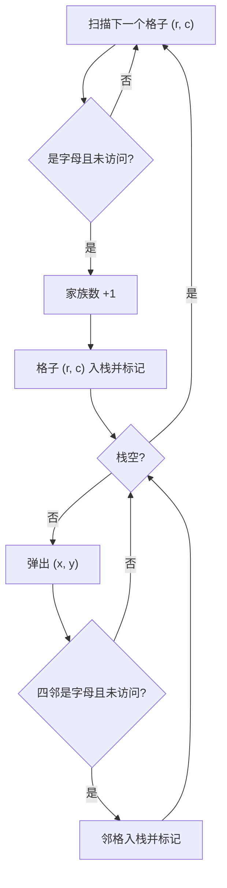
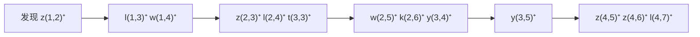

[[TOC]]

## 形式化题目

给定一个 $n \times m$ 的字符网格（$n \leqslant 100$，每行不超过 200 个字符，各行长度可以不同）。每个格子是三种字符之一：

- 空格：大海；
- `*`：河流或山丘；
- 小写字母：一户人家，字母本身表示这户人家的姓氏。

规定两个字母格子「相邻」当且仅当它们上下左右共边。若一个字母格子集合中任意两格都能通过相邻字母格互相到达，则它们属于同一个家族（同一家族的人姓氏不一定相同）。求家族的个数。

### 样例

```plaintext
4
*zlw**pxh
l*zlwk*hx*
w*tyy**yyy 
    zzl
```

输出 `3`。把三个家族分别染色（A、B、C）后可以看清连通关系（`·` 表示 `*` 或空格等非字母格）：

| 行\列 | 1    | 2    | 3    | 4    | 5    | 6    | 7    | 8    | 9    | 10   |
| ---- | ---- | ---- | ---- | ---- | ---- | ---- | ---- | ---- | ---- | ---- |
| 第1行 | ·    | A    | A    | A    | ·    | ·    | ·    | B    | B    | B    |
| 第2行 | C    | ·    | A    | A    | A    | A    | ·    | B    | B    | ·    |
| 第3行 | C    | ·    | A    | A    | A    | ·    | ·    | B    | B    | B    |
| 第4行 |      |      |      |      | A    | A    | A    |      |      |      |

观察重点：

- 三个家族一目了然：A 是从 `zlw` 蜿蜒到 `zzl` 的最大一片，B 是右侧 `pxh / hx / yyy` 一片，C 是第 1 列竖着的 `l/w`。
- 字母不同不影响连通：家族 A 里 `z`、`l`、`w`、`k`、`t`、`y` 混在一起，只要共边就是同一家族。
- 对角线不算相邻：第 1 行的 `z` 和第 2 行的 `l` 只隔一条对角线，而且中间还有 `*`，所以它们属于不同家族；斜着「看起来挨着」的格子不能合并。
- `*` 和空格是「断开物」：`*zl` 里的 `*` 把左边与右边隔开，最后一行的前导空格把大海区域整体让开，`zzl` 顺着第 3 行的 `yyy` 向上连通。

## 正解

### 思路

**把地图变成图。** 每个字母格子是一个节点，两个字母格上下左右共边就在它们之间连一条无向边；`*` 和空格上没有节点，天然把图断开。于是：

> 家族数 = 这个网格图里连通块的个数。

**朴素做法及其问题。** 最直接的想法是枚举每一对字母格、判断它们是否连通（每次做一遍搜索），复杂度至少 $O(V^2)$，而且实现繁琐。其实连通块个数有更省的数法——**洪水填充（Flood Fill）**：一个连通块只需要被「发现」一次，发现后把整块一次性染掉，之后不会再对它计数。

**洪水填充流程。** 从左到右、从上到下扫描每个格子：

1. 遇到一个**没有访问过**的字母格——它一定属于一个还没见过的家族（它的相邻字母如果早已被访问，它自己也会顺带被访问），计数器 +1；
2. 从这个格子出发做 DFS，沿着四连通的字母格把整个家族全部标记为已访问；
3. 已访问的格子不会再触发计数。

正确性：每个字母格恰好属于一个连通块，且一个连通块第一次被扫描到时，计数器恰好加 1——所以结束时计数器就是家族数。

**实现要点。**

- 读入必须**保留行首空格**（它们是大海），用 `splitlines()` 逐行原样保存，各行长度可以不同，越界判断按 `len(row)` 逐行处理。
- 网格最多 $100 \times 200 = 20000$ 个格子，一条竖直的长链就能把递归 DFS 压到两万层深，所以用**显式栈**写成迭代 DFS，不依赖 `setrecursionlimit`。
- 「入栈前先标记」而不是「出栈时再标记」，防止同一个格子被重复入栈。
- 字母判定用 `ch.isalpha()`，与 `*`、空格天然区分。

洪水填充的执行过程如下：



### 代码

@include-code(./main.py, python)

### 复杂度

每个格子至多入栈一次，每个格子被检查四个方向的邻居，时间复杂度 $O(n \times 200)$，最多约 20000 步；`seen` 集合与栈的开销同阶，空间复杂度 $O(n \times 200)$。远小于题目 1000ms / 128MB 的限制。

## 总结

- 家族 = 字母格子的四连通块；家族数 = 连通块个数。
- 洪水填充：扫到未访问的字母格就计数 +1 并把整块染色，每个连通块只被发现一次。
- 两个实现陷阱：读入要保留行首空格；网格深链要用显式栈的迭代 DFS 防爆栈。

## 图示解析

### 从「染色」到「计数」

以样例中间那个大家族 A 为例（从第 1 行的 `zlw` 蜿蜒到第 4 行的 `zzl` 一整片），按行扫描时洪水填充的扩散顺序大致是：



（括号内是「第几行第几列」，从 1 开始编号；`⁺` 表示该步被染色入栈。）

观察重点：

- 计数只发生在最开始的 `z(第1行第2列)`：家族数 +1 之后，后续扩散无论多大都不再计数。
- 扩散严格沿着共边的字母格走：第 1 行的 `z` 只能通过下方的 `z` 走到第 2 行，`*` 与空格像墙一样挡住了搜索，所以这一片最终恰好覆盖整个家族 A。
- 等这批格子全部出栈后，扫描继续前进，下一个未访问的字母格（例如第 1 列的 `l`）又会触发一次「+1 + 染色」，如此往复直到扫完地图。
