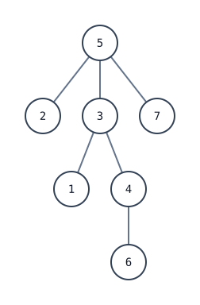

[[TOC]]

## 形式化题目

给定一棵 $n$ 个点的树。点 $i$ 初始保存单字符序列 $[i]$。

一次聚拢操作选择点 $u$，取出 $u$ 及其所有邻点上的非空序列，任意调整这些**完整序列块**的先后顺序，再把它们拼成一个新序列放到 $u$，其余参与点清空。

第一次操作没有限制；从第二次开始，每次参与聚拢的序列中必须至少有一个长度不小于 $2$。要求最终把 $1,2,\ldots,n$ 合并成一个序列，并使该序列的字典序最小。

## 暴力

小数据时，可以保存每个点当前放着的完整序列，枚举本次聚拢中心，再枚举所有参与序列块的排列。下面的程序对完整状态去重，适合 $n\leqslant7$ 的随机数据和对拍：

@include-code(./brute.cpp, cpp)

它枚举了所有合法操作与块顺序，因此容易确认正确性；但状态数和每次的排列数都增长得极快。优化必须先找出后续操作真正围绕什么展开。

## 思路

本文保留两份可提交代码：

- `main-60.cpp`：枚举第一次聚拢中心，复杂度为 $O(n^2\log n)$，对应前三个子任务；
- `main.cpp`：候选根搜索与共享模拟，复杂度为 $O(n\log^2 n)$，是面向 $n=10^5$ 的正式 100 分实现。

两种做法共用同一个固定根贪心。满分优化不是替换这个贪心，而是避免把它对全部 $n$ 个根从头运行。

目前没有找到经过当前评测框架验证、同时又足够短的满分实现。`main.cpp` 的长度主要来自候选根正确淘汰、历史事件恢复和多套数据结构；学习时应先掌握 60 分部分，再阅读满分筛根层。

## 解法一：枚举根的 60 分做法

### 思路

#### 唯一活动串

第一次聚拢后会产生一个长度大于 $1$ 的序列，称为**活动串**。其他非空点仍只保存一个尚未合并的单字符。

以后每次操作都必须接触活动串，操作完成后又只留下一个新的活动串。因此：

1. 整个过程中始终只有一个活动串；
2. 新操作中心必须是当前中心或其邻点；
3. 操作中心在树上形成一条 walk；
4. 活动串是完整的块，后续只能在它前后拼接新块，不能拆开内部字符。

这把“全树上的字符串状态”压缩成了“一个活动串沿树移动并吸收新字符”。

#### 固定第一次聚拢中心

固定第一次中心 $r$，并以 $r$ 为根。第一次操作参与的全是单字符，直接按编号升序拼接。之后，当内部点 $u$ 成为新中心时，父亲一侧已经与活动串连通，新吸收的只有 $u$ 尚未处理的儿子。

样例取 $r=5$ 时，定根后的结构如下图。这张图展示操作中心 walk 与父子方向：



节点 `5` 的儿子是 `2,3,7`，节点 `3` 的儿子是 `1,4`，节点 `4` 的儿子是 `6`。操作中心依次为 `5 -> 3 -> 4`，每次向下走到一个内部点，就吸收它还未处理的儿子。

#### 一次聚拢怎样拼接

设活动串为 $S$，首字符为 $h$。本次新加入的块全是单字符，比较单字符 $x$ 和 $S$ 时只需比较 $x$ 与 $h$。所以最优拼接一定是：

- 所有 $x<h$ 的儿子按升序放在 $S$ 前面；
- 所有 $x\geqslant h$ 的儿子按升序放在 $S$ 后面。

样例第一次在 `5` 聚拢得到

$$
S=[2,3,5,7],\qquad h=2.
$$

接着走到 `3`，新字符为 `1,4`，得到

$$
[1]+[2,3,5,7]+[4]=[1,2,3,5,7,4].
$$

再走到 `4` 并吸收 `6`，最终得到 $[1,2,3,5,7,4,6]$。

代码中的 `answer_buffer` 从中间存放活动串，两端预留空间，因此左插和右插都不需要搬移整个序列。

#### 为什么需要红点

只从当前可达点中选择编号最小者是错误的：较深的点未来可能把更小字符插到整个活动串前面，直接改写已经看到的前缀。

对有儿子的点 $u$ 定义

$$
mn(u)=\min\{v\mid v\text{ 是 }u\text{ 的儿子}\}.
$$

若 $mn(u)<h$，处理 $u$ 会产生新的串首，称 $u$ 为**红点**。多个小字符最终都会插到前面，而后插入的块位置更靠前；为了让最终前缀升序，应先暴露较大值，再暴露较小值。

同一根到叶路径上，只需关注最靠上的红点。代码把每个红点连向最近红色祖先，形成红点压缩树；`visible_red` 保存没有红色祖先的红点。串首降低时，原来的一批红点会失效，删除它们并把红色儿子上提即可。

每一轮在两类分支之间比较：

- `frontier`：当前沿 walk 已经可以处理的分支；
- `visible_red`：未来会改写前缀、不能无限推迟的分支。

选择使下一个未确定位置更小的分支，吸收它的儿子，并继续维护边界与红点。这样便得到固定 $r$ 的最优串。

### 代码

@include-code(./main-60.cpp, cpp)

### 复杂度

固定一个根需要 $O(n\log n)$ 时间、$O(n)$ 额外空间。枚举全部 $n$ 个根后，总时间复杂度为 $O(n^2\log n)$，只适合 $n\leqslant3000$。

## 解法二：候选根搜索与共享模拟

### 思路

满分瓶颈非常明确：`FixedRootSolver` 已经能在 $O(n\log n)$ 内解决一个根，但不能对 $n$ 个根全部重跑。

正式代码使用一个固定的基准根预处理树链剖分与欧拉序，再把搜索分成“筛根、归档、共享模拟”三部分。

#### 1. 按已确定前缀给分支定向

`candidate_set` 初始包含所有点，表示它们都可能是第一次聚拢中心。算法按当前最小的未处理字符推进答案前缀。

当已经确定的前缀迫使某条边只能朝一个方向连接时，`direct_branch(u,v)` 给整棵分支定向。分支内部的点若作为根，会在已经确定的位置产生更大字符，后缀不可能反超，所以可以从 `candidate_set` 整块删除。

`EraseSet` 用并查集跳过已删除根。`prefix_mark` 记录历史中已经固定的前缀点；树链剖分配合 BIT 统计路径上这类点的数量，让 `valid()` 判断一个已定向点是否仍能参与当前比较。

#### 2. 把红点历史归档到候选根区间

搜索推进后，如果重新选择一个候选根，某些过去的点会在新根方向下重新成为红点，不能只保存“当前时刻的红点”。因此代码把红点变化记录成历史事件。

一次事件可写成 $(x,f)$：从邻点 $f$ 的方向看点 $x$，$f$ 是 $x$ 在这个根方向下最小的两个孩子之一。删去边 $(x,f)$ 后，哪些根满足条件只取决于根落在哪个连通块。

在基准根的欧拉序上，这个根集合是：

- 一个子树区间；或
- 一个子树的补集，可拆成前缀和后缀两个区间。

`RedTree` 是欧拉序线段树。每个事件加入 $O(\log n)$ 个线段树节点，每个节点内部用 AVL 树按 $(f,x)$ 排序，并用 `act/any` 标记事件是否活动。查询某个候选根时，只访问它的欧拉位置到线段树根的路径，就能找出当前串首以下最大的有效红点。

#### 3. 从历史位置继续模拟候选根

当搜索遇到一个仍存活的在线候选根时，不能再为它重建整套固定根状态。代码使用：

| 结构 | 维护内容 |
| --- | --- |
| `NextSet` | 每个点尚未被消费的邻点，可跳过已删位置 |
| `DoneDSU` | 已经完全处理的连通区域、区域边界最小值 |
| `RedTree` | 对当前候选根仍有效的历史红点 |
| `candidate_head` | 候选活动串当前首字符 |

`peek_candidate()` 用这些共享状态生成候选答案的下一个字符，`check_candidate(x)` 把它与全局搜索当前确定的字符 $x$ 比较：

- 候选字符更大：立即淘汰这个根；
- 候选字符相等：消费该字符，继续比较；
- 候选字符更小：它已经在第一个不同位置获胜，可以停止筛选。

当 `candidate_set` 只剩至多两个点时，再加上可能仍在线的候选根，总共只需对常数个根运行 `solve_fixed_root()`，比较完整结果即可。

#### 正确性要点

**固定根正确。** 唯一活动串覆盖所有合法后续操作；单次按块首字符排序最优；`frontier` 与红点压缩树完整覆盖当前可达分支和未来会改写前缀的分支。

**筛根不漏解。** `direct_branch` 只删除在已经确定的答案位置上必然更大的根。字典序在第一个不同位置决定大小，这些根不可能通过后缀反超。

**历史查询等价。** 红点事件对根的有效集合被准确表示为欧拉区间。BIT、`NextSet`、`DoneDSU` 与 `RedTree` 保存了固定根贪心决定下一字符所需的全部历史，因此共享模拟产生的下一字符与从头模拟一致。

**最终答案正确。** 在线比较只在第一个不同字符处淘汰或确认候选；搜索结束后再精确计算所有剩余根，所以不会遗漏全局最优第一次中心。

### 代码

@include-code(./main.cpp, cpp)

### 复杂度

树链剖分路径查询和红点线段树操作均为 $O(\log^2 n)$。每个点与事件只被常数次加入或删除，所以总时间复杂度为 $O(n\log^2 n)$。

欧拉 RMQ 稀疏表和线段树中的 AVL 事件副本共占 $O(n\log n)$ 空间。

## 复杂度对比

| 文件 | 做法 | 时间复杂度 | 空间复杂度 | 适用范围 |
| --- | --- | --- | --- | --- |
| `brute.cpp` | 完整状态与块排列搜索 | 指数级 | 指数级 | $n\leqslant7$，对拍 |
| `main-60.cpp` | 枚举根 + 固定根贪心 | $O(n^2\log n)$ | $O(n)$ | $n\leqslant3000$ |
| `main.cpp` | 候选根搜索 + 历史归档 + 共享模拟 | $O(n\log^2 n)$ | $O(n\log n)$ | $n\leqslant10^5$ |

## 总结

这道题的第一层本质是唯一活动串：合法性迫使它沿树上 walk 移动，固定第一次中心后，每次只需把当前点的儿子插到活动串两端。`frontier` 与红点压缩树解决了未来小字符会改写前缀的问题。

满分难点位于第二层：不能枚举所有根。分支定向负责淘汰已经不可能最优的根，HLD 与 BIT 归档前缀，线段树套 AVL 归档不同根下的红点，`NextSet + DoneDSU` 让在线候选从共享历史继续逐字符模拟。最终只对常数个根运行固定根算法。

## 图示解析

这张图串起从完整状态搜索到满分候选根共享模拟的路线：

```text
完整聚拢状态
|- n <= 7：枚举中心与块排列，作为 brute.cpp
`- 唯一活动串沿树 walk
   |- 固定第一次中心 r
   |  `- frontier + 红点压缩树，O(n log n)
   |- 枚举全部 r：main-60.cpp，O(n^2 log n)
   `- 在线筛选候选根：main.cpp
      |- 分支定向 + 可删除并查集
      |- HLD + BIT 归档前缀
      |- 线段树套 AVL 归档红点
      `- NextSet + DoneDSU 共享逐字符模拟
```

前三层优化都建立在“只有一个活动串”上。60 分代码已经解决固定根问题，满分代码没有重新设计局部贪心，而是解决“不能把它对每个根重跑”的瓶颈。候选根搜索只保留可能匹配当前最优前缀的根，并从历史事件继续模拟，因此总复杂度降为 $O(n\log^2 n)$。
