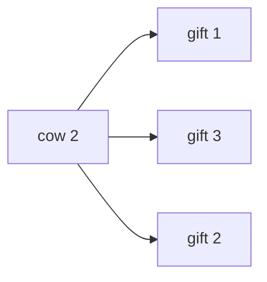

[[TOC]]

### 题意

有 $N$ 头奶牛和 $N$ 个礼物。初始时，第 $i$ 头奶牛拿到第 $i$ 个礼物。

每头奶牛给出一个礼物偏好排列。奶牛们可以重新分配礼物，但每头奶牛最终拿到的礼物必须不比自己原来的礼物更差。

对每头奶牛，输出她在某种合法重新分配中可能拿到的最喜欢的礼物。

### 思路

先看一个小数据暴力。它枚举所有礼物分配排列，保留每头奶牛都不变差的方案，再统计每头奶牛能拿到的最优礼物。

@include-code(./brute.cpp, cpp)

满分做法把问题转成有向图。

如果奶牛 `i` 愿意接受礼物 `j`，就连一条边：

```text
i -> j
```

这里的礼物 `j` 也可以看成“原来拥有礼物 `j` 的奶牛 `j`”。所以边 `i -> j` 表示：在某个交换环里，奶牛 `i` 可以拿走奶牛 `j` 的礼物。

只连奶牛 `i` 偏好列表中从开头到礼物 `i` 为止的礼物，因为这些礼物都不比原来的礼物差。

例如样例中，奶牛 `2` 可以接受礼物 `1,3,2`，所以有：



一次合法的重新分配，本质上是把若干奶牛分成若干个交换环。若奶牛 `i` 想拿礼物 `j`，就需要存在一个包含边 `i -> j` 的环。

在有向图中，边 `i -> j` 能在某个环里，当且仅当 `j` 可以沿图走回 `i`。因此：

```text
奶牛 i 可以拿礼物 j  <=>  reachable[j][i] 为真
```

于是先用 Floyd 求所有点之间的可达性。因为 $N\leqslant 500$，用 `bitset` 可以把一次合并写成整行或运算：

```text
如果 i 能到 k，那么 i 能到的点并上 k 能到的点
```

最后对每头奶牛按偏好顺序扫描，找到第一个满足 `reachable[gift][i]` 的礼物，就是她能拿到的最喜欢礼物。

### 代码

@include-code(./main.cpp, cpp)

### 复杂度

建图需要 $O(N^2)$。

`bitset` Floyd 需要 $O(N^3 / w)$，其中 $w$ 是机器字长；在本题 $N\leqslant 500$ 下很轻。

空间复杂度为 $O(N^2)$。

### 总结

本题的关键是把“礼物重新分配”看成交换环。

奶牛 `i` 能拿礼物 `j`，等价于边 `i -> j` 能放进一个环，也就是 `j` 能到达 `i`。求出可达闭包后，按偏好顺序选第一个可行礼物即可。
