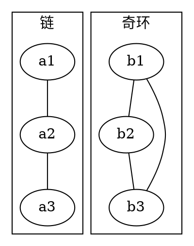

# luogu P1330 封锁阳光大学

> 原文摘录，非模型摘要。来源：`problems/luogu/P1330/index.md`。

## 元信息（frontmatter 摘录）
- 难度：普及+/提高；标签：['图论', '二分图染色', 'bfs']

## 题目解析（原文摘录）

### 题意

给出一张无向图。要选出若干个点去封锁，使得：

- 每条边至少有一个端点被封锁
- 任意两个相邻点不能同时被封锁

要求封锁点数量最少；若做不到，输出 `Impossible`。

### 思路

最直接的办法是暴力枚举选哪些点。

先看一个可以直接验证想法的朴素解：

@include-code(./brute.cpp, cpp)

下面是另一种「01 序列」风格的暴力写法。它按点编号依次决定“封锁 / 不封锁”，递归生成完整选择后，叶子节点统一检查每条边是否恰好有一个端点被选，并统计最少封锁点数：

另一种暴力写法：01 序列

@include-code(./brute_01_style.cpp, cpp)

`brute.cpp` 直接检查每条边是否满足“恰好选一个端点”，适合小图对拍。

真正的关键是：对任意一条边 `(u, v)`，

- 如果两个端点都不选，这条边没被封锁
- 如果两个端点都选，会发生冲突

所以每条边必须恰好选一个端点。

这张图对比了两种典型情况：

从图中可以看到，链可以二分成两侧，任选一侧就能覆盖所有边；而奇环没法做到“每条边恰好跨越选与不选”，所以直接无解。

因此做法就是：

1. 对每个连通块做二分图染色
2. 若遇到相邻同色，输出 `Impossible`
3. 否则这个块只能整块选某一种颜色，答案加上 `min(cnt0, cnt1)`

## 代码位置
- `problems/luogu/P1330/brute.cpp`
- `problems/luogu/P1330/brute_01_style.cpp`
- `problems/luogu/P1330/gen.py`
- `problems/luogu/P1330/main.cpp`
