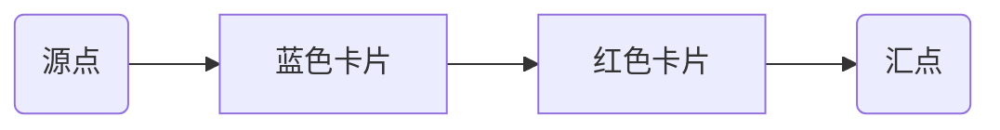
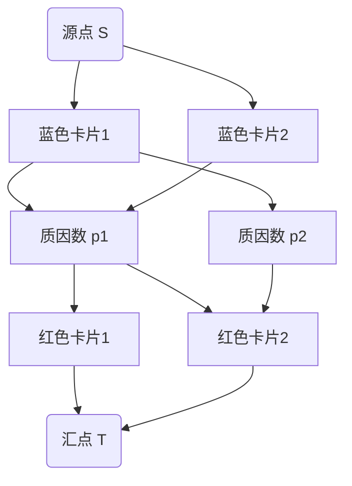

# luogu P2065 [TJOI2011] 卡片

> 原文摘录，非模型摘要。来源：`problems/luogu/P2065/index.md`。

## 元信息（frontmatter 摘录）
- 难度：提高+/省选-；标签：['网络流', '二分图']

## 题目解析（原文摘录）

## 题目解析

我们有 $m$ 张蓝色卡片和 $n$ 张红色卡片，每张卡片上有一个大于 1 的整数。每次可以拿走一张蓝色卡片和一张红色卡片组成一组，要求这两张卡片上的数字**最大公约数大于 1**。问最多可以拿走多少组卡片。

### 关键点
- 每次只能拿走**一蓝一红**两张卡片
- 这两张卡片的数字必须有**公共的质因数**（因为 gcd > 1）
- 每张卡片只能被使用一次

## 问题转化

这是一个典型的**二分图最大匹配**问题：
- 左侧：所有蓝色卡片
- 右侧：所有红色卡片
- 边：如果蓝色卡片 $b_i$ 和红色卡片 $r_j$ 的 gcd > 1，则它们之间有一条边

我们需要找到最多的匹配对数。

## 算法设计

### 方法一：直接建图 + 最大流（代码1）
这是最直观的方法，直接将蓝色卡片和红色卡片作为二分图的两部分，用最大流求解。

**建图方式：**

1. 源点 S 连接所有蓝色卡片，容量为 1
2. 所有红色卡片连接汇点 T，容量为 1
3. 如果蓝色卡片 i 和红色卡片 j 的 gcd > 1，则从蓝色 i 到红色 j 连一条容量为 1 的边

**复杂度分析：**
- 节点数：$m + n + 2 ≈ 1002$
- 边数：最坏 $m × n = 250,000$（当 m=n=500 时）
- 使用 Dinic 算法，在二分图中的复杂度约为 $O(E√V) ≈ 250,000 × √1000 ≈ 8 × 10^6$

这个方法虽然简单，但边数较多，在 T=100 组数据时可能达到临界。

### 方法二：质因数分解优化建图（代码2）
更高效的方法是利用**质因数作为中间节点**。

**核心思想：** 两张卡片匹配的条件是它们有公共质因数。我们可以通过质因数节点来连接蓝色和红色卡片。

**建图方式：**

1. 源点 S → 每张蓝色卡片（容量 1）
2. 蓝色卡片 → 该卡片数字的所有质因数节点（容量 1）
3. 质因数节点 → 拥有该质因数的红色卡片（容量 1）
4. 红色卡片 → 汇点 T（容量 1）

**为什么这样是正确的？**
- 从 S 到 T 的一条流路径代表一组匹配：S → 蓝色 → 质因数 → 红色 → T
- 只有当蓝色和红色有公共质因数时，才可能存在这样的路径
- 每条边容量为 1，保证了每张卡片只被使用一次

> !!! 质数这一层 条件了一个 blue 选择 red 的限制条件 : 拥有同一个 质因子: 
> 
> 这是一种通用的 有条件的二分图匹配的处理方式

**优点：**
- 边数大大减少：每张卡片最多有 8 个质因数（因为 $2×3×5×7×11×13×17×19 > 10^7$）
- 总边数从 $O(mn)$ 降到 $O((m+n)×8)$

## 代码位置
- `problems/luogu/P2065/1.cpp`
- `problems/luogu/P2065/2.cpp`
