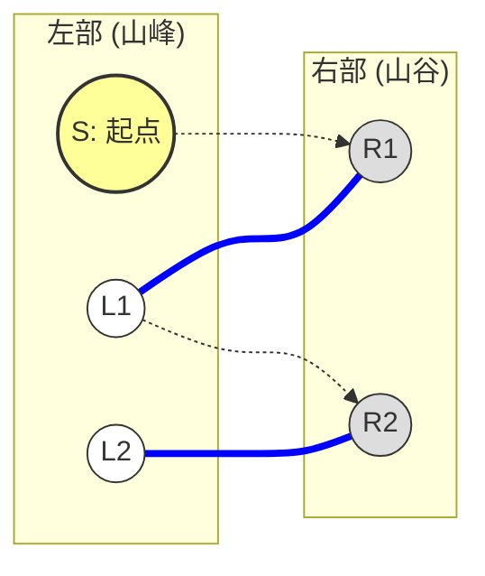
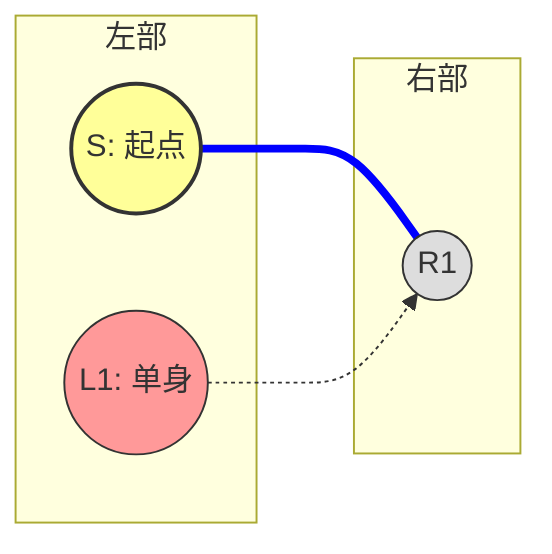

# luogu P4617 [COCI 2017/2018 #5] Planinarenje

> 原文摘录，非模型摘要。来源：`problems/luogu/P4617/index.md`。

## 元信息（frontmatter 摘录）
- 难度：省选/NOI-；标签：['二分图', '二分图博弈论']

## 题目解析（原文摘录）

## 题目解析

> 你好！我是你的算法老师。很高兴看到你已经掌握了二分图最大匹配（匈牙利算法）和增广路的基本定义。

这道题是 **二分图博弈** 的经典入门题。你现在卡在最核心的博弈结论上：**“为什么起点的匹配状态决定了谁必胜？”**

别担心，这其实是二分图博弈中最迷人也最反直觉的地方。为了让你彻底理解，我们不堆砌数学公式，而是通过图解和逻辑推演来“破解”这个结论。

---

### 一、 游戏规则梳理

首先，我们要把题目中的故事翻译成博弈模型：

1.  **地图**：是一个二分图。
    *   左边集合（山峰）：$L$
    *   右边集合（山谷）：$R$
2.  **角色**：
    *   **先手（Slavko）**：目前在 $L$，必须走到 $R$。
    *   **后手（Mirko）**：目前在 $R$，必须走到 $L$。
3.  **规则**：
    *   交替移动，不能经过重复的点。
    *   **输赢判定**：谁无路可走，谁就输了（标准博弈规则）。
        *   如果停在 $L$（轮到 Slavko 走但没路了），Mirko 赢。
        *   如果停在 $R$（轮到 Mirko 走但没路了），Slavko 赢。

---

### 二、 核心结论图解

我们要证明的结论是：

> **如果起点 $S$ 一定在最大匹配中（即无论怎么画最大匹配，都必须包含 $S$），则先手（Slavko）必胜。否则，后手（Mirko）必胜。**

我们分两种情况来剖析。

#### 情况 1：起点 $S$ 不在某个最大匹配中（Mirko 必胜）

假设我们求出了一个最大匹配（下图中粗线表示匹配边），而起点 $S$ 恰好没有被匹配。

**推演过程：**

1.  **Slavko (先手) 行动**：$S$ 是非匹配点。Slavko 必须沿着某条边走出去，比如走到 $R1$。
    *   注意：$R1$ **一定**是一个匹配点。
    *   *为什么？* 如果 $R1$ 也是非匹配点，那么 $S \to R1$ 就是一条增广路！这就意味着当前匹配不是最大匹配，与假设矛盾。所以 Slavko 只能走到一个“名草有主”的山谷。
2.  **Mirko (后手) 行动**：现在球在 $R1$ 手里。因为 $R1$ 是匹配点，Mirko 只要**沿着匹配边**走回去即可（走到 $L1$）。
    *   这是必经之路吗？是的，这是 Mirko 的最优策略。
3.  **循环**：现在的局势等同于 Slavko 在 $L1$ 重新开始。但 $L1$ 是匹配点，如果 Slavko 再往外走（比如去 $R2$），$R2$ 也必然是匹配点（否则 $S \to R1 \to L1 \to R2$ 就是增广路了）。
4.  **结局**：
    *   Mirko 的策略是：“**你只要敢过来，我就沿着匹配边把你踢回去**”。
    *   因为没有增广路（最大匹配的性质），这条路径**不可能**在右边（山谷）停下。
    *   路径最终一定会停在左边（山峰），轮到 Slavko 走投无路。
    *   **Mirko 胜**。

**结论 1**：如果起点 $S$ 不在最大匹配中，Mirko 只要死守“沿着匹配边走”的策略，Slavko 必输。

---

#### 情况 2：起点 $S$ 在当前的最大匹配中，但“不一定”在所有最大匹配中（Mirko 必胜）

这是最容易绕晕的地方。
**什么叫“不一定”？** 意思是：虽然当前的匹配方案里 $S$ 被匹配了，但我们可以通过“换边”，搞出另一个最大匹配方案，让 $S$ 变成单身。

看下图：

*   当前匹配：$(S, R1)$。$S$ 被匹配了。
*   但是，我们可以发现一条交错路径：$L1 \to R1 \to S$。
*   如果我们把匹配边换一下，变成 $(L1, R1)$，匹配数依然是 1（最大），但 $S$ 变成了**非匹配点**。

**只要 $S$ 能变成非匹配点，就回到了【情况 1】，Mirko 必胜。**

**怎么判断这种情况？**
如果在残量网络里，存在一个非匹配点 $L_{free}$，能够通过交错路径走到 $S$，那我们就可以把这条路径“取反”，让 $L_{free}$ 变成匹配点，让 $S$ 变成非匹配点。

---

#### 情况 3：起点 $S$ 在“所有”最大匹配中（Slavko 必胜）

这是 Slavko 唯一赢的机会。
这意味着：**无论你怎么画最大匹配，都无法让 $S$ 单身。**

**推演过程：**

1.  **Slavko (先手) 行动**：因为 $S$ 一定被匹配，Slavko 只要**沿着匹配边**走向 $R1$。
2.  **Mirko (后手) 行动**：Mirko 现在在 $R1$。
    *   他能不能走到一个非匹配点 $L_{free}$ 从而结束游戏赢下比赛？
    *   **不能！** 如果 Mirko 能从 $R1$ 走到非匹配点 $L_{free}$，那路径就是 $S \to R1 \to L_{free}$。
    *   这又是一条交错路！我们可以把匹配边 $(S, R1)$ 换成 $(R1, L_{free})$。这样 $S$ 就变成单身了。
    *   但这违背了前提：“$S$ 必须在所有最大匹配中”。
    *   所以，Mirko 无论怎么走，都只能走到另一个**匹配点** $L2$。
3.  **结局**：
    *   Slavko 的策略变成了：“**我就沿着匹配边走，把你踢到左边去**”。
    *   这就变成了【情况 1】的角色互换版！
    *   Slavko 只要死守匹配边，Mirko 就不得不走到新的匹配点。
    *   最终一定会停在右边（山谷），轮到 Mirko 走投无路。
    *   **Slavko 胜**。

---

### 三、 总结与算法实现思路

**总结：**

*   **Mirko 赢** $\iff$ 能够找到一种最大匹配方案，使得起点 $S$ 是非匹配点。
    *   这包括两种情况：$S$ 本身就匹配不上；或者 $S$ 虽然匹配了，但可以通过交错路换成非匹配点。
*   **Slavko 赢** $\iff$ 起点 $S$ 被死死锁在匹配中，怎么换都换不出来。

**算法步骤：**
我们不需要枚举所有匹配，只需要反着想：**找出所有“Mirko 赢”的点，剩下的就是“Slavko 赢”的点。**

1.  **跑一遍匈牙利算法**，得到任意一个最大匹配。
2.  **初始标记**：所有在这次匹配中**没被匹配到的左边点**，肯定是 Mirko 赢（对应【情况 1】）。
3.  **传染标记**：
    *   从这些非匹配点出发，沿着 **“非匹配边 -> 匹配边 -> 非匹配边...”** 的顺序走（也就是寻找增广路/交错树）。
    *   凡是能从非匹配点走到的左边点（意味着可以通过“换边”让它变成非匹配点），都是 Mirko 赢（对应【情况 2】）。
4.  **剩余点**：既不是非匹配点，也连不通非匹配点，那就是“铁打的匹配点”，Slavko 赢。

## 代码位置
- `problems/luogu/P4617/1.cpp`
